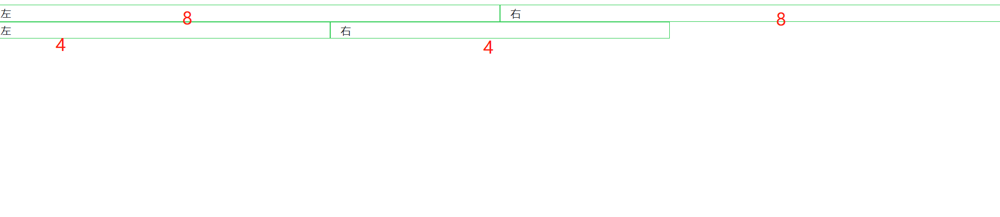

### **1、Bootstrap 简介**<br/>

Bootstrap，来自 Twitter，是目前很受欢迎的前端框架。Bootstrap 是基于 HTML、CSS、JavaScript 的，它简洁灵活，使得 Web 开发更加快捷。它是一个 CSS/HTML 框架。Bootstrap 提供了优雅的 HTML 和 CSS 规范。

- 移动设备优先：自 Bootstrap 3 起，框架包含了贯穿于整个库的移动设备优先的样式。
- 浏览器支持：所有的主流浏览器都支持 Bootstrap。
- 容易上手：只要您具备 HTML 和 CSS 的基础知识，您就可以开始学习 Bootstrap。
- 响应式设计：Bootstrap 的响应式 CSS 能够自适应于台式机、平板电脑和手机。
- 它为开发人员创建接口提供了一个简洁统一的解决方案。
- 它包含了功能强大的内置组件，易于定制。
- 它还提供了基于 Web 的定制。
- 它是开源的

### 2、环境安装<br/>

下载地址：[https://getbootstrap.com/](https://getbootstrap.com/)<br/>


  <br>


### 3、网格系统<br/>

Bootstrap 提供了一套响应式、移动设备优先的流式网格系统，随着屏幕或视口（viewport）尺寸的增加，系统会自动分为最多 12 列<br/>

**渐进增强**：向上兼容。<br/>

**优雅增强**：向下兼容。<br/>

- 行必须放置在 `.container` class 内，以便获得适当的对齐（alignment）和内边距（padding）
- 使用行来创建列的水平组<br/>
- 内容应该放置在列内，且唯有列可以是行的直接子元素<br/>
- 预定义的网格类，比如 `.row` 和 `.col-xs-4`，可用于快速创建网格布局。LESS 混合类可用于更多语义布局<br/>
- 列通过内边距（padding）来创建列内容之间的间隙。该内边距是通过 `.rows` 上的外边距（margin）取负，表示第一列和最后一列的行偏移<br/>
- 网格系统是通过指定您想要横跨的十二个可用的列来创建的。例如，要创建三个相等的列，则使用三个 `.col-xs-4`<br/>

```
<div cass="container">
    <div class="row">
        <div class="col-md-6 col-xs-6" style="border: #34ce57 1px solid">左</div>
        <div class="col-md-6 col-xs-6" style="border: #34ce57 1px solid">右</div>
    </div>
    <div class="row">
        <div class="col-md-4 col-xs-4" style="border: #34ce57 1px solid">左</div>
        <div class="col-md-4 col-xs-4" style="border: #34ce57 1px solid">右</div>
    </div>
</div>
```

自适应效果：<br>

  <br>
  <br>
### 4、媒体查询<br/>


max-width是媒体特性中最常用的一个特性，其意思是指媒体类型小于或等于指定的宽度时，样式生效。

```text

@media screen and (max-width:480px) {
 .ads {
   display:none;
  }
}
```

```text
媒体类型大于或等于指定宽度时，样式生效。
@media screen and (min-width: 900px) {
    .wrapper {width: 980px;}
}

多条件
@media screen and (min-width:600px) and (max-width:900px) {
  body {background-color:#F5F5F5;}
}


/* 超小设备（手机，小于 768px） */
/* Bootstrap 中默认情况下没有媒体查询 */

/* 小型设备（平板电脑，768px 起） */
@media (min-width: @screen-sm-min) { ... }

/* 中型设备（台式电脑，992px 起） */
@media (min-width: @screen-md-min) { ... }

/* 大型设备（大台式电脑，1200px 起） */
@media (min-width: @screen-lg-min) { ... }


实例：
<style type="text/css">
    @media screen and (max-width:480px) {
        .row {
            display:none;
        }
    }
</style>
```

&nbsp;&nbsp;

### 5、表格

```
<caption>基本的表格布局</caption>
<table class="table table-bordered table-hover table-striped table-condensed">
    <thead>
    <tr>
        <th>名称</th>
        <th>城市</th>
    </tr>
    </thead>
    <tbody>
    <tr >
        <td>Tanmay</td>
        <td>Bangalore</td>
    </tr>
    <tr>
        <td>Sachin</td>
        <td>Mumbai</td>
    </tr>
    </tbody>
</table>
```


### 6、字体图标


我们已经在 [环境安装](https://www.runoob.com/bootstrap/bootstrap-environment-setup.html) 章节下载了 Bootstrap 3.x 版本，并理解了它的目录结构。在 *fonts* 文件夹内可以找到字体图标，它包含了下列这些文件：

- glyphicons-halflings-regular.eot
- glyphicons-halflings-regular.svg
- glyphicons-halflings-regular.ttf
- glyphicons-halflings-regular.woff

相关的 CSS 规则写在 *dist* 文件夹内的 css 文件夹内的 *bootstrap.css* 和 *bootstrap-min.css* 文件上。


&nbsp;&nbsp; 本人授权[维权骑士](http://rightknights.com)对我发布文章的版权行为进行追究与维权。未经本人许可，不可擅自转载或用于其他商业用途。


