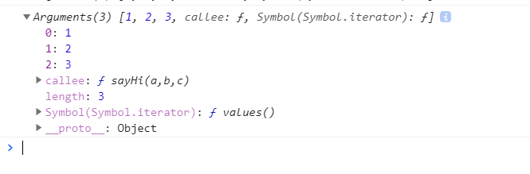

### 1.1、历史与简介

JavaScript在1995年由Netscape公司的Brendan Eich，在网景导航者浏览器上首次设计实现而成。<br>

最开始的作用只是为了做表单的必填项验证。<br>

ECMAScript是由网景的Brendan Eich开发的一种脚本语言的标准化规范；1996年11月，网景公司将JavaScript提交给欧洲计算机制造商协会进行标准化。<br>

现在说的ES6，2015年6月17日，ECMAScript 6发布正式版本，即*ECMAScript 2015*。<br>

JavaScript的含义范围更广，包括**BOM、DOM、ECMAScript** 三部分。<br>


### 1.2、文档对象模型（DOM）

文档对象模型（Document Object Model，简称DOM），是W3C组织推荐的处理xml的标准编程接口。它是一种与平台和语言无关的API,可以动态地访问程序和脚本。<br>

W3C DOM 标准被分为 3 个不同的部分：<br>

- Core DOM - 所有文档类型的标准模型<br>
- XML DOM - XML 文档的标准模型<br>
- HTML DOM - HTML 文档的标准模型<br>

**通过 HTML DOM，JavaScript 能够访问和改变 HTML 文档的所有元素。**<br>

**浏览器将结构化的文档以树的数据结构读入浏览器内存**，并将每个树的子节点定义为一个NODE处理。<br>


### 1.3、浏览器对象模型（BOM）


**浏览器对象模型（Browser Object Model (BOM)）允许 JavaScript 与浏览器对话。**<br>

BOM的核心对象是window，它表示浏览器的一个实例。在浏览器中，**window对象有双重角色，它既是通过JavaScript访问浏览器窗口的一个接口，又是ECMAScript规定的Global对象。**<br>


### 2.1、在html中使用JavaScript

在 HTML 中，JavaScript 代码必须位于 <script> 与 </script> 标签之间。<br>

script属性：<br>

src引入外部文件：<br>

```
<script src="myScript.js"></script>
```

type：<br>

```
<script type="text/javascript">
```

最大限度的浏览器兼容性text/javascript，可不写。<br>

 async="async"：异步执行<br>

```
<script type="text/javascript" src="demo_async.js" async="async"></script>
```

defer 属性规定是否对脚本执行进行**延迟执行**，直到页面加载为止:<br>

**用这个一般是js不会对页面构造产生影响**，建议只用一个：<br>

```
<script type="text/javascript" defer="defer">
alert(document.getElementById("p1").firstChild.nodeValue);
</script>
```

- 如果 async="async"：脚本相对于页面的其余部分异步地执行（当页面继续进行解析时，脚本将被执行）<br>
- 如果不使用 async 且 defer="defer"：脚本将在页面完成解析时执行<br>
- 如果既不使用 async 也不使用 defer：在浏览器继续解析页面之前，立即读取并执行脚本<br>


**script标签是顺序执行的。**<br>

1）**载入后马上执行**，2）执行时会阻塞页面后续的内容（包括页面的渲染、其它资源的下载）。如果有多个js文件被引入，那么对于浏览器来说，这些js文件被被串行地载入，并依次执行。<br>

**放在标签中的javascript会在页面一旦打开的时候进行加载，因此，如果这里面的js对DOM树进行加载的话，很容易就会因为找不到** **将所有的JS文件都放在后面后再进行调用**<br>


### 2.2、文档模式

**html5:**<br>

```
<!DOCTYPE html>
```

**html4.0.1:**<br>

```
<!DOCTYPE HTML PUBLIC "-//W3C//DTD HTML 4.01//EN" "http://www.w3.org/TR/html4/strict.dtd">
```


### 3.1、数据类型

**五种简单数据类型String、Number、boolean、null、undefined，一种复杂数据类型Object；**

```
var msg = "msgtest";
alert(typeof msg ); //String

var msg2 = "123";
alert(typeof msg2 ); //String

var msg3 = 123; 
alert(typeof msg3 );//number 

var msg4 = false; 
alert(typeof msg4 ); //boolean

var msg5 ; 
alert(typeof msg5 ); //undefined

var msg6 = "" ; 
alert(typeof msg6 ); //String

alert(typeof msg7 ); //undefined

// 在 JavaScript 中，null 的数据类型是对象。
var msg8 = null;
alert(typeof msg8 ); //object

var cars = ["Porsche", "Volvo", "BMW"];
alert(typeof cars ); //object

var person = {firstName:"Bill", lastName:"Gates", age:62, eyeColor:"blue"};
alert(typeof person ); //object
```

**Undefined 与 Null 的区别:**

```
typeof undefined              // undefined
typeof null                   // object
null === undefined            // false
null == undefined             // true
```

**NaN(Not a Number):**

```
var msg = 1;
alert(isNaN(msg) ); //false

var msg2 = "2";
alert(isNaN(msg2) ); //false

var msg3 = "s";
alert(isNaN(msg3) ); //true

var msg4 = true;
alert(isNaN(msg4) ); //false
```

**数值转换：**<br>

**number（）：**<br>

```
var msg = "";
alert(Number(msg)); // 0

var msg1 = null;
alert(Number(msg1)); // 0

var msg2;
alert(Number(msg2)); // NaN

var msg3 = true;
alert(Number(msg3)); // 1

var msg4 = "123";
alert(Number(msg4)); // 123

var msg4 = "12ff3";
alert(Number(msg4)); // NaN

var msg4 = "12   3";
alert(Number(msg4)); // NaN
```

**在处理整数时，更常用parseInt**:

```
var msg = "";
alert(parseInt(msg)); // NaN

var msg1;
alert(parseInt(msg1)); // NaN

var msg2 = null;
alert(parseInt(msg2)); // NaN

var msg3 = "12ss3";
alert(parseInt(msg3)); // 12

var msg3 = "12.3";
alert(parseInt(msg3)); // 12
```


**在处理浮点数，用parseFloat**:<br>

**String(),toString():**<br>

```
var msg2 = 10;
alert(String(msg2)); // 10
alert(msg2.toString()); // 10


var msg3 = true;
alert(String(msg3)); // true
alert(msg3.toString()); // true


var msg = "";
alert(String(msg)); //    ("")
alert(msg.toString()); //  ("")

var msg1;
alert(String(msg1)); // undefined

var msg4 = null;
alert(String(msg4)); // null


```


**Object类型：**

```
var a = new Object()
// 每个Object都有以下属性和方法
// 构造函数Constructor构造函数 本例就是Object()
//objectName.propertyName 或 objectName["propertyName"]访问对象属性
//objectName.methodName() 访问对象方法
```


### 3.2、函数
ECMAScript函数传参时，函数接收是数组的形式。所以ECMAScript函数不在乎传来的参数个数和类型:<br>

实际上可以用arguments对象访问这个数组。

```
function sayHi(a,b,c){
    alert("Hi"+arguments); //Hi[object Arguments]
    alert("Hi"+arguments[0]); //Hi1
    alert("Hi"+arguments[3]); //Hiundefined
    console.log(arguments);
    alert(arguments.length);
}

sayHi(1,2,3);
```


  


**修改参数：**

```
function sayHi(a,b,c){
alert(b);//1
arguments[1] = 2;
alert(b);//2
}
```

**传参不同实现重载：** 

```
function sayHi(a,b,c){
    if(arguments.length == 1){
        alert("执行一个参数的功能------");
    }else if(arguments.length == 2){
        alert("执行两个参数的功能------");
    }
}
```

**不能重载：**<br>

ECMAScript不能像传统意义上那样实现重载，只能通过上面的方式，如果声明两个同名函数，只有最后一个有效，前一个被覆盖。


### 4、变量、作用域、内存

### **4.1、基本类型和引用类型的值**

**动态：引用类型可以添加删除属性和方法。但是基本类型不可以**<br>

```
var person = new Object();
person.age = "10";
console.log(person.age); //10

var person = "app";
person.age = "10";
console.log(person.age); //undefined
```


**基本类型和引用类型的值复制上的不同：**<br>


```
var a = "aaaa";
var b = a;
// a,b是分开保存的
a = "bbb";
alert(b); // aaaa

// obj1和obj2指向同一个对象
var obj1 = new Object();
var obj2 = obj1;
obj1.age = 10;
alert(obj2.age);  //10
```


**理解函数传参过程中，是把函数外部的值复制给函数内部的arguments，不影响外部值（作用域）**<br>

```
function addTen(num){
	num = num + 10;
	return num;
}

var count = 10;
var rusult = addTen(count);

alert(count);  //10
alert(rusult); //20
```


### **4.2、执行环境与作用域**

在web浏览器器中，执行环境是window对象，因此所有的全局变量和函数都是window对象的属性和方法创建的（关闭网页、浏览器被销毁）；<br>

当代码在一个环境中执行，会创建变量对象的一个**作用域链**，实现变量和函数的有序访问。<br>

**作用域链**的最前面：当前代码所在环境的变量对象<br>

下一个，外部环境；再下一个，再外部环境；<br>

**作用域链**的最后面一定是全局执行的变量对象<br>


```
var color = "blue";

function changeColor(){
// 这里有两个变量对象 ，它自己的（定义arguments）和全局变量对象
	if(color == "blue"){  //作用域链找到全局的color
		color = "red";
	}else {
		color = "blue"
	}
}

changeColor();

alert(color); //red
```


```
var color = "blue";

function changeColor(){
	var anotherColor = "red";
	

	function swapColors(){
	
		var tempColor = anotherColor;
		anotherColor = color;
		color = tempColor;
		// 这里可以访问color、anotherColor和tempColor
	}
	swapColors()；
	// 这里可以访问color、anotherColor，不能访问tempColor
	alert(tempColor); // tempColor is not defined

}
// 只能访问color
changeColor();
```

这里有三个执行环境、全局环境、changeColor()和swapColors()；<br>
内部环境可以通过作用域链访问所有外部环境，外部环境不能访问内部环境的变量和函数；<br>


**没有块级作用域**

```
function count(){
	var a = 1;
}
count();
alert(a); // a is not defined
```

```
if(1 == 1){
	var a = 1;
}

alert(a); // 1
```

典型例子：在JavaScript中，对于for循环中定义的i变量，其生命周期在循环结束后仍然是有效的。<br>

```
for(var i = 1; i < 10; i++){
	// doSomething();
}
alert(i); //10
```

### **4.3、垃圾收集**

全局变量的生命周期：<br>
**从程序开始执行创建，到整个页面关闭时，变量收回。**<br>
局部变量的生命周期：<br>
**从函数开始调用开始，一直到函数调用结束**<br>（自动垃圾回收）

### **4.3.1、标记清除**

当运行addTen()这个函数的时候，就是当变量进入环境时，就将这个变量标记为“进入环境”。从逻辑上讲，永远不能释放进入环境的变量所占用的内存，因为只要执行流进入相应的环境，就可能会用到它们。而当变量离开环境时，则将其标记为“离开环境”。

### **4.3.2、引用计数**

当声明了一个变量并将一个引用类型值赋值该变量时，则这个值的引用次数就是1.如果同一个值又被赋给另外一个变量，则该值得引用次数加1。相反，如果包含对这个值引用的变量又取 得了另外一个值，则这个值的引用次数减 1。当这个值的引用次数变成 0时，则说明没有办法再访问这个值了，因而就可以将其占用的内存空间回收回来。这样，当垃圾收集器下次再运行时，它就会释放那 些引用次数为零的值所占用的内存。 

### **4.3.3、管理内存**

浏览器可用内存数量通常比桌面应用少很多。

为了减少内存使用情况优化，一旦数据不再使用，可设置为null**解除引用**。

```
function createPerson(name){
	var person = new Object();
	person.name = name;
	return person;
}

var person1 = createPerson("js");
//  .......

// 不再使用person1
// 手工解除引用

person1 = null;
```


### 5、引用类型

### 5.1、Object类型

```
var person = {
  firstName: "Bill",
  lastName : "Gates",
  id       : 678,
  fullName : function() {
    return this.firstName + " " + this.lastName;
  }
};
```

以两种方式访问属性：

```
objectName.propertyName
```

或者

```
objectName["propertyName"]
```

### 5.2、Array类型

```
var array-name = [item1, item2, ...];
```

```
var cars = new Array("Saab", "Volvo", "BMW");
```

ECMAScript 5 定义了新方法 Array.isArray()：

```
Array.isArray(fruits);     // 返回 true
```

方法：


### 5.3、Date类型


### 5.4、正则表达式RegExp类型


&nbsp;&nbsp;&nbsp;&nbsp; 本人授权[维权骑士](http://rightknights.com)对我发布文章的版权行为进行追究与维权。未经本人许可，不可擅自转载或用于其他商业用途。


