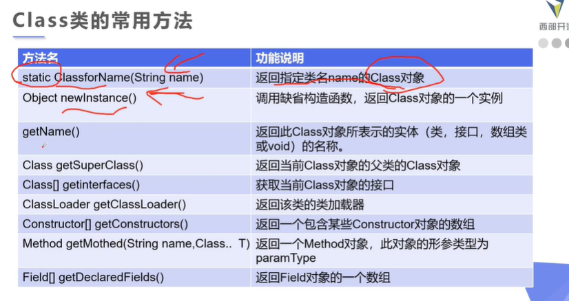

## 一、内置注解

### @Override
表示重写方法

### @Deprecated 
标记过时方法。如果使用该方法，会报编译警告。

### @SuppressWarnings

指示编译器去忽略注解中声明的警告

## 二、元注解meta-annotation

可注解其他注解

### @Target

注解适用范围

参数为枚举类型对作用域。

### @Retention

什么级别保存注释信息 source<class<runtime

源码级、编译class、运行时

### @Document

标记这些注解是否包含在用户文档中

### @Inherited 

标记这个注解是继承于哪个注解类(默认 注解并没有继承于任何子类)

## 三、自定义注解

使用@Interface自定义注解，就自动继承了Annotation接口

### 定义参数

## 四、反射Reflection

通过生成对象获取类的信息

### 得到Class对象方法

### 类属性与方法

## 五、获取注解信息自定义ORM

