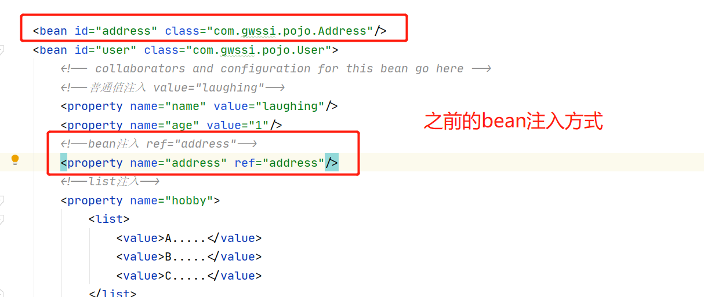
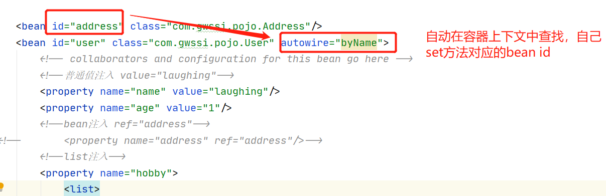
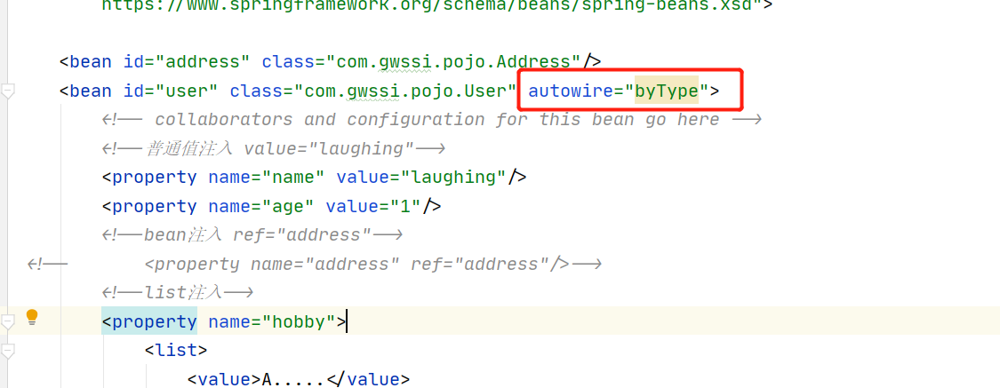
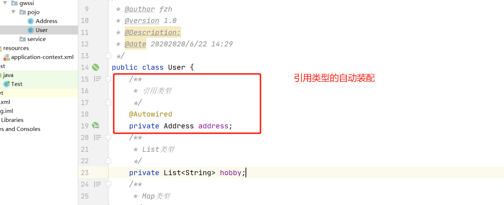
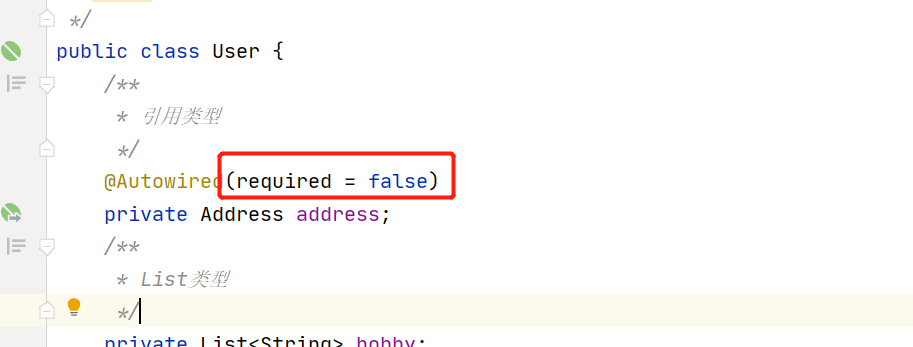

## 一、Bean的作用域

查看官方文档：

| Scope                                                        | Description                                                  |
| :----------------------------------------------------------- | :----------------------------------------------------------- |
| [singleton](https://docs.spring.io/spring/docs/5.3.0-SNAPSHOT/spring-framework-reference/core.html#beans-factory-scopes-singleton) | (Default) Scopes a single bean definition to a single object instance for each Spring IoC container. |
| [prototype](https://docs.spring.io/spring/docs/5.3.0-SNAPSHOT/spring-framework-reference/core.html#beans-factory-scopes-prototype) | Scopes a single bean definition to any number of object instances. |
| [request](https://docs.spring.io/spring/docs/5.3.0-SNAPSHOT/spring-framework-reference/core.html#beans-factory-scopes-request) | Scopes a single bean definition to the lifecycle of a single HTTP request. That is, each HTTP request has its own instance of a bean created off the back of a single bean definition. Only valid in the context of a web-aware Spring `ApplicationContext`. |
| [session](https://docs.spring.io/spring/docs/5.3.0-SNAPSHOT/spring-framework-reference/core.html#beans-factory-scopes-session) | Scopes a single bean definition to the lifecycle of an HTTP `Session`. Only valid in the context of a web-aware Spring `ApplicationContext`. |
| [application](https://docs.spring.io/spring/docs/5.3.0-SNAPSHOT/spring-framework-reference/core.html#beans-factory-scopes-application) | Scopes a single bean definition to the lifecycle of a `ServletContext`. Only valid in the context of a web-aware Spring `ApplicationContext`. |
| [websocket](https://docs.spring.io/spring/docs/5.3.0-SNAPSHOT/spring-framework-reference/web.html#websocket-stomp-websocket-scope) | Scopes a single bean definition to the lifecycle of a `WebSocket`. Only valid in the context of a web-aware Spring `ApplicationContext`. |


### single 单例模式（默认）

```
<!--    scope="singleton"-->
<bean id="user" class="com.gwssi.pojo.User" scope="singleton">
    <property name="name" value="laughing" />
    <property name="age" value="1"/>
</bean>
```

IOC容器仅创建一个Bean实例，IOC容器每次返回的是同一个Bean实例。

### single 原型模式

```
<bean id="user" class="com.gwssi.pojo.User" scope="prototype">
    <property name="name" value="laughing" />
    <property name="age" value="1"/>
</bean>
```

IOC容器可以创建多个Bean实例，每次返回的都是一个新的实例。

### request

该属性仅对HTTP请求产生作用，使用该属性定义Bean时，每次HTTP请求都会创建一个新的Bean，适用于WebApplicationContext环境。

### session

该属性仅用于HTTP Session，同一个Session共享一个Bean实例。不同Session使用不同的实例。

### global-session

该属性仅用于HTTP Session，同session作用域不同的是，所有的Session共享一个Bean实例。


## 二、Bean自动装配




**byName自动注入:**



**byType自动注入：**




按照类型装配。

## 三、注解自动装配

spring2.5之后支持注解装配,，需要导入约束<br>

```
<?xml version="1.0" encoding="UTF-8"?>
<beans xmlns="http://www.springframework.org/schema/beans"
    xmlns:xsi="http://www.w3.org/2001/XMLSchema-instance"
    xmlns:context="http://www.springframework.org/schema/context"
    xsi:schemaLocation="http://www.springframework.org/schema/beans
        https://www.springframework.org/schema/beans/spring-beans.xsd
        http://www.springframework.org/schema/context
        https://www.springframework.org/schema/context/spring-context.xsd">

    <context:annotation-config/>

</beans>
```


### @Autowired 

它可以对类成员变量、方法及构造函数进行标注，完成自动装配的工作。(也可用在set方法上)




需要符合byname规范，且在beans中注册。<br>

Autowired有一个属性**required**，默认为true。<br>

```
public @interface Autowired {
    boolean required() default true;
}
```


设置为false，表示可以为空<br>
我们可以经常见到这种写法，表示自动装配到这个类：

```
    @Autowired
    private MovieCatalog movieCatalog;
```


### @Resource

@Resource的作用和@Autowired相同，@Autowired按byType自动注入，@Resource默认按 byName自动注入罢了。@Resource有两个属性是比较重要的，分是name和type，Spring将@Resource注解的name属性解析为bean的名字，而type属性则解析为bean的类型。所以如果使用name属性，则使用byName的自动注入策略，而使用type属性时则使用byType自动注入策略。如果既不指定name也不指定type属性，这时将通过反射机制使用byName自动注入策略。<br>

@Resources按名字，是JDK的，@Autowired按类型，是Spring的。<br>


