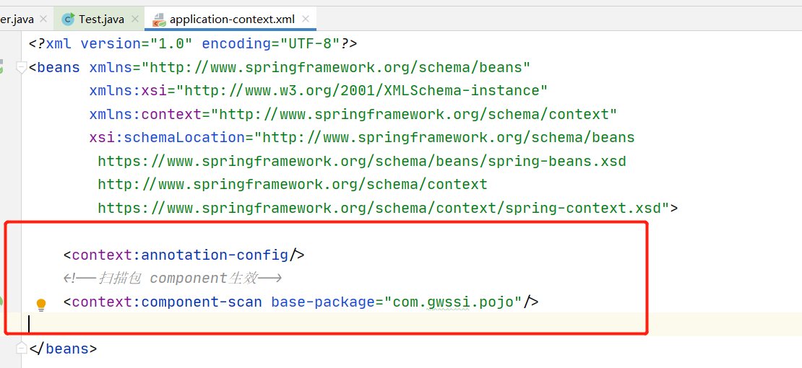
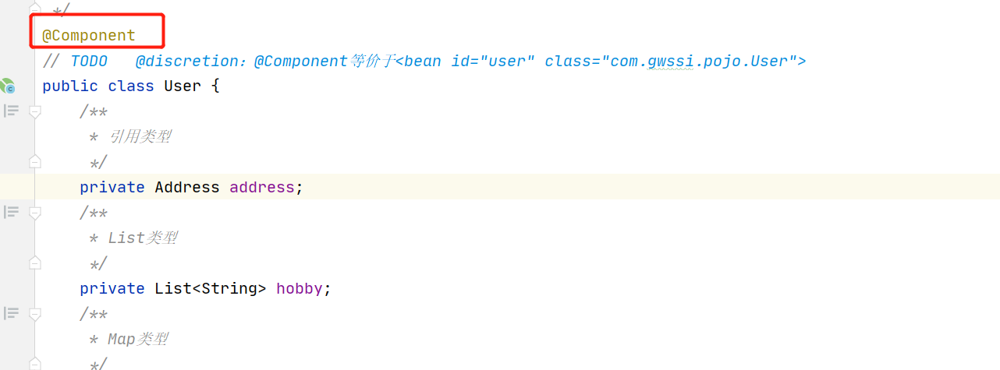
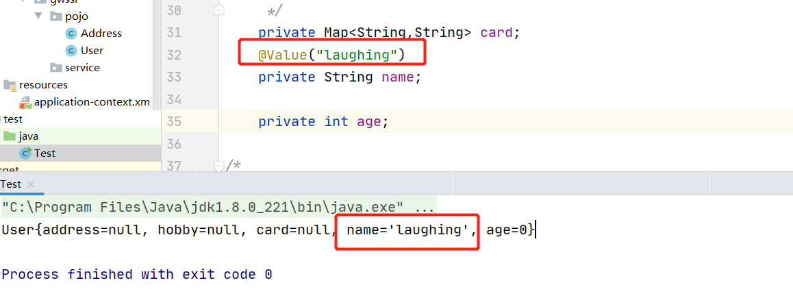
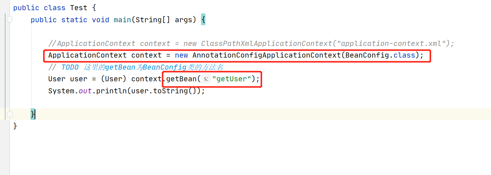
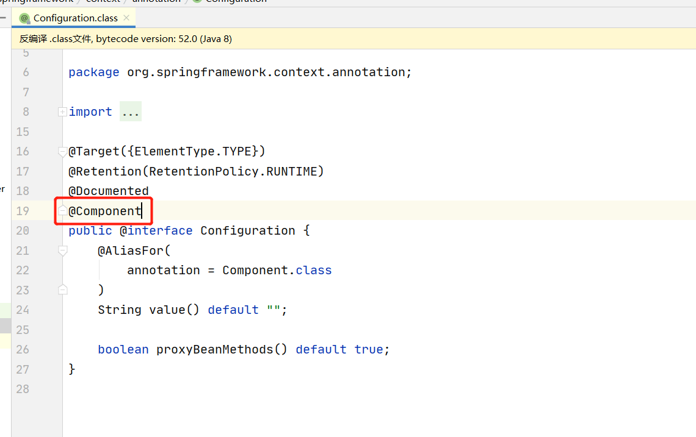

## 一、注解开发
### @Component
把普通pojo实例化到spring容器中，相当于配置文件中的bean,是实现bean的注入。





### @Value

通过@Value将外部的值动态注入到Bean中




### @Component衍生注解

在MVC的三层架构中，我们常分：<br>

dao

```
@Repository
public class User {
}
```

service

```
@Service
public class UserService {
}
```

controller

```
@Controller
public class UserController {
}
```

**这四个注解功能都是装配bean**

### @Scope

@Scope("singleton")标注这个bean为单例模式

```
@Repository
@Scope("singleton")
public class User {
}
```


## 二、@Configuration Config配置

我们可以完全不用xml来实现配置。@Configuration用于定义配置类，可替换xml配置文件，被注解的类内部包含有一个或多个被@Bean注解的方法，这些方法将会被AnnotationConfigApplicationContext或AnnotationConfigWebApplicationContext类进行扫描，并用于构建bean定义，初始化Spring容器。<br>

定义一个BeanConfig，用@Configuration注解声明，**@Bean就相当于之前xml中的bean标签，id为方法名，返回值为class**

```
@Configuration
public class BeanConfig {
    @Bean
    public User getUser (){
        return new User();
    }
}
```

读取context:




@Configuration还是交给spring托管




