## 一、代理模式
代理模式的核心是为其他对象提供一种代理以控制对这个对象的访问。先看一个例子：

### 普通的服务调用模式

服务接口：

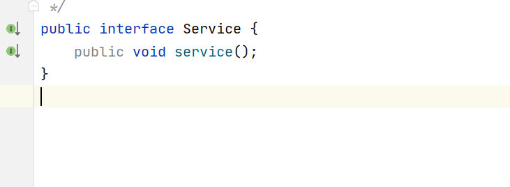

服务接口实现

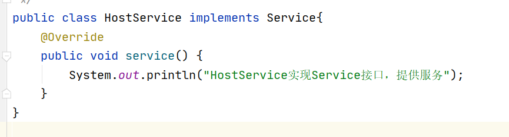

客户端调用：

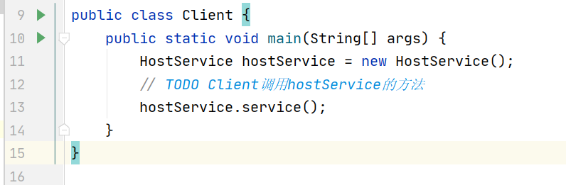

### 静态代理

上述调用，加入一个代理：

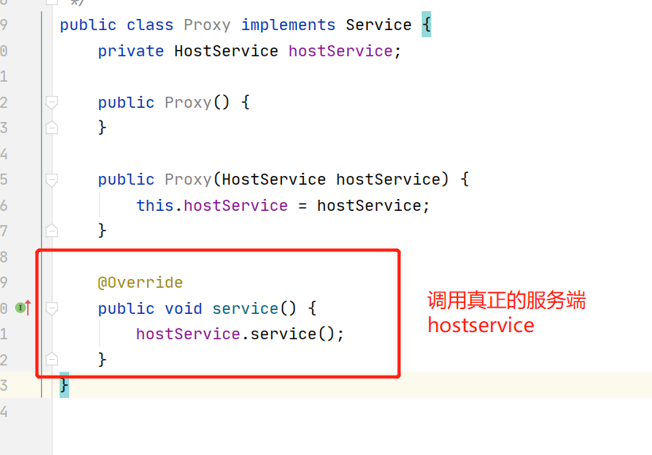

客户端调用

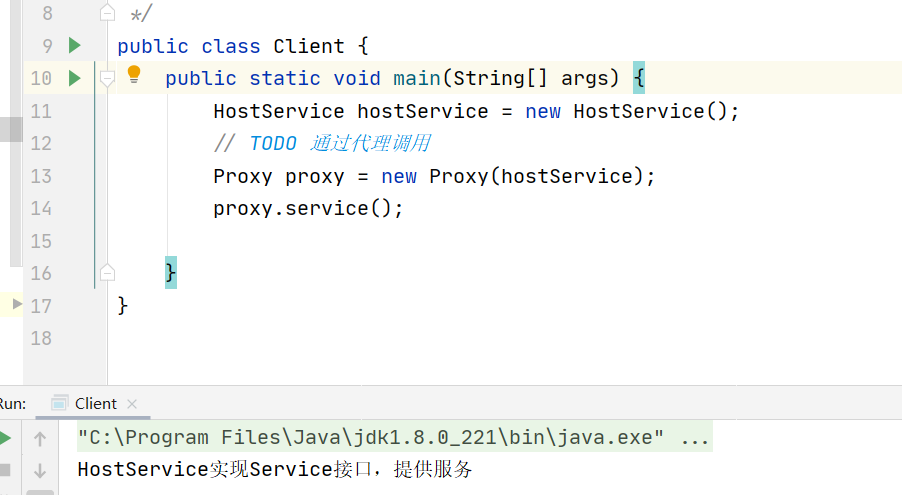

这样做我们可以在Proxy的方法中，添加额外的实现。

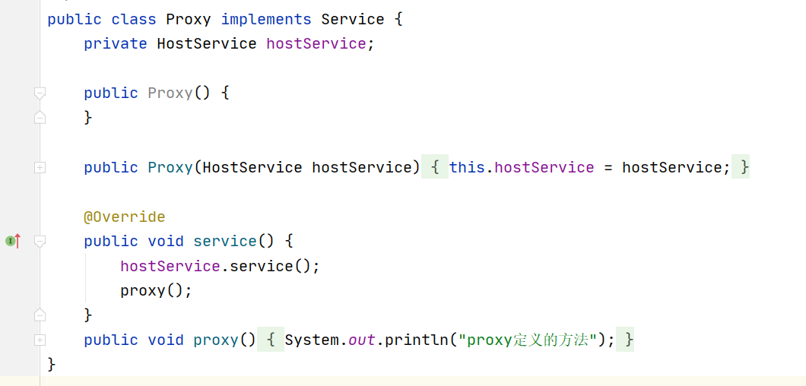

我们思考为什么要这样做： 

1、可以更好的解耦，真正的service可以是公共的业务，代理角色完成更细致的定制业务。

2、集中管理service业务。

### 动态代理

从静态代理会发现，每个代理类只能为一个接口服务，这样程序开发中必然会产生许多的代理类。所以我们想办法通过一个代理类完成全部的代理功能，那么我们就需要用动态代理。 

**我们可以基于接口或类实现代理类的动态生成。** 

Proxy  InvocationHandler 

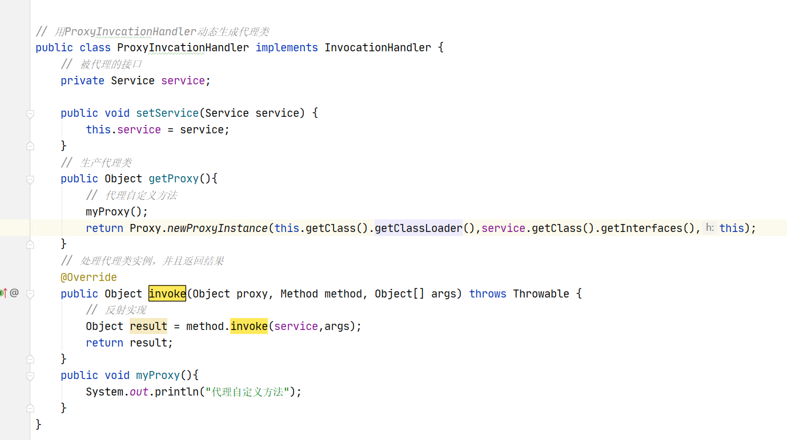

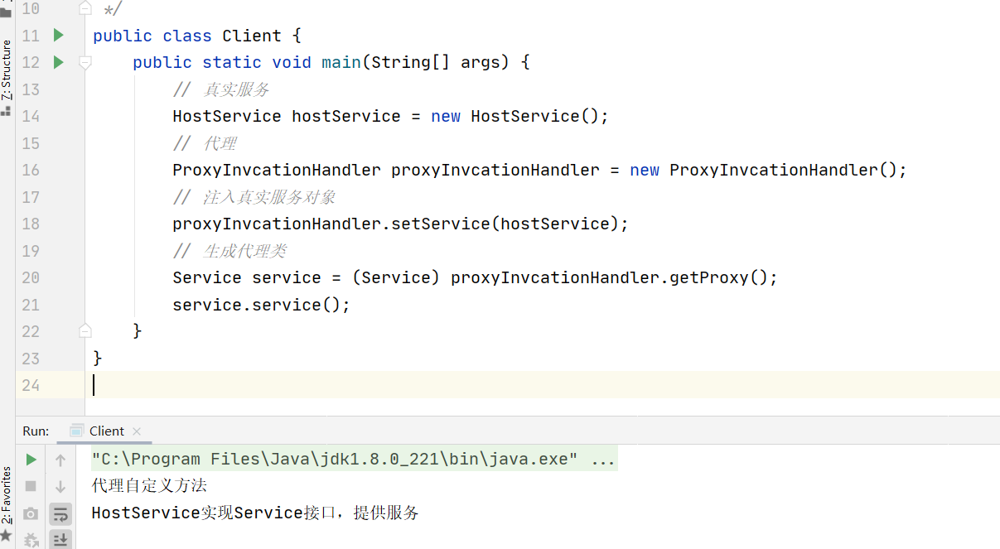

**注意动态代理，代理的是一个接口，所以他可以代理多个实现同一个接口的类。**

## AOP实现

### 使用spring接口实现

增删改查的接口和增删改查的实现类；

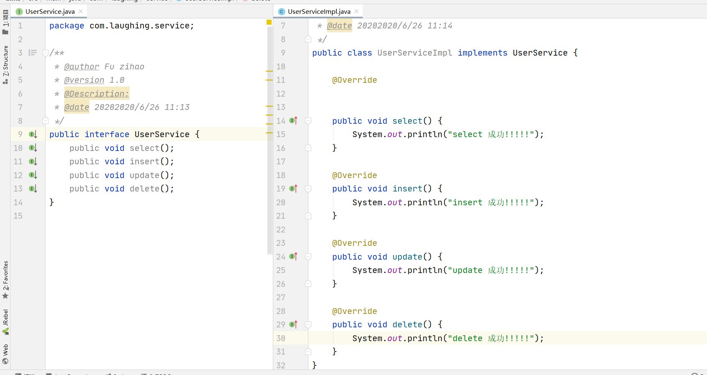

给增删改查横向接入打印日志功能：

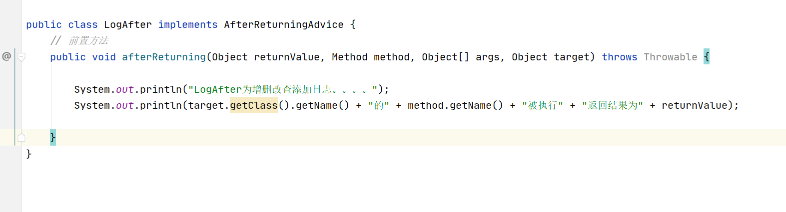

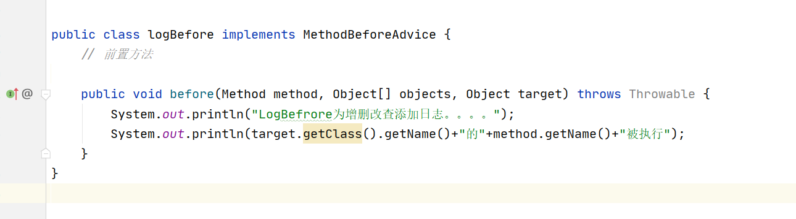

配置AOP:

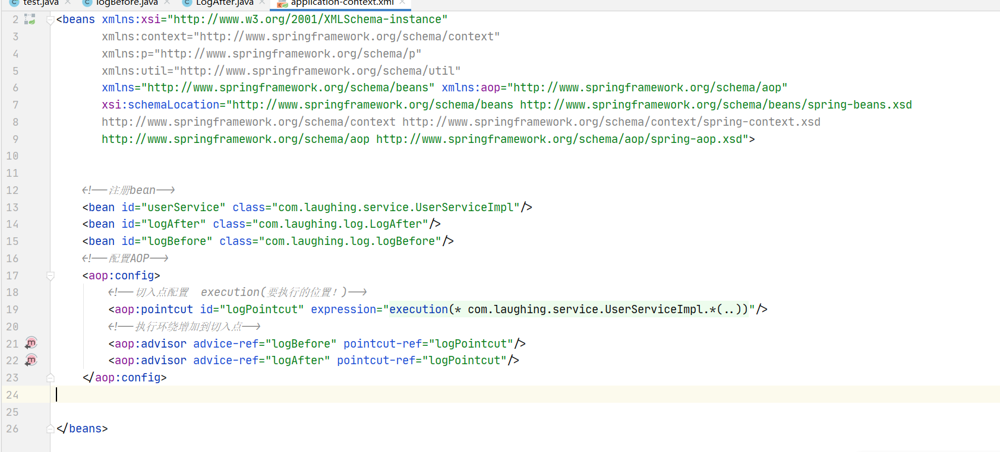

测试：

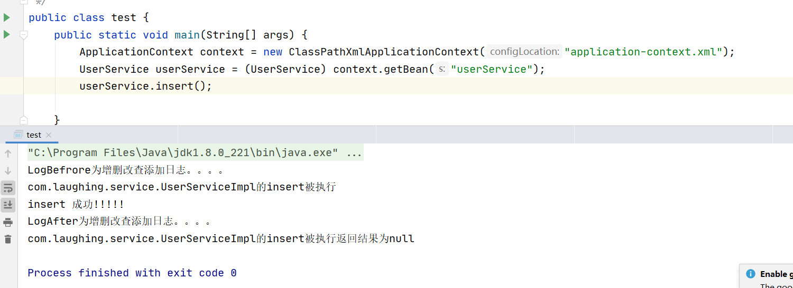

### 自定义类实现

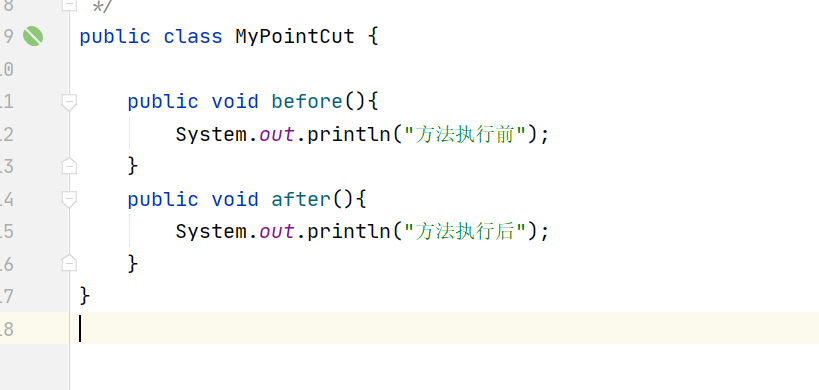

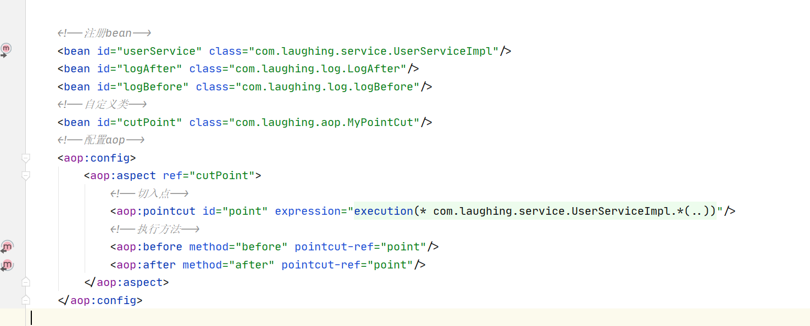

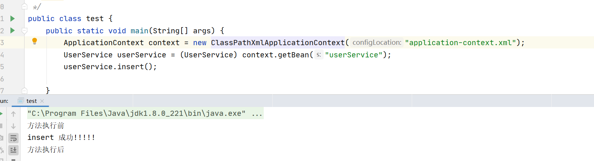

### 注解实现

配置文件支持：

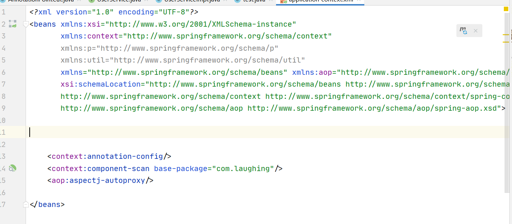

代理类

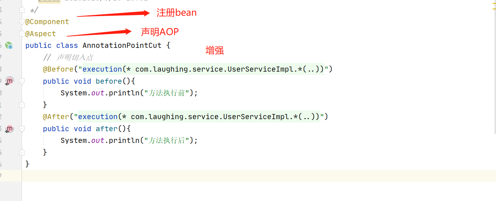

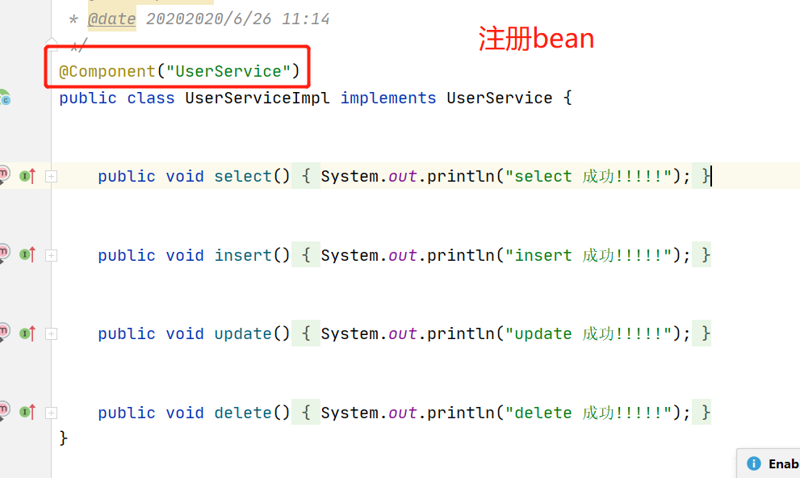

调用：

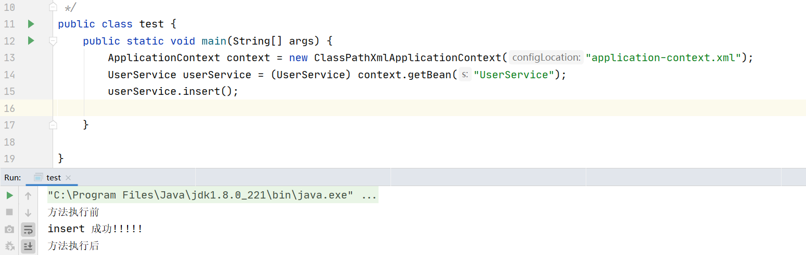

