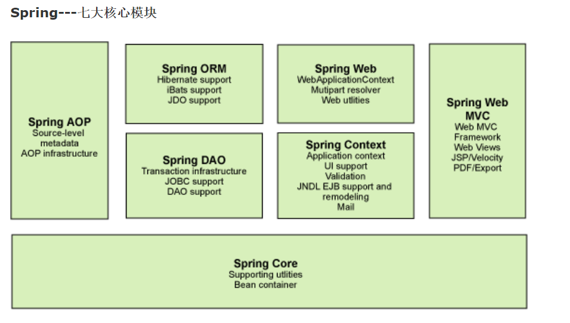
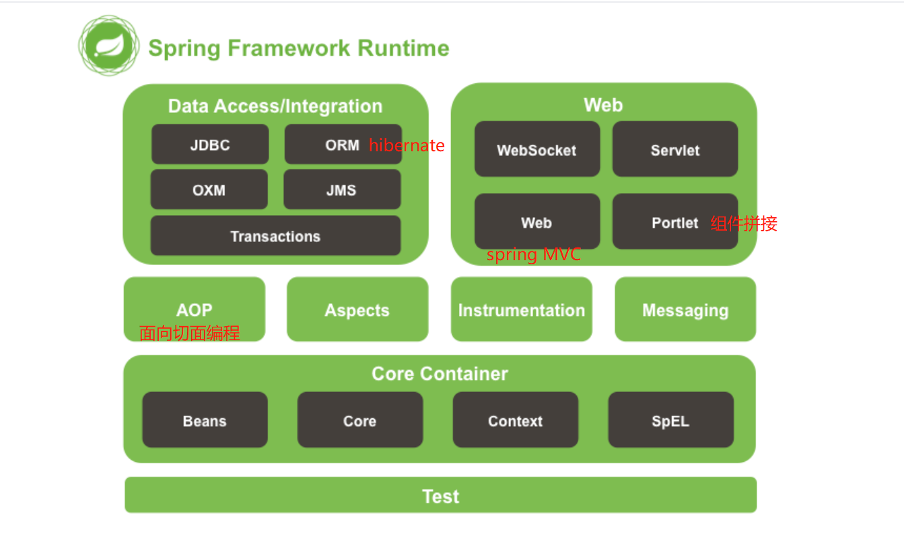
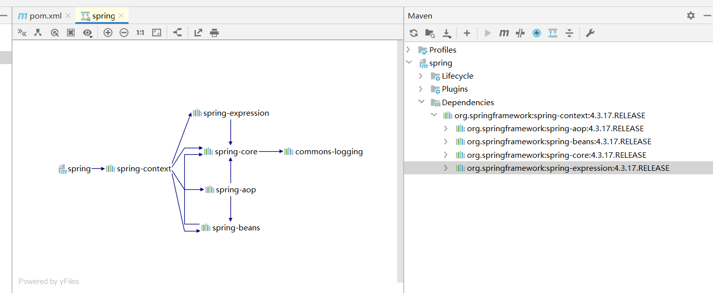

### **1、Spring 简介**<br/>

官网：[https://spring.io/](https://spring.io/)<br/>

根据功能的不同，可以将一个系统中的代码分为 **主业务逻辑** 与 **系统级业务逻辑** 两类。<br/>

Spring 的主要作用就是为代码“解耦”，降低代码间的耦合度。 AOP 使得系统级服务得到了最大复用，且不用再由程序员手工将系统级服务“混杂”到主业务逻辑中了，而是由 Spring 容器统一完成“织入”。<br/>

Spring 由 20 多个模块组成，它们可以分为数据访问/集成（Data Access/Integration）、Web、面向切面编程（AOP, Aspects）、应用服务器设备管理（Instrumentation）、消息发送（Messaging）、核心容器（Core Container）和测试（Test）。<br/>
  <br>
  <br>

### 2、Spring 特点<br/>

**非侵入式：**

所谓非侵入式是指，Spring 框架的 API 不会在业务逻辑上出现，即业务逻辑是 POJO。由于业务逻辑中没有 Spring 的 API，所以业务逻辑可以从 Spring 框架快速的移植到其他框架， 即与环境无关。

**IoC:**

控制反转（Inversion of Control），即创建被调用者的实例不是由调用者完成，而是由 Spring 容器完成，并注入调用者。

当应用了 IoC，一个对象依赖的其它对象会通过被动的方式传递进来，而不是这个对象自己创建或者查找依赖对象。即，不是对象从容器中查找依赖，而是容器在对象初始化时不等对象请求就主动将依赖传递给它。

**AOP:**

面向切面编程（AOP，Aspect Orient Programming），是一种编程思想，是面向对象编程 OOP 的补充。很多框架都实现了对 AOP 编程思想的实现。Spring 也提供了面向切面编程的丰富支持，允许通过分离应用的业务逻辑与系统级服务（例如日志和事务管理）进行开发。应用对象只实现它们应该做的——完成业务逻辑——仅此而已。它们并不负责其它的系统级关注点，例如日志或事务支持。

我们可以把日志、安全、事务管理等服务理解成一个“切面”，那么以前这些服务一直是直接写在业务逻辑的代码当中的，这有两点不好：首先业务逻辑不纯净；其次这些服务被很多业务逻辑反复使用，完全可以剥离出来做到复用。那么 AOP 就是这些问题的解决方案， 可以把这些服务剥离出来形成一个“切面”，以期复用，然后将“切面”动态的“织入”到业务逻辑中，让业务逻辑能够享受到此“切面”的服务。


### 3、Spring  项目<br/>

先使用第四个版本 spring-context：<br/>

```
<dependency>
    <groupId>org.springframework</groupId>
    <artifactId>spring-context</artifactId>
    <version>4.3.17.RELEASE</version>
</dependency>
```
  

写一个接口实现类UserService,在spring-context.xml配置文件中定义bean。<br/>

```&lt;?xml version=&quot;1.0&quot; encoding=&quot;UTF-8&quot;?&gt;
<?xml version="1.0" encoding="UTF-8"?>
<beans xmlns="http://www.springframework.org/schema/beans"
       xmlns:xsi="http://www.w3.org/2001/XMLSchema-instance"
       xsi:schemaLocation="
       http://www.springframework.org/schema/beans http://www.springframework.org/schema/beans/spring-beans.xsd">

    <bean id="userService" class="com.gwssi.spring.service.impl.UserServiceImpl" />


</beans>
```

<br>

```
public class MyTest {
    public static void main(String[] args) {

        // 获取 Spring 容器
        ApplicationContext applicationContext = new 	   ClassPathXmlApplicationContext("spring-context.xml");

        // 从 Spring 容器中获取对象
        UserService userService = (UserService) applicationContext.getBean("userService");
        userService.sayHi();
    }
}
```


&nbsp;&nbsp; 本人授权[维权骑士](http://rightknights.com)对我发布文章的版权行为进行追究与维权。未经本人许可，不可擅自转载或用于其他商业用途。


