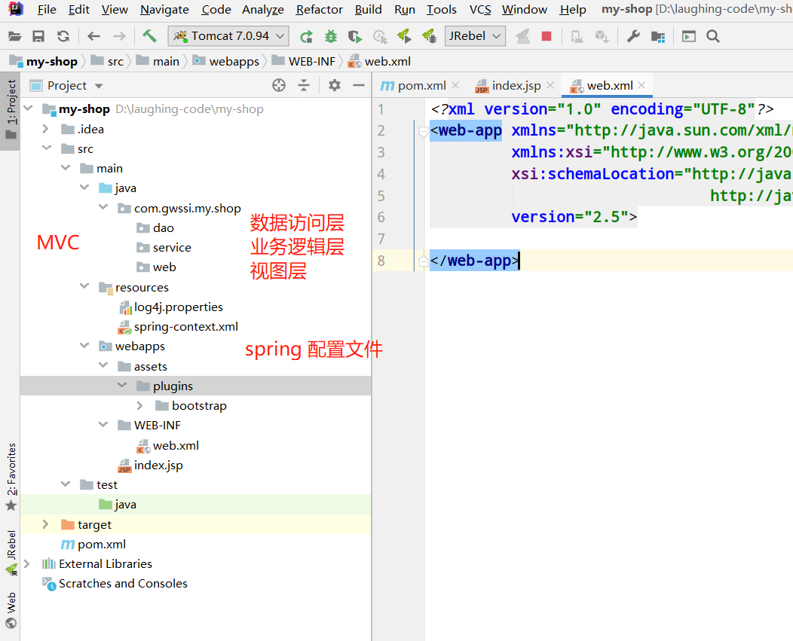
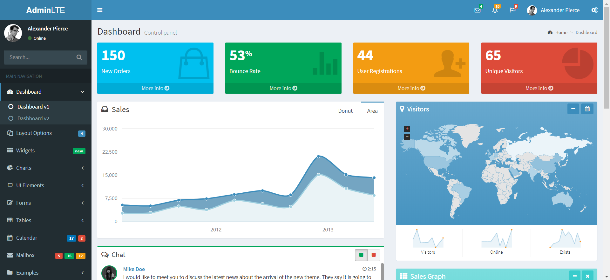
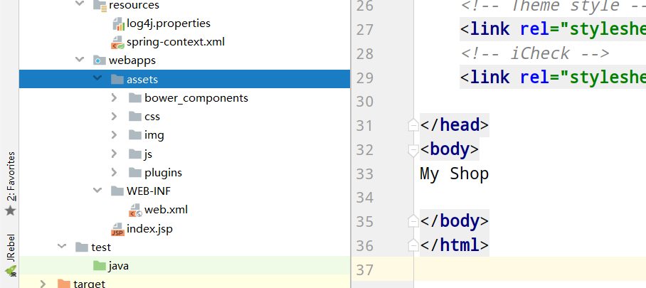
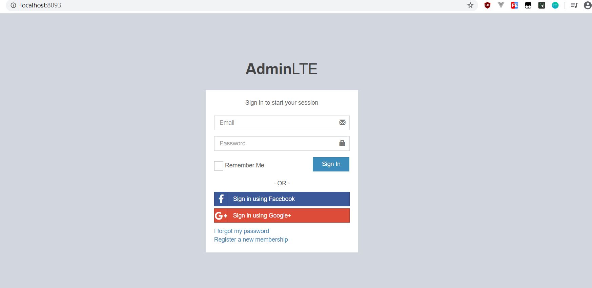

### **1、项目结构**<br/>

  <br>


以前一直搞不懂webapps和WEB-INF的区别：<br/>

通常情况下我们的项目结构是将css/js/html放在WEB—INF下面，因为WEB—INF是webapp的安全目录。所谓安全目录就是客户端无法访问的目录，只有服务端可以访问。而webapp则可以通过浏览器直接访问到。


### 2、Bootstrap 管理模板-AdminLTE

AdminLTE是一个完全响应管理模板。基于Bootstrap3，jQuery 3.3.1 这两个框架框架，易定制模板。适合多种屏幕分辨率，从小型移动设备到大型台式机。内置了多个页面，包括仪表盘、邮箱、日历、锁屏、登录及注册、404错误、500错误等页面。对于后台站点的模板渲染，有很大的作用。<br/>

**AdminLTE官网**https://adminlte.io/

**AdminLTE2.4.3下载地址(zip)**：[https://codeload.github.com/ColorlibHQ/AdminLTE/zip/v2.4.3](https://codeload.github.com/ColorlibHQ/AdminLTE/zip/v2.4.3)


  <br>

引入:
  <br>


### 3、AdminLTE登录页jsp

```
<%--
  Created by IntelliJ IDEA.
  User: Administrator
  Date: 2020/5/29
  Time: 10:52
  To change this template use File | Settings | File Templates.
--%>
<%@taglib prefix="c" uri="http://java.sun.com/jsp/jstl/core"%>
<%@ page contentType="text/html;charset=UTF-8" language="java" %>
<!DOCTYPE html>
<html>
<script src="https://code.jquery.com/jquery-3.3.1.min.js"></script>
<head>
    <meta charset="utf-8">
    <meta http-equiv="X-UA-Compatible" content="IE=edge">
    <title>登录</title>
    <!-- Tell the browser to be responsive to screen width -->
    <meta content="width=device-width, initial-scale=1, maximum-scale=1, user-scalable=no" name="viewport">
    <!-- Bootstrap 3.3.7 -->

    <link rel="stylesheet" href="./assets/bower_components/bootstrap/dist/css/bootstrap.min.css"/>
    <!-- Font Awesome -->
    <link rel="stylesheet" href="./assets/bower_components/font-awesome/css/font-awesome.min.css"/>
    <!-- Ionicons -->
    <link rel="stylesheet" href="./assets/bower_components/Ionicons/css/ionicons.min.css"/>
    <!-- Theme style -->
    <link rel="stylesheet" href="./assets/css/AdminLTE.min.css"/>
    <!-- iCheck -->
    <link rel="stylesheet" href="./assets/plugins/iCheck/square/blue.css"/>

</head>
<body class="hold-transition login-page">

<div class="login-box">
    <div class="login-logo">
        <a href=""><b>Admin</b>LTE</a>
    </div>
    <!-- /.login-logo -->
    <div class="login-box-body">
        <p class="login-box-msg">Sign in to start your session</p>

        <form action="/login" method="post">
            <c:if test="${msg != null}">
                <div class="alert alert-danger alert-dismissible">
                    <button type="button" class="close" data-dismiss="alert" aria-hidden="true">&times;</button>
                        ${msg}
                </div>
            </c:if>

            <div class="form-group has-feedback">
                <input type="email" name="email" class="form-control" placeholder="Email">
                <span class="glyphicon glyphicon-envelope form-control-feedback"></span>
            </div>
            <div class="form-group has-feedback">
                <input type="password" name="password" class="form-control" placeholder="Password">
                <span class="glyphicon glyphicon-lock form-control-feedback"></span>
            </div>
            <div class="row">
                <div class="col-xs-8">
                    <div class="checkbox icheck">
                        <label>
                            <input type="checkbox"> Remember Me
                        </label>
                    </div>
                </div>
                <!-- /.col -->
                <div class="col-xs-4">
                    <button type="submit" class="btn btn-primary btn-block btn-flat">Sign In</button>
                </div>
                <!-- /.col -->
            </div>
        </form>

        <div class="social-auth-links text-center">
            <p>- OR -</p>
            <a href="#" class="btn btn-block btn-social btn-facebook btn-flat"><i class="fa fa-facebook"></i> Sign in using
                Facebook</a>
            <a href="#" class="btn btn-block btn-social btn-google btn-flat"><i class="fa fa-google-plus"></i> Sign in using
                Google+</a>
        </div>
        <!-- /.social-auth-links -->

        <a href="#">I forgot my password</a><br>
        <a href="" class="text-center">Register a new membership</a>

    </div>
    <!-- /.login-box-body -->
</div>

<!-- /.login-box -->
<!-- jQuery 3 -->
<script src="./assets/bower_components/jquery/dist/jquery.min.js"></script>
<!-- Bootstrap 3.3.7 -->
<script src="./assets/bower_components/bootstrap/dist/js/bootstrap.min.js"></script>
<!-- iCheck -->
<script src="./assets/plugins/iCheck/icheck.min.js"></script>
<script>
    $(function () {
        $('input').iCheck({
            checkboxClass: 'icheckbox_square-blue',
            radioClass: 'iradio_square-blue',
            increaseArea: '20%' /* optional */
        });
    });
</script>
</body>
</html>

```

效果：
  <br>


### 4、后台

```
package com.gwssi.my.shop.dao.impl;

import com.gwssi.my.shop.dao.UserDao;
import com.gwssi.my.shop.entity.User;
import org.slf4j.Logger;
import org.slf4j.LoggerFactory;


/**
 * @author fzh
 * @version 1.0
 * @date 2020/5/29 13:34
 */
public class UserDaoImpl implements UserDao {
    public static final Logger logger = LoggerFactory.getLogger(UserDaoImpl.class);
    User user = null;

    @Override
    public User getUser(String email, String password) {
        logger.debug("getUser调用  email：{}  password:{}",email,password);
        if(email.equals("619426619@qq.com")){
            if(password.equals("123123")){
                user = new User();
                user.setEmail(email);
                user.setUsername("laughing");
                logger.debug("登录成功  用户：{}",user.getUsername());
            }

        }else {
            logger.debug("{}登录失败",email);
        }


        return user;
    }
}
```


```
package com.gwssi.my.shop.service.impl;

import com.gwssi.my.shop.commons.context.SpringContext;
import com.gwssi.my.shop.dao.UserDao;
import com.gwssi.my.shop.entity.User;
import com.gwssi.my.shop.service.UserService;

/**
 * @author fzh
 * @version 1.0
 * @date 2020/5/29 13:39
 */
public class UserSeerviceImpl implements UserService {


    @Override
    public User login(String email, String password) {

        SpringContext context = new SpringContext();
        UserDao userDao = (UserDao) context.getBean("UserDao");

        return userDao.getUser(email, password);
    }
}
```

```
package com.gwssi.my.shop.web.controller;

import com.gwssi.my.shop.commons.context.SpringContext;
import com.gwssi.my.shop.entity.User;
import com.gwssi.my.shop.service.UserService;

import javax.servlet.ServletException;
import javax.servlet.http.HttpServlet;
import javax.servlet.http.HttpServletRequest;
import javax.servlet.http.HttpServletResponse;
import java.io.IOException;

/**
 * @author fzh
 * @version 1.0
 * @date 2020/5/29 13:52
 */
public class UserController extends HttpServlet {


    @Override
    protected void doGet(HttpServletRequest req, HttpServletResponse resp) throws ServletException, IOException {


    }

    @Override
    protected void doPost(HttpServletRequest req, HttpServletResponse resp) throws ServletException, IOException {
        String email =req.getParameter("email");
        String password =req.getParameter("password");

        SpringContext context = new SpringContext();
        UserService userService = (UserService) context.getBean("UserService");

        User user = userService.login(email,password);

        // 登陆成功
        if(user != null){

            resp.sendRedirect("/main.jsp");

        }else {
            req.setAttribute("msg","用户名或密码错误");
            req.getRequestDispatcher("/index.jsp").forward(req,resp);
        }


    }
}
```


&nbsp;&nbsp; 本人授权[维权骑士](http://rightknights.com)对我发布文章的版权行为进行追究与维权。未经本人许可，不可擅自转载或用于其他商业用途。


