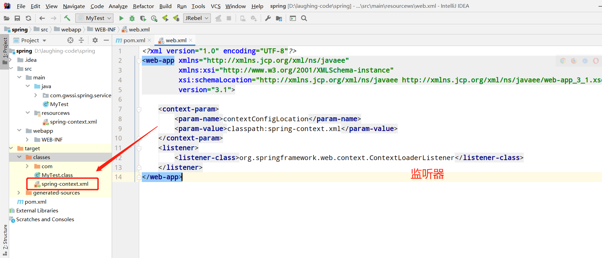

### **1、引入web包**<br/>

```
<dependency>
    <groupId>org.springframework</groupId>
    <artifactId>spring-web</artifactId>
    <version>4.3.17.RELEASE</version>
</dependency>
```

### **2、配置web.xml**<br/>
  


### 3、SpringContext

当一个类实现了这个接口（`ApplicationContextAware`）之后，这个类就可以方便获得 `ApplicationContext` 中的所有 bean。换


&nbsp;&nbsp; 本人授权[维权骑士](http://rightknights.com)对我发布文章的版权行为进行追究与维权。未经本人许可，不可擅自转载或用于其他商业用途。


