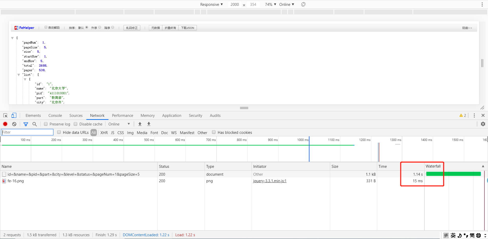
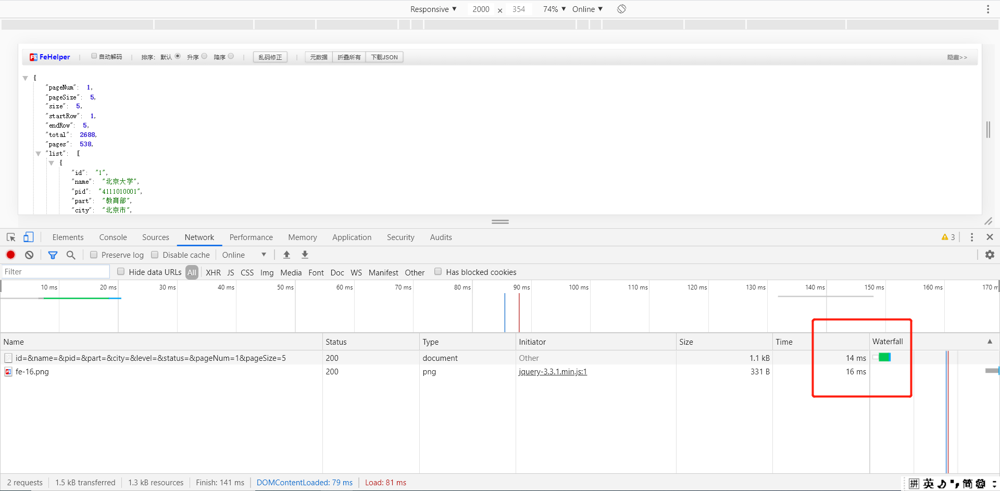
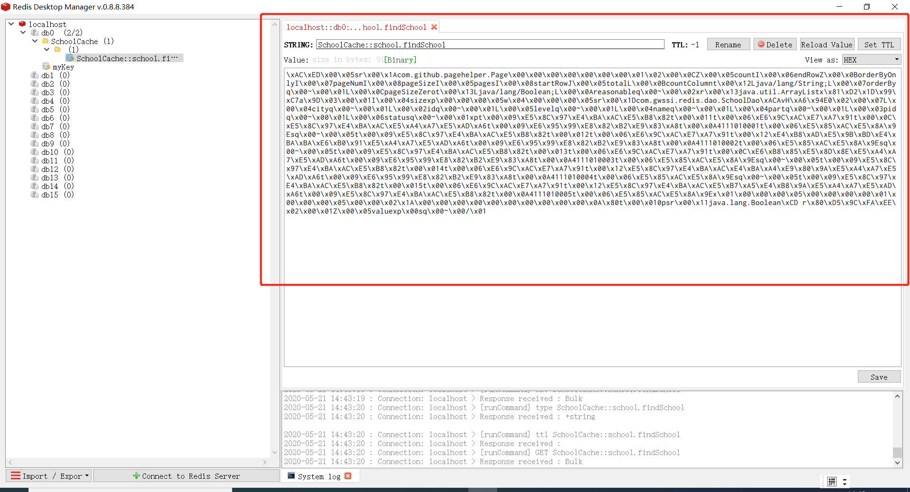

### **1、pom**<br/>    

    <dependency>
        <groupId>org.springframework.boot</groupId>
        <artifactId>spring-boot-starter-data-redis</artifactId>
    </dependency>
    <dependency>
    	<groupId>org.mybatis.spring.boot</groupId>
    	<artifactId>mybatis-spring-boot-starter</artifactId>
    	<version>1.3.2</version>
    </dependency>
    <dependency>
    	<groupId>mysql</groupId>
    	<artifactId>mysql-connector-java</artifactId>
    	<scope>runtime</scope>
    </dependency>

现在底层已经不采用jredis的链接方式，而采用lettuce（采用netty,实例可以在多个线程中共享）。


### 2、yml <br/>

```
mybatis:
  mapper-locations: classpath:mapping/*.xml
  type-aliases-package: com.gwssi.redis.dao
  configuration:
    cache-enabled: true   #开启缓存


logging:
  level:
    com.gwssi.redis.mapper: debug

pagehelper:
  helperDialect: mysql
  reasonable: true
  supportMethodsArguments: true
  pageSizeZero: false #pageSize=0

  redis:
    host: 127.0.0.1
    port: 6379
    password:
    pool:
      max-active: 100
      max-idle: 10
      max-wait: 100000
    timeout: 0

```

### 3、RedisTemplate测试类 <br/>


**RedisTemplate提供了redis各种操作、异常处理及序列化**

```
@SpringBootTest
class RedisApplicationTests {

    @Autowired
    private RedisTemplate redisTemplate;

    @Test
    void contextLoads() {
        // set String 类型
        redisTemplate.opsForValue().set("myKey","myValue");
        redisTemplate.opsForValue().get("myKey");

    }

}
```

### 4、RedisConfig配置类<br/>


```
配置json序列化等
```


### 5、mybatis二级缓存

Mybatis 的缓存是针对Sql语句查询效率的优化，一级缓存与二级缓存，是针对短时间内重复查询而做的优化<br/>

Mybatis 默认只开启一级缓存，一级缓存只是相对于同一个 SqlSession 而言。<br/>

只有在参数和SQL完全一样的情况下，并且使用同一个 SqlSession的情况下，Mybatis才会将第一次的查询结果缓存起来，后续同一个SqlSession的再查询，就会命中缓存，而不是去直接查库

当执行SQL查询中间发生了增删改的操作，MyBatis会把SqlSession的缓存清空。<br/>


二级缓存需要手动配置，使得缓存在SqlSessionFactory层面上能够提供给各个Sql Session共享，由同一个SqlSessionFactory对象创建的SqlSession共享其缓存<br/>


**使用：**

1、启动类添加注解 @EnableCaching<br/>

2、mapper 里添加缓存注解<br/>

```
 @Repository
public interface SchoolMapper {

    @Cacheable(value = "SchoolCache", key = "'school.findSchool'")
    public List<SchoolDao> findSchool(SchoolDao schoolDao);

}
```

3、DAO类序列化  <br/>

```
implements Serializable

```

注意传递对象必须要序列化。


**效果：**

若业务数据命中率很高，用redis效果会很好







&nbsp;&nbsp;&nbsp;&nbsp; 本人授权[维权骑士](http://rightknights.com)对我发布文章的版权行为进行追究与维权。未经本人许可，不可擅自转载或用于其他商业用途。


