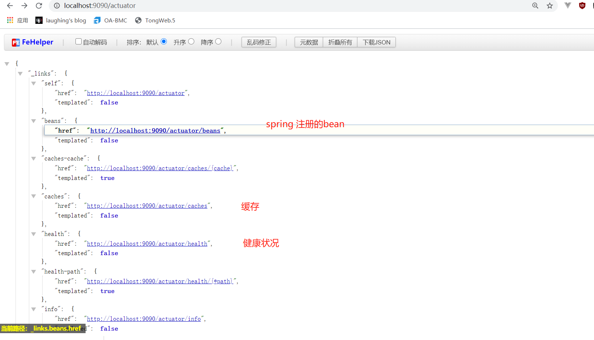
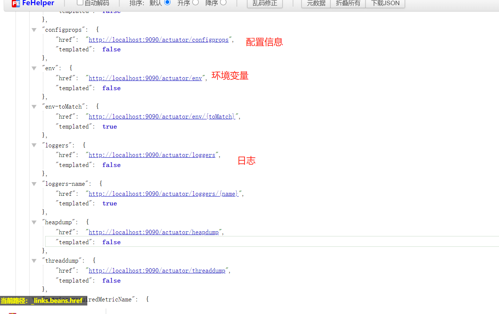
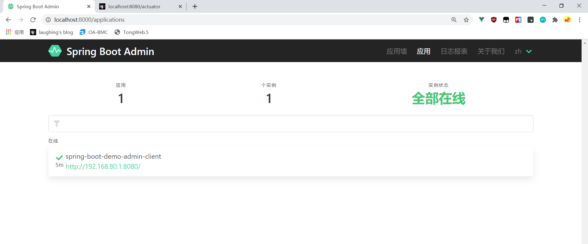
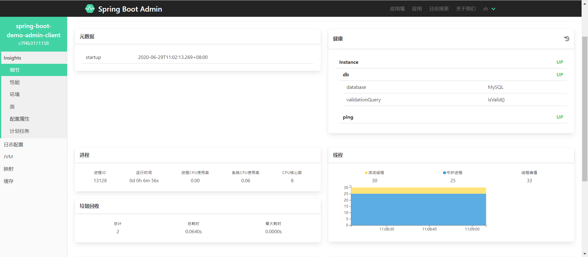
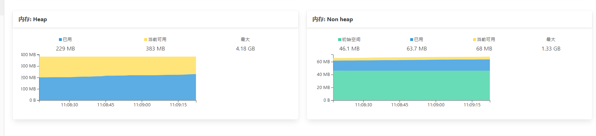
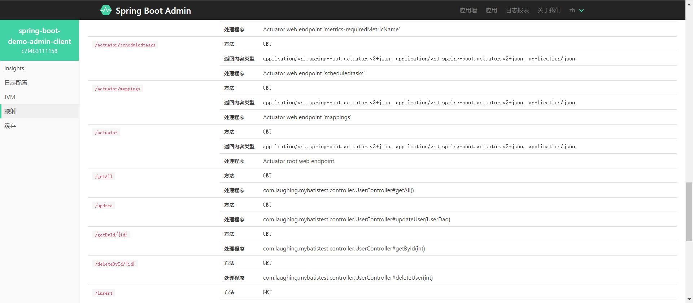
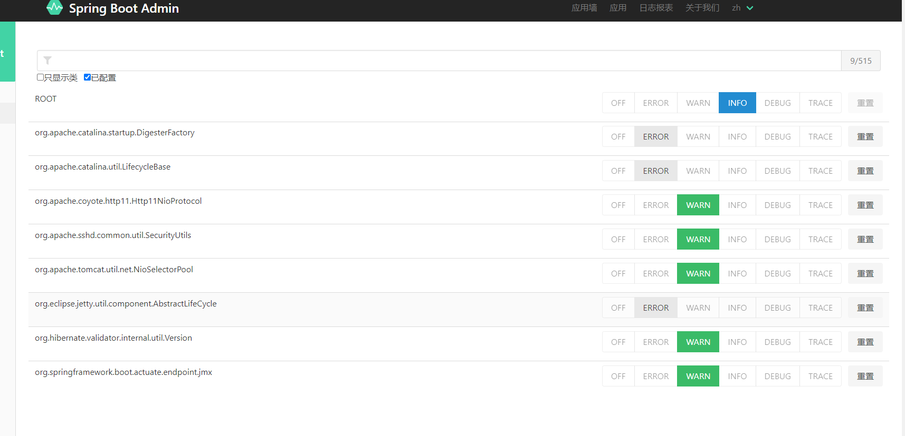

::: tip Sping boot
Spring Boot Admin是一个开源社区项目，用于管理、监控SpringBoot应用程序。 应用程序作为Spring Boot Admin Client以http方式向Spring Boot Admin Server注册或使用SpringCloud注册中心（Eureka等）发现。

github: [https://github.com/codecentric/spring-boot-admin](https://github.com/codecentric/spring-boot-admin)

:::

## 一、Spring Boot Actuator

Actuator为SpringBoot自带监控功能，可以帮助实现对程序内部运行情况监控，比如监控状况、Bean加载情况、环境变量、日志信息、线程信息等。

```xml
<dependency>
    <groupId>org.springframework.boot</groupId>
    <artifactId>spring-boot-starter-actuator</artifactId>
</dependency>
```

相关配置：

```
# 放开Actuator Web REST 端点,否则访问不到
management:
  endpoint:
    health:
      # 端点健康情况，默认值"never"，设置为"always"可以显示硬盘使用情况和线程情况
      show-details: always
  endpoints:
    web:
      exposure:
        # 设置端点暴露的哪些内容，默认["health","info"]，设置"*"代表暴露所有可访问的端点
        include: "*"
```

启动登录后即可看spring-boot的监控信息





## 二、Spring Boot Admin

### spring-boot-admin-starter-client

客户端需要引入client的pom，能够被服务端发现。

```
<dependency>
    <groupId>de.codecentric</groupId>
    <artifactId>spring-boot-admin-starter-client</artifactId>
    <version>2.2.3</version>
</dependency>
```

配置信息：

```
spring:
  application:
    # Spring Boot Admin展示的客户端项目名，不设置，会使用自动生成的随机id
    name: spring-boot-demo-admin-client
  boot:
    admin:
      client:
        # Spring Boot Admin 服务端地址
        url: "http://localhost:8000/"
```

###  spring-boot-admin-starter-server

客户端需要引入服务端的pom

```
<dependency>
    <groupId>de.codecentric</groupId>
    <artifactId>spring-boot-admin-starter-server</artifactId>
    <version>2.2.3</version>
</dependency>
```

端口与client配置的  boot:admin: client:url:一致

```
server:
  port: 8000
```

注意服务端需要在启动类添加启动注解：

```
@EnableAdminServer
```




点进应用墙查看详细信息：



内存使用：



查看映射：




还有JVM、缓存、日志等级配置等：



后续在spring cloud的学习中可以继续了解admin管理台的

### eureka实现

### security实现


&nbsp;&nbsp;&nbsp; 本人授权[维权骑士](http://rightknights.com)对我发布文章的版权行为进行追究与维权。未经本人许可，不可擅自转载或用于其他商业用途。


