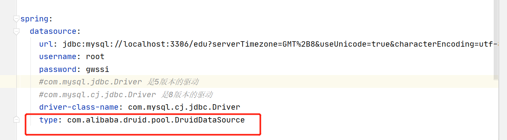
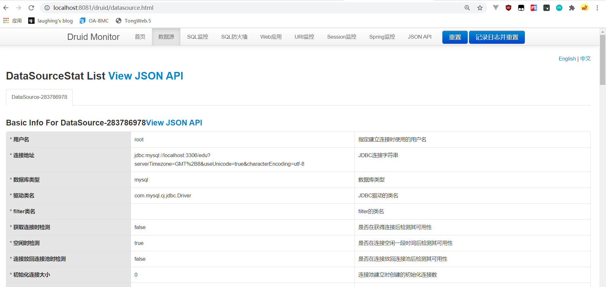
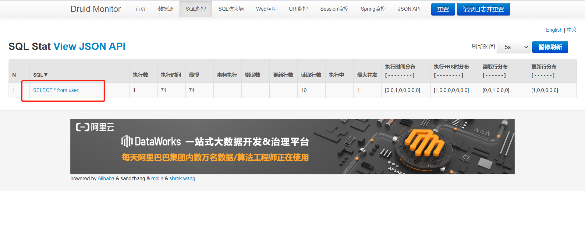

::: tip Sping boot
 Druid 是阿里巴巴开源的一个数据库连接池，Druid能够提供强大的监控和扩展功，并防止sql注入。
:::

## 一、配置

导入依赖

```
<dependency>
    <groupId>com.alibaba</groupId>
    <artifactId>druid</artifactId>
    <version>1.1.21</version>
</dependency>
```

配置数据源：



​	其他配置项

```
spring:
  datasource:
    url: jdbc:mysql://localhost:3306/edu?serverTimezone=GMT%2B8&useUnicode=true&characterEncoding=utf-8
    username: root
    password: xxxx
    #com.mysql.jdbc.Driver 是5版本的驱动
    #com.mysql.cj.jdbc.Driver 是8版本的驱动
    driver-class-name: com.mysql.cj.jdbc.Driver
    type: com.alibaba.druid.pool.DruidDataSource
    #druid 数据源专有配置
    initialSize: 5
    minIdle: 5
    maxActive: 20
    maxWait: 60000
    timeBetweenEvictionRunsMillis: 60000
    minEvictableIdleTimeMillis: 300000
    validationQuery: SELECT 1 FROM DUAL
    testWhileIdle: true
    testOnBorrow: false
    testOnReturn: false
    # 打开PSCache
    poolPreparedStatements: true
    #配置监控统计拦截的filters，stat:监控统计、log4j：日志记录、wall：防御sql注入
    #如果运行时报错  java.lang.ClassNotFoundException: org.apache.log4j.Priority
    #则导入 log4j 依赖即可，Maven 地址： https://mvnrepository.com/artifact/log4j/log4j
    filters: stat,wall,log4j,config
    #指定每个连接上PSCache的大小
    maxPoolPreparedStatementPerConnectionSize: 20
    #合并多个DruidDataSource的监控数据
    useGlobalDataSourceStat: true
    #通过connectProperties属性来打开mergeSql功能；慢SQL记录
    connectionProperties: druid.stat.mergeSql=true;druid.stat.slowSqlMillis=5000

```


## 二、Druid 监控

编写配置类：

```
@Configuration
public class DruidConfig {
    @ConfigurationProperties(prefix = "spring.datasource")
    @Bean
    public DataSource dataSource() {
        return new DruidDataSource();
    }

    // TODO 后台监控
    @Bean
    public ServletRegistrationBean druid() {
        ServletRegistrationBean<StatViewServlet> bean = new ServletRegistrationBean<>(new StatViewServlet(), "/druid/*");
        HashMap<String, String> inteParameters = new HashMap<>();
        inteParameters.put("loginUsername","admin");
        inteParameters.put("loginPassWord","123456");
        inteParameters.put("allow","");
        bean.setInitParameters(new HashMap<>());
        return bean;
    }
    /**
     * 配置web监控的filter
     * @return
     */
    @Bean
    public FilterRegistrationBean webStatFilter(){
        FilterRegistrationBean bean = new FilterRegistrationBean();
        bean.setFilter(new WebStatFilter());
        Map<String,String> initParams = new HashMap<>();
        initParams.put("exclusions","/static/*,*.js,*.gif,*.jpg,*.png,*.css,*.ico,/druid/*");
        bean.setInitParameters(initParams);
        bean.setUrlPatterns(Arrays.asList("/*"));
        return  bean;
    }
}
```




可以看到sql的执行信息

