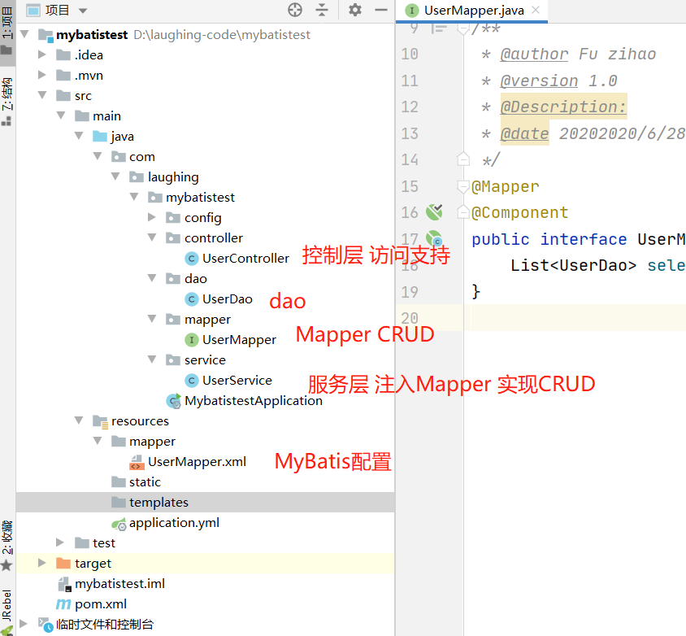
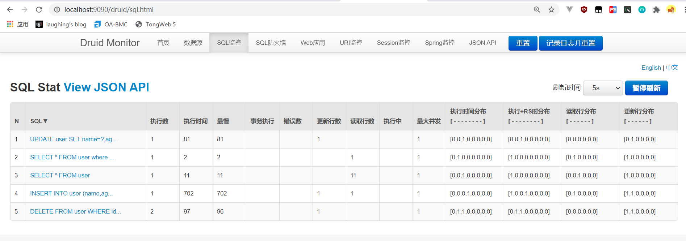

::: tip Sping boot
MyBatis 是支持定制化 SQL、存储过程以及高级映射的持久层ORM框架,对JDBC进行封装,
MyBatis 直接使用原生SQL 语句，优化空间比较大。本文用Springboot集成，数据库用mysql。
:::

## 一、pom文件引入  

    <dependency>
    	<groupId>org.mybatis.spring.boot</groupId>
    	<artifactId>mybatis-spring-boot-starter</artifactId>
    	<version>2.1.3</version>
    </dependency>
    <dependency>
    	<groupId>mysql</groupId>
    	<artifactId>mysql-connector-java</artifactId>
    	<scope>runtime</scope>
    </dependency>

## 二、配置数据源

参照上个章节配置JDBC和Druid的内容看，在yml中配置数据库<br>

配置mybatis

```
mybatis:
  #mapper配置文件
  mapper-locations: classpath:mapper/*.xml
  # mybatis中的type-aliases-package是为了配置xml文件中resultType返回值的包位置，如果未配置请使用全包名
  type-aliases-package: com.laughing.mybatistest.dao
```

## 三、目录结构

符合标准的MVC形式，控制层Controller Autowired了service,服务层service又Autowired了mapper，实现CRUD。




## 四、编写代码
写一个CRUD
### DAO

```
@Data
@NoArgsConstructor
@AllArgsConstructor
@Repository
public class UserDao {
    private String name;
    private int age;
    private int id;
    private String email;
    private Date create_time;
    private Date update_time;
    private int version;

    @Override
    public String toString() {
        return "UserDao{" +
                "name='" + name + '\'' +
                ", age=" + age +
                ", id=" + id +
                ", email='" + email + '\'' +
                ", create_time=" + create_time +
                ", update_time=" + update_time +
                ", version=" + version +
                '}';
    }
}
```

### Mapper

```
@Mapper
@Component
public interface UserMapper {
    /**
     * 查询全部
     *
     * @return
     */
    List<UserDao> selectAll();

    /**
     * 按id查询
     */
    UserDao selectById(int id);

    /**
     * insert
     */
    int insertUser(UserDao userDao);

    /**
     * delete
     */
    int deleteUserById(int id);

    /**
     * UPDATE
     */
    int updateUser(UserDao userDao);
}
```

### UserService

```
@Service
public class UserService {
    @Autowired
    private UserMapper UserMapper;

    public List<UserDao> selectAll() {
        return UserMapper.selectAll();
    }

    public UserDao selectById(int id) {
        return UserMapper.selectById(id);
    }

    public int insertUser(UserDao userDao) {
        return UserMapper.insertUser(userDao);
    }

    public int deleteUserById(int id) {
        return UserMapper.deleteUserById(id);
    }

    public int updateUser(UserDao userDao) {
        return UserMapper.updateUser(userDao);
    }

}
```

### UserController

```
@RestController
public class UserController {

    public static final Logger logger = LoggerFactory.getLogger(UserController.class);


    @Autowired
    private UserService userService;

    @GetMapping("/getAll")
    public List<UserDao> getAll() {
        return userService.selectAll();
    }

    @GetMapping("getById/{id}")
    public UserDao getById(@PathVariable("id") int id) {
        return userService.selectById(id);
    }

    /**
     * http://localhost:9090/insert?name=ming&age=3&email=666
     *
     * @param userDao
     */
    @GetMapping("/insert")
    public void insertUser(UserDao userDao) {
        logger.info("insert =================>>" + userDao.toString());
        int result = userService.insertUser(userDao);
        if (result == 1) {
            logger.info("insert =================>>成功！！");
        }
    }

    @GetMapping("deleteById/{id}")
    public void deleteUser(@PathVariable("id") int id) {
        int result = userService.deleteUserById(id);
        if (result == 1) {
            logger.info("delete =================>>成功！！");
        }
    }
    /**
     * http://localhost:9090/update?name=li&age=7&email=777&id=101
     *
     * @param userDao
     */
    @GetMapping("/update")
    public void updateUser(UserDao userDao) {
        logger.info("update =================>>" + userDao.toString());
        int result = userService.updateUser(userDao);
        if (result == 1) {
            logger.info("update =================>>成功！！");
        }
    }

}
```

### mapper.xml

```
<?xml version="1.0" encoding="UTF-8" ?>
<!DOCTYPE mapper PUBLIC "-//mybatis.org//DTD Mapper 3.0//EN" "http://mybatis.org/dtd/mybatis-3-mapper.dtd" >
<!-- 1、它在命名空间 “com.laughing.mybatistest.mapper.UserMapper”
中定义了一个名为 “selectAll” 的映射语句-->
<mapper namespace="com.laughing.mybatistest.mapper.UserMapper">
    <!--    2、resultType，我在yml中配置了
        type-aliases-package: com.laughing.mybatistest.dao
        这里resultType就不用写全。
        3、resultType可以是java的基础类型、实体类、map\list
        4、id为具体的方法名-->
    <select id="selectAll" resultType="UserDao">
        SELECT * FROM user
    </select>
    <!--5、parameterType为参数类型-->
    <select id="selectById" parameterType="int" resultType="UserDao">
        SELECT * FROM user where id = #{id}
    </select>
    <!--6、useGeneratedKeys设置主键自增-->
    <insert id="insertUser" useGeneratedKeys="true" keyProperty="id">
        INSERT INTO user (name,age,email) values (#{name},#{age},#{email})
    </insert>

    <delete id="deleteUserById" parameterType="int">
        DELETE FROM user WHERE id = #{id}
    </delete>
    
    <update id="updateUser">
        UPDATE user SET name=#{name},age=#{age},email=#{email} WHERE id = #{id}
    </update>
    
</mapper>
```

## 五、注解版本

既然用到了spring boot当然是0配置xml了，所以这里用注解实现CRUD，首先把mapper.xml删除，去掉yml中mapper-locations的配置，修改mapper类即可。

```
@Mapper
@Component
public interface UserMapper {
    /**
     * 查询全部
     *
     * @return
     */
    @Select("SELECT * FROM user")
    List<UserDao> selectAll();

    /**
     * 按id查询
     */
    @Select("SELECT * FROM user where id = #{id}")
    UserDao selectById(int id);

    /**
     * insert
     */
    @Options(useGeneratedKeys = true,keyProperty = "id")//id自增长
    @Insert("INSERT INTO user (name,age,email) values (#{name},#{age},#{email})")
    int insertUser(UserDao userDao);

    /**
     * delete
     */
    @Delete("DELETE FROM user WHERE id = #{id}")
    int deleteUserById(int id);

    /**
     * UPDATE
     */
    @Update("UPDATE user SET name=#{name},age=#{age},email=#{email} WHERE id = #{id}")
    int updateUser(UserDao userDao);
}
```





&nbsp;

&nbsp;&nbsp;&nbsp; 本人授权[维权骑士](http://rightknights.com)对我发布文章的版权行为进行追究与维权。未经本人许可，不可擅自转载或用于其他商业用途。


