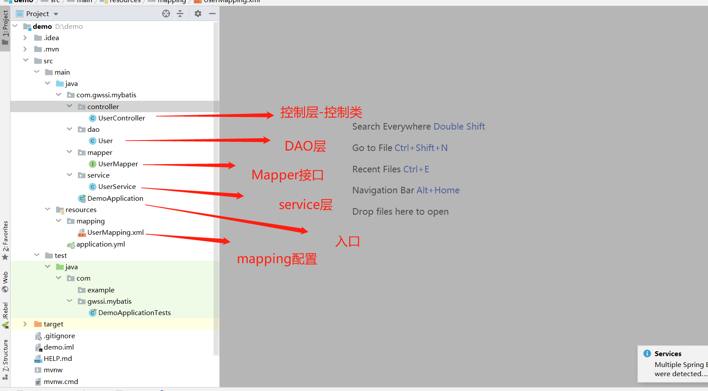

&nbsp;&nbsp;&nbsp;&nbsp;MyBatis 是支持定制化 SQL、存储过程以及高级映射的持久层ORM框架,对JDBC进行封装,MyBatis 直接使用原生SQL 语句，优化空间比较大。本文用Springboot集成，数据库用mysql。
   * 1、**pom文件引入**   

    <dependency>
    	<groupId>org.mybatis.spring.boot</groupId>
    	<artifactId>mybatis-spring-boot-starter</artifactId>
    	<version>1.3.2</version>
    </dependency>
	<dependency>
		<groupId>mysql</groupId>
		<artifactId>mysql-connector-java</artifactId>
		<scope>runtime</scope>
	</dependency>

   * 2、**application.yml源文件配置**   

    #配置服务器信息
    server:
      port: 8080
    spring:
      #mysql数据库相关配置
      datasource:
        url: jdbc:mysql://localhost:3306/xxxx?useUnicode=true&characterEncoding=utf-8&useSSL=true&serverTimezone=UTC
        username: root
        password: ******
        driver-class-name: com.mysql.jdbc.Driver   #mysql驱动
    #mybatis依赖
    mybatis:
      mapper-locations: classpath:mapping/*Mapper.xml
      type-aliases-package: com.gwssi.mybatis.dao
    
    #showSql
    logging:
      level:
        com:
          gwssi:
            mybatis:
              mapper : debug  
   
   
   * 3、**目录结构**      
   

   * 4、**DAO层** 
 
    package com.gwssi.mybatis.dao;
    
    /**
     * Created with IntelliJ IDEA
     *
     * @version 1.0.0
     * @author: ZIHAO FU
     * @create: 2020/4/14 16:59
     * @description:
     */
    public class User {
        private Integer id;
        private String userName;
        private String passWord;
        private String realName;
    
        public Integer getId() {
            return id;
        }
    
        public void setId(Integer id) {
            this.id = id;
        }
    
        public String getUserName() {
            return userName;
        }
    
        public void setUserName(String userName) {
            this.userName = userName;
        }
    
        public String getPassWord() {
            return passWord;
        }
    
        public void setPassWord(String passWord) {
            this.passWord = passWord;
        }
    
        public String getRealName() {
            return realName;
        }
    
        public void setRealName(String realName) {
            this.realName = realName;
        }
    
        @Override
        public String toString() {
            return "User{" +
                    "id=" + id +
                    ", userName='" + userName + '\'' +
                    ", passWord='" + passWord + '\'' +
                    ", realName='" + realName + '\'' +
                    '}';
        }
    
    }
   * 5、**接口API UserService** 
 
    @Repository
    public interface UserMapper {
        User Sel(int id);
    }
   * 6、**接口实现类** 
 
    @Service
    public class UserService {
        @Autowired
        UserMapper userMapper;
        public User Sel(int id){
            return userMapper.Sel(id);
        }
    }   
 
   * 7、**Mapping.xml** 

    <?xml version="1.0" encoding="UTF-8"?>
            <!DOCTYPE mapper PUBLIC "-//mybatis.org//DTD Mapper 3.0//EN" "http://mybatis.org/dtd/mybatis-3-mapper.dtd">
            <mapper namespace="com.gwssi.mybatis.mapper.UserMapper">
                <resultMap id="BaseResultMap" type="com.gwssi.mybatis.dao.User">
                    <result column="id" jdbcType="INTEGER" property="id" />
                    <result column="userName" jdbcType="VARCHAR" property="userName" />
                    <result column="passWord" jdbcType="VARCHAR" property="passWord" />
                    <result column="realName" jdbcType="VARCHAR" property="realName" />
                </resultMap>
                <select id="Sel" resultType="com.gwssi.mybatis.dao.User">
                    select * from user where id = #{id}
                </select>
            </mapper>
       

    
    
    
    
    
    
       
&nbsp;&nbsp;&nbsp;&nbsp; 本人授权[维权骑士](http://rightknights.com)对我发布文章的版权行为进行追究与维权。未经本人许可，不可擅自转载或用于其他商业用途。

 