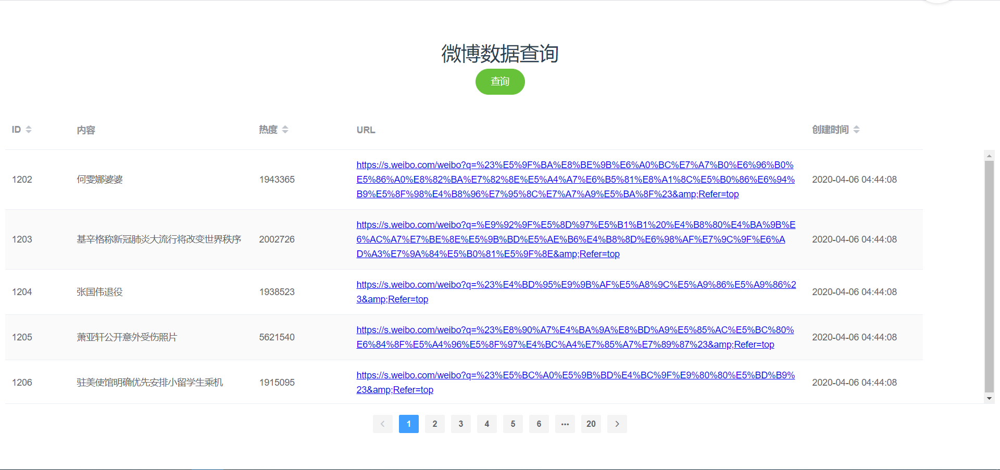
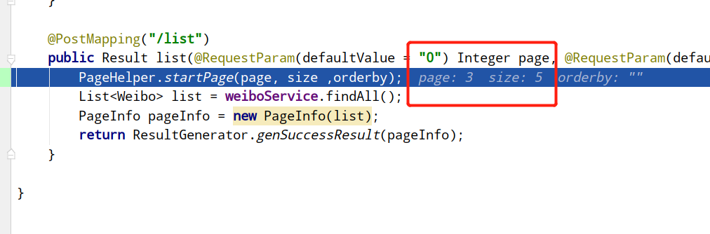
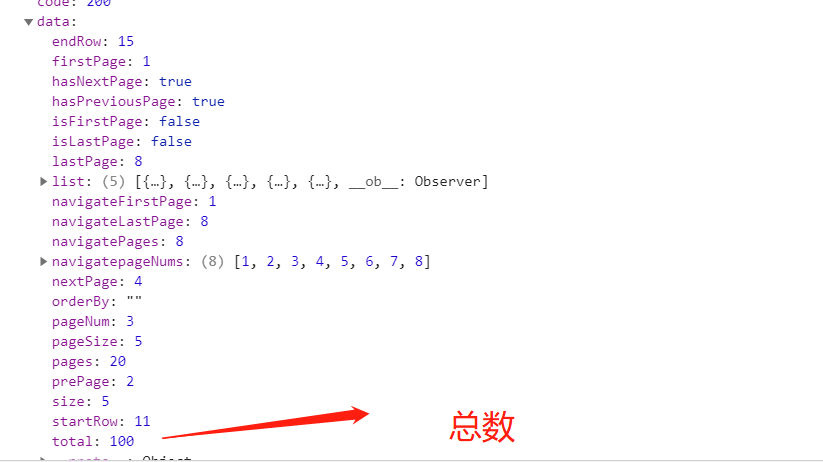

&nbsp;&nbsp;&nbsp;&nbsp;之前写了一个微博热搜的数据抓取工具，把微博热搜存到mysql数据库中，为了方便查询大量的列表数据，就做了
一个Element-ui（vue）+Springboot+Pagehelper简单的前后端分离分页查询的页面。这样就可以这个月最高的热搜是什么之类的。 
&nbsp;&nbsp;&nbsp;&nbsp;效果如图： 
   
&nbsp;&nbsp;&nbsp;&nbsp;首先看Element-ui的table写法： 

    <el-table
      id="xxx"
      stripe
      height="450"    //锁死高度
      :data="list"    //绑定data数据
      @sort-change='sortChange' //升降序改变用到的方法
      style="width: 100%">
    <el-table-column
      sortable="custom"  //可以升降排序
      prop="xxx"
      width="180">
    </el-table-column>
    </el-table>
&nbsp;&nbsp;&nbsp;&nbsp;首先看Element-ui分页器el-pagination： 

    <el-pagination
      style="margin-top:15px;"
      background
      layout="prev, pager, next"
      :current-page.sync="pagination.page" //第几页
      :page-size.sync="pagination.size" //一页显示几条
      :total="pagination.count"        //数据总条数
      @current-change="handleCurrentChange">
    </el-pagination>
&nbsp;&nbsp;&nbsp;&nbsp;需要绑定的data： 

                currentPage: 1, //初始页
                pagesize: 5,    //    每页的数据
                pagination: {
                    page: 1,
                    size: 5,
                    count: 0,
                    orderby: ''  //升降序
                },
&nbsp;&nbsp;&nbsp;&nbsp;发起axios的post请求： 

                this.axios.post(this.HOME2 + "/ipa/weibo/list", this.qs.stringify(this.pagination))
                    .then(res => {
                        this.list = res.data.data.list;
                        this.pagination.count = res.data.data.total;
                    })
&nbsp;&nbsp;&nbsp;&nbsp;Springboot后台： 

    @PostMapping("/list")
    public Result list(@RequestParam(defaultValue = "0") Integer page, @RequestParam(defaultValue = "0") Integer size,@RequestParam(defaultValue = "")String orderby) {
        PageHelper.startPage(page, size ,orderby);
        List<Weibo> list = weiboService.findAll();
        PageInfo pageInfo = new PageInfo(list);
        return ResultGenerator.genSuccessResult(pageInfo);
    }
&nbsp;&nbsp;&nbsp;&nbsp;我们看看pageInfo返回的分页数据，比如我现在请求第三页： 
&nbsp;&nbsp;&nbsp;&nbsp;传入数据page=3 size=5 
   
&nbsp;&nbsp;&nbsp;&nbsp;前台返回数据： 
     

&nbsp;&nbsp;&nbsp;&nbsp;到这里还没完，我们要实现order by按字段排序，首先
在el-table-column中加一个属性sortable="custom"，再声明table里升降序方法@sort-change='sortChange' 

            sortChange(column, prop, order) {
                if (column.order == "ascending") {
                        this.pagination.orderby = column.prop + ' ' + 'ASC';
                } else {

                        this.pagination.orderby = column.prop + ' ' + 'DESC';
                }
                this.weibo.length = 0;
                this.axios.post(this.HOME2 + "/weibo/list", this.qs.stringify(this.pagination))
                    .then(res => {
                        this.list = res.data.data.list;
                        this.pagination.count = res.data.data.total;
                    })
            },
&nbsp;&nbsp;&nbsp;&nbsp;后台`PageHelper.startPage(page, size ,orderby);`传入的orderby
字段的格式为  xxxx ASC或 xxxx DESC,而element-ui table 生成的是ascending这种，注意转换一下。
即可完成查询。
           
&nbsp;&nbsp;&nbsp;&nbsp; 本人授权[维权骑士](http://rightknights.com)对我发布文章的版权行为进行追究与维权。未经本人许可，不可擅自转载或用于其他商业用途。

 