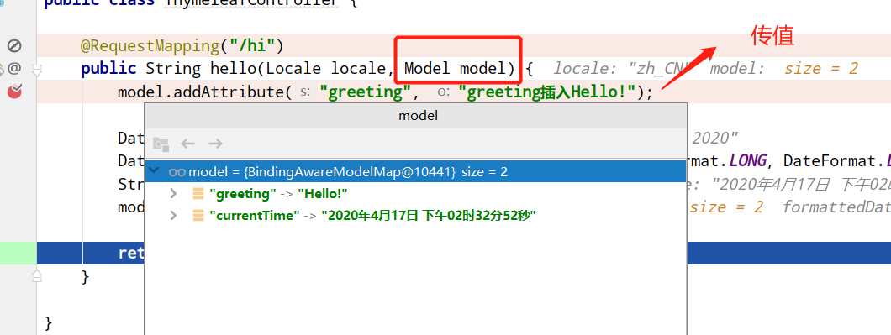

   * 1、**Hello Spring Boot 2.0!**   

    @RestController
    public class HelloController {
    	
        @RequestMapping("/")
        public String index() {
            return "Hello Spring Boot 2.0!";
        }
    }
    
    @RestController  // Controller 里面的方法都以 json 格式输出
    @RequestMapping   //注解来将请求URL映射到整个类上
   * 2、**json 接口开发**   

    @RestController
    public class UserController {
        @RequestMapping("/getUser")
        public User getUser() {
        	User user=userRepository.findByUserName("6");
            return user;
        }
     }
   * 3、**application.properties自定义配置Property** 
&nbsp;&nbsp;&nbsp;&nbsp;配置com.neo.title=laughing 
&nbsp;&nbsp;&nbsp;&nbsp;类里注解使用@Value("${com.neo.title}")   
   * 4、**springboot+thymeleaf** 
&nbsp;&nbsp;&nbsp;&nbsp;配置信息： 

    #模板的模式，支持 HTML, XML TEXT JAVASCRIPT
    spring.thymeleaf.mode=HTML5
    #编码 可不用配置
    spring.thymeleaf.encoding=UTF-8
    #开发配置为false,避免修改模板还要重启服务器
    spring.thymeleaf.cache: false
    #配置模板路径，默认是templates，可以不用配置
    spring.thymeleaf.prefix: classpath:/templates

&nbsp;&nbsp;&nbsp;&nbsp;ThymeleafController： 

        @RequestMapping("/hi")
    	public String hello(Locale locale, Model model) {
    		model.addAttribute("greeting", "greeting插入Hello!");
    
    		Date date = new Date();
    		DateFormat dateFormat = DateFormat.getDateTimeInstance(DateFormat.LONG, DateFormat.LONG, locale);
    		String formattedDate = dateFormat.format(date);
    		model.addAttribute("currentTime", formattedDate);
    
    		return "hello";
    	}
    
    }

   
    
  
    

&nbsp;&nbsp;&nbsp;&nbsp; 本人授权[维权骑士](http://rightknights.com)对我发布文章的版权行为进行追究与维权。未经本人许可，不可擅自转载或用于其他商业用途。

 