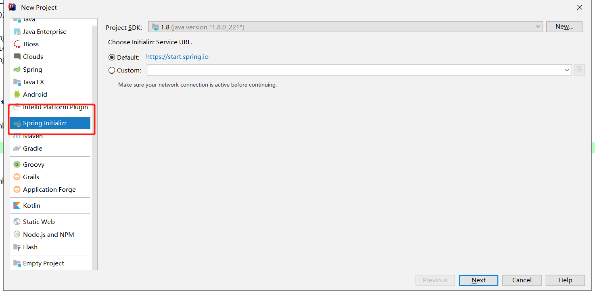
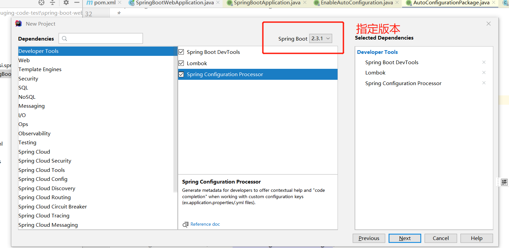
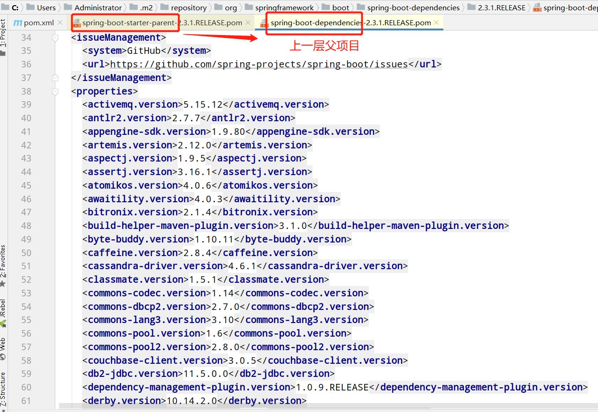
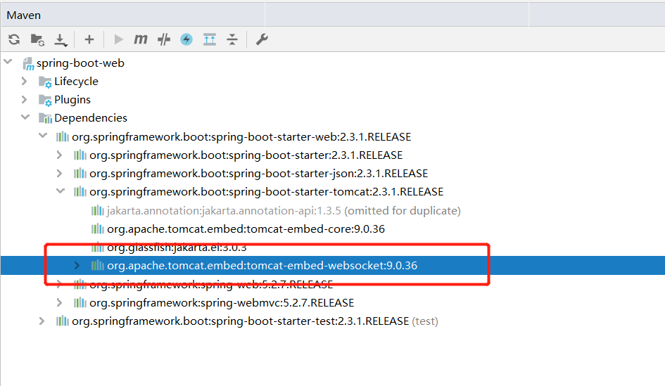
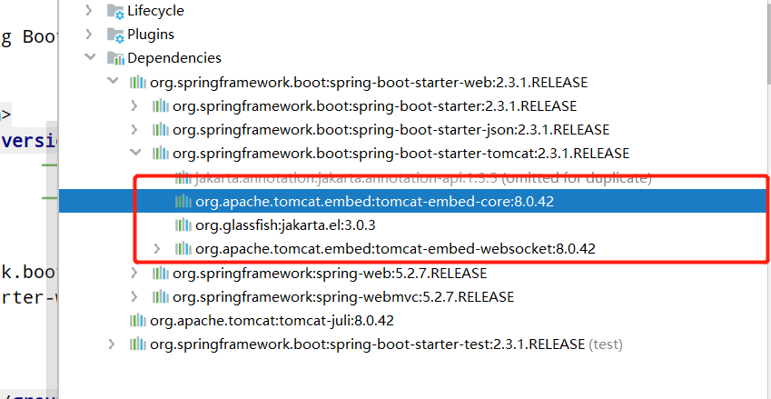
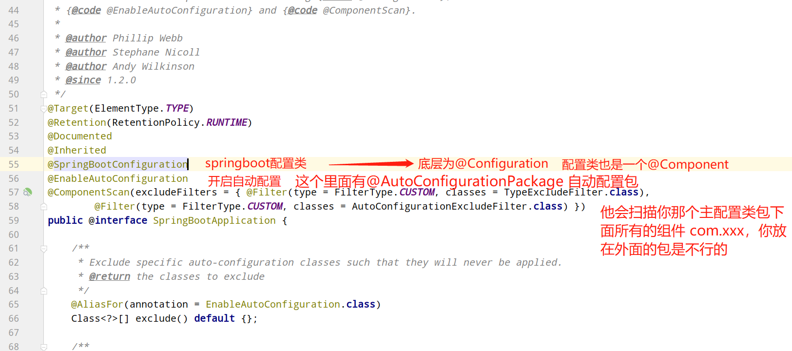

::: tip Sping boot
 在spring boot的学习中，我想更多的去从文档来看：
 [https://spring.io/](https://spring.io/)
:::


## 一、spring boot的特性

spring boot真正好用的地方有两点。<br>

一个是在于他易于创建、简化配置（自动化配置），不需要任何xml配置，可以很容易的把环境搭建起来。（开箱即用）。另一个是他易于集成，封装了各种经常使用的套件，MyBatis、hibernate、redis想使用只用打一个start进来。

还有很多优点，看官方文档的Features：<br>
1、Create stand-alone Spring applications
 <br>(spring boot项目都是stand-alone的)<br>

2、Embed Tomcat, Jetty or Undertow directly (no need to deploy WAR files)<br>（不用容器，内嵌tomcat，不用war包了，都是jar）<br>

3、Provide opinionated 'starter' dependencies to simplify your build configuration（<br>start场景启动器的引入简化了配置）<br>

4、Automatically configure Spring and 3rd party libraries whenever possible（自动配置）<br>

5、Provide production-ready features such as metrics, health checks, and externalized configuration（监控、检查、部署的好处）<br>

6、Absolutely no code generation and no requirement for XML configuration（不用xml）<br>


## 二、Spring Boot构建
 **要求：** jdk1.8+ maven 3.3+

&nbsp;&nbsp;&nbsp;&nbsp;Spring Boot官网：[https://spring.io/projects/spring-boot](https://spring.io/projects/spring-boot)<br>
&nbsp;&nbsp;&nbsp;&nbsp;idea可用构建器快速构建，这个会自动导入spring的pom依赖，并生成标准的maven项目的目录，建议使用。<br>
 

你可以导入各种starter场景启动器，选择所需要的模块：

 


## 三、Spring Boot依赖

分析项目的依赖：<br>

**spring-boot-starter-parent:**

首先是父依赖spring-boot-starter-parent，它用来提供相关的Maven默认依赖，注意这个版本的设置2.3.1.RELEASE，后续的spring依赖如果不指定版本，默认就取这个，这是一个重要的作用。<br>

```
<parent>
    <groupId>org.springframework.boot</groupId>
    <artifactId>spring-boot-starter-parent</artifactId>
    <version>2.3.1.RELEASE</version>
    <relativePath/> <!-- lookup parent from repository -->
</parent>
```

点进去发现他是定义了 spring-boot-dependencies，可以看到各种版本定义。

 

spring构建了很多**starter场景启动器**，spring-boot-starter--xxxx，需要什么场景，就引入什么场景，非常的方便，比如我们使用web项目，就可以直接引入spring-boot-starter-web<br>

spring-boot-starter-web**<br>

### 容器相关：

spring-boot-starter-web包含HttpMessageConverter、spring MVC等组件，提供web支持。并且会自动嵌入tomcat容器。可以在配置文件中配置server.为前缀的嵌入Web容器配置。比如server.port: 8080

```
<dependency>
    <groupId>org.springframework.boot</groupId>
    <artifactId>spring-boot-starter-web</artifactId>
</dependency>
```

 

可以看到这个spring-boot-starter-web，引入的tomcat的版本为9.0.36。我们也可以指定这个tomcat的版本。

```
<properties>
    <java.version>1.8</java.version>
    <tomcat.version>8.0.42</tomcat.version>
</properties>
```

并且需要引入tomcat的包

```
<dependency>
    <groupId>org.apache.tomcat</groupId>
    <artifactId>tomcat-juli</artifactId>
    <version>${tomcat.version}</version>
</dependency>
```




Undertow性能比较好，那比如我们想使用Undertow作为容器，也是可以的。

首先把spring-boot-starter-tomcat，exclusions出去，再引入相应的spring-boot-starter-undertow即可。

```
<dependencies>
    <dependency>
        <groupId>org.springframework.boot</groupId>
        <artifactId>spring-boot-starter-web</artifactId>
        <exclusions>
            <exclusion>
                <groupId>org.springframework.boot</groupId>
                <artifactId>spring-boot-starter-tomcat</artifactId>
            </exclusion>
        </exclusions>
    </dependency>
```


        <dependency>
            <groupId>org.springframework.boot</groupId>
            <artifactId>spring-boot-starter-undertow</artifactId>
        </dependency>
你想用Jetty，同理！

项目里还有一个spring-boot-starter-test的包，可以进行

```
<dependency>
    <groupId>org.springframework.boot</groupId>
    <artifactId>spring-boot-starter-test</artifactId>
    <scope>test</scope>
    <exclusions>
        <exclusion>
            <groupId>org.junit.vintage</groupId>
            <artifactId>junit-vintage-engine</artifactId>
        </exclusion>
    </exclusions>
</dependency>
```

pom文件还引入了一个插件：Spring Boot also provides an optional Maven plugin to create executable jars.

```
<plugins>
    <plugin>
        <groupId>org.springframework.boot</groupId>
        <artifactId>spring-boot-maven-plugin</artifactId>
    </plugin>
</plugins>
```

maven项目添加了spring-boot-maven-plugin插件，当运行mvn package进行打包时，会打包成一个可以直接运行的 JAR 文件，使用“Java -jar”命令就可以直接运行。他这个默认是个JAR,你可以进行声明：

```
<packaging>jar</packaging>
```

```
<packaging>war</packaging>
```


## 四、启动类（入口类）Application

```
@SpringBootApplication
public class SpringbootApplication {

    public static void main(String[] args) {
        SpringApplication.run(SpringbootApplication.class, args);
    }

}
```

@SpringBootApplication注解声明这个类为入口类，通过这个main方法启动springboot应用。<br>

那spring boot究竟是如何启动的呢？可以点进去看他是由多个注解组合而成。<br>

 


We generally recommend that you locate your main application class in a root package above other classes. The @SpringBootApplication annotation is often placed on your main class, and it implicitly defines a base “**search package**” for certain items. For example, if you are writing a JPA application, the package of the @SpringBootApplication annotated class is used to search for @Entity items. Using a root package also allows component scan to apply only on your project.


&nbsp;&nbsp;&nbsp;&nbsp; 本人授权[维权骑士](http://rightknights.com)对我发布文章的版权行为进行追究与维权。未经本人许可，不可擅自转载或用于其他商业用途。


