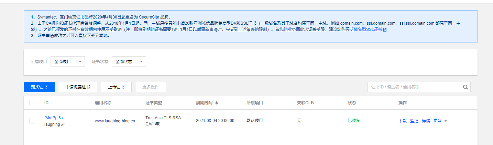
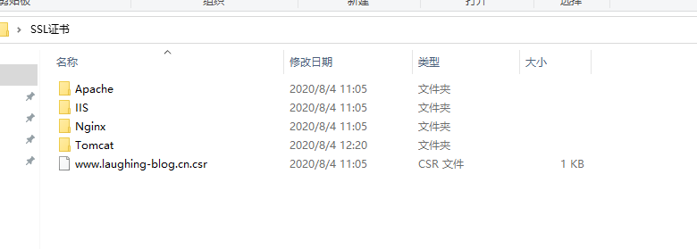
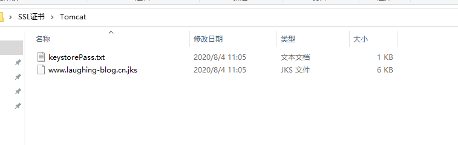
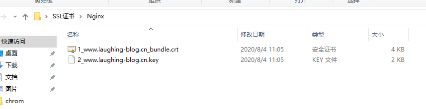
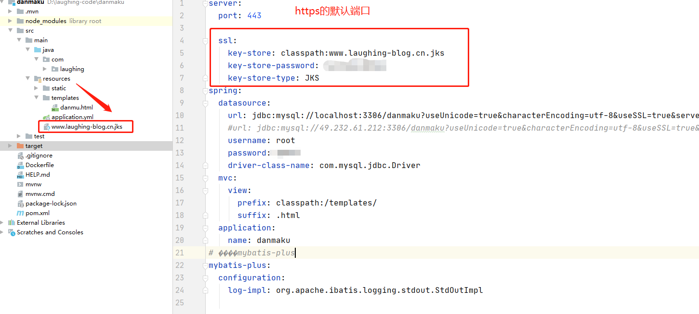

## 一、HTTPS

在计算机网络中学过，https以安全为目标的 HTTP 通道，在HTTP的基础上通过**传输加密和身份认证**保证了传输过程的安全性。具体参考计算机网络。

## 二、SSL证书

SSL（Secure socket layer）证书是数字证书的一种，配置在服务器端，又称服务器证书。它在客户端（浏览器）与服务端（网站服务器）之间搭建一条安全的加密通道，对两者之间交换的信息进行加密，确保传输数据不被泄露或篡改。

SSL证书又分域名型SSL证书（DV SSL），企业型SSL证书（OV SSL），增强型SSL证书（EV SSL）

在腾讯云申请的免费证书，这是个单域名证书：

www.laughing-blog.cn.csr为证书请求文件。

一般来说，主流的Web服务软件，通常都基于两种基础密码库：OpenSSL和Java。

Tomcat、Weblogic、JBoss等，使用Java提供的密码库。通过Java的Keytool工具，生成Java Keystore（JKS）格式的证书文件。

nginx

## 三、在spring boot项目中使用ssl证书

springboot内嵌tomcat,这里使用jks证书。

直接在yml文件中配置就可以了，将证书放在资源目录下

在申请该域名对应服务器上启动项目即可用https访问项目。

&nbsp;&nbsp;&nbsp;&nbsp; 本人授权[维权骑士](http://rightknights.com)对我发布文章的版权行为进行追究与维权。未经本人许可，不可擅自转载或用于其他商业用途。

