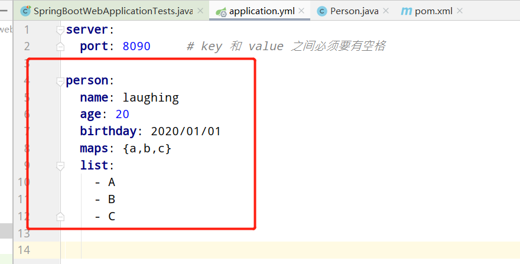
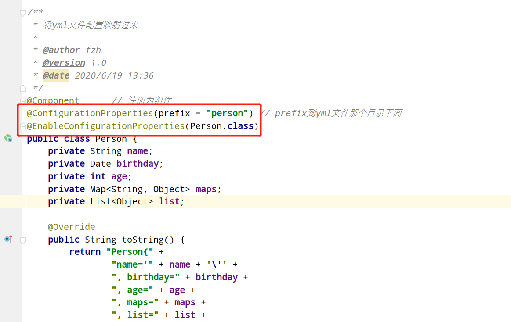
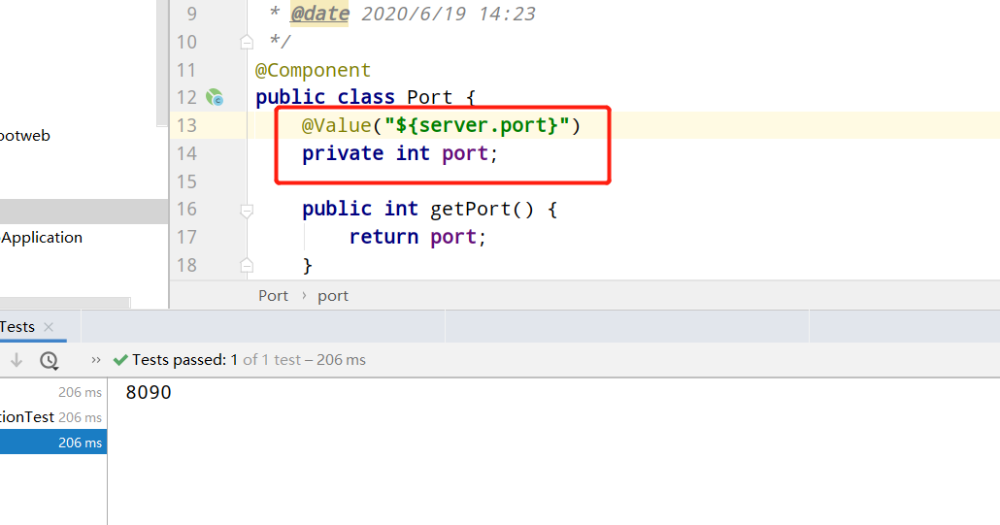
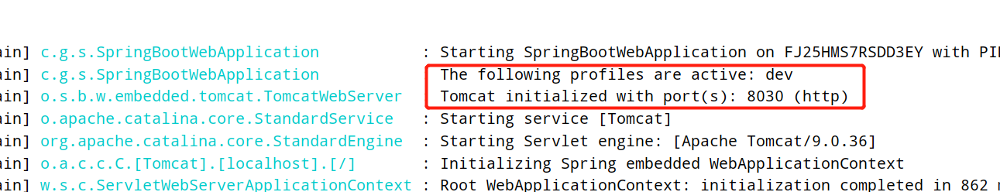
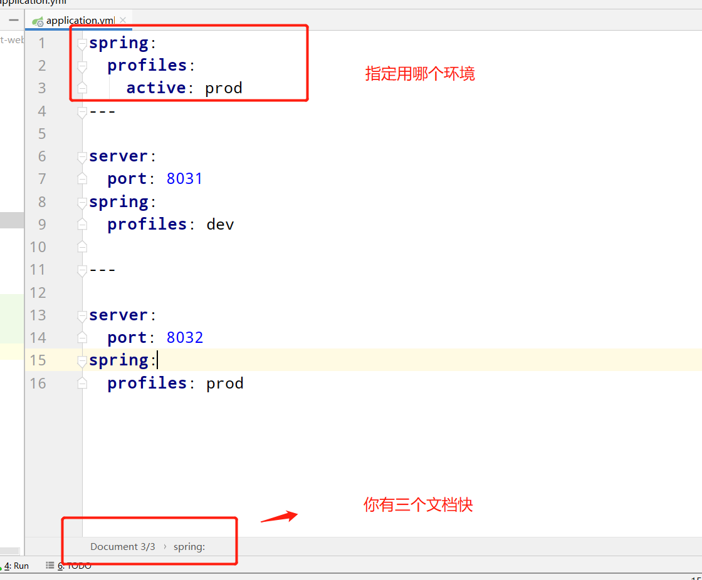
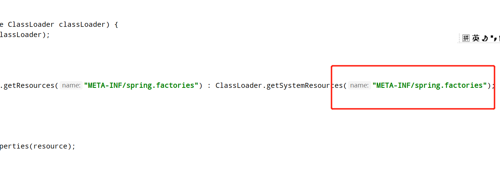
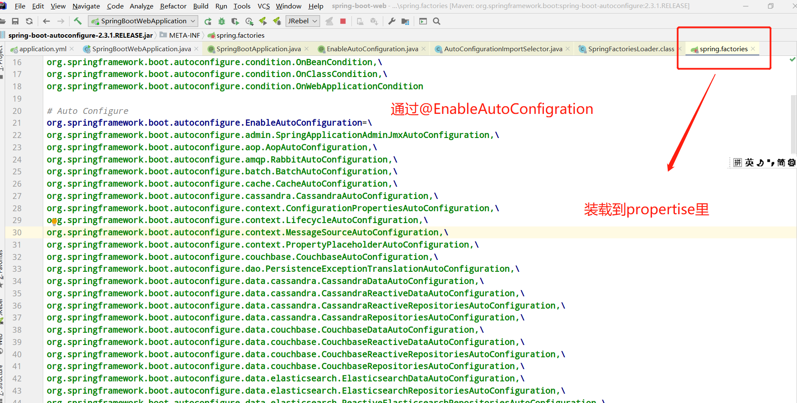
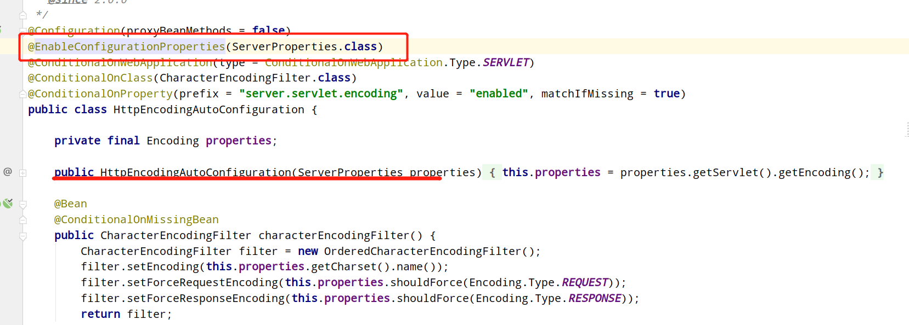
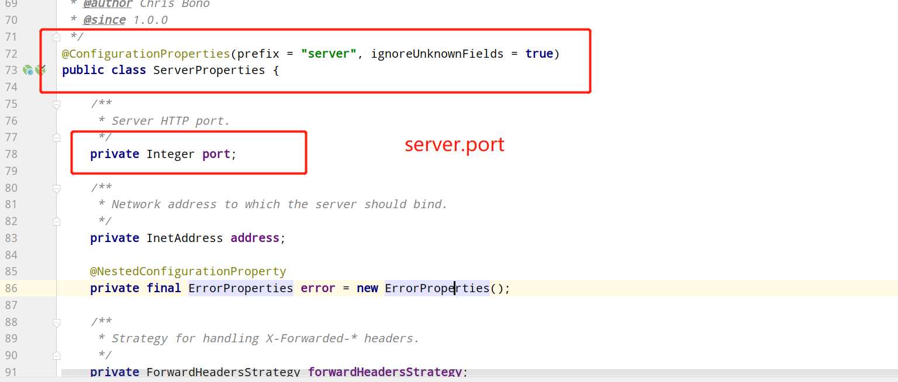
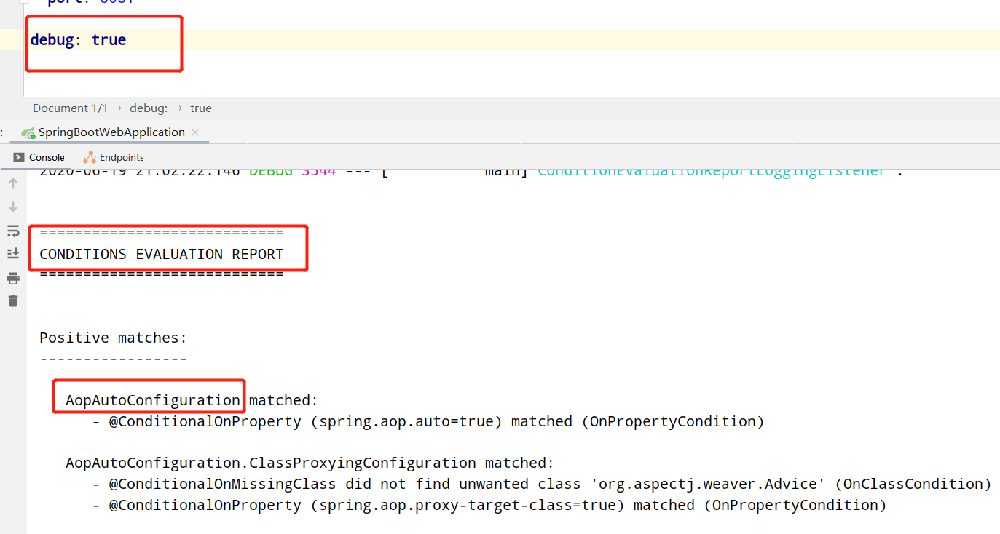

## 一、YAML语法

spring boot的配置文件支持两种application.properties和application.yml，初始化为空，你可以更改一些默认配置，我比较习惯使用yml，看起来更加清晰一点。<br>

YAML 是 "YAML Ain't a Markup Language"（YAML 不是一种标记语言）的递归缩写。在开发的这种语言时，YAML 的意思其实是："Yet Another Markup Language"（仍是一种标记语言）。<br>

- 大小写敏感<br>
- 使用缩进表示层级关系<br>
- 缩进时不允许使用Tab键，只允许使用空格。<br>
- key 和 value 之间必须要有空格<br>
- 相同层级的元素左侧对齐<br>
- \# 表示注释，从这个字符一直到行尾，都会被解析器忽略。<br>
- 它也是支持value为数组，在value前面加 - 即可。<br>

## 二、@ConfigurationProperties和@Value访问yml属性

### 通过@ConfigurationProperties访问yml属性;<br>

比如有一个场景，我在yml中配置了很多http地址、ftp地址。那我如何在代码中读到这些配置并且注入进来呢？

我可以做一个javabean来映射管理所有的ftp地址<br>

首先引入配置的dependency<br>

```
<dependency>
    <groupId>org.springframework.boot</groupId>
    <artifactId>spring-boot-configuration-processor</artifactId>
    <optional>true</optional>
</dependency>
```

比如我在yml文件中添加配置

 

实体类就可以直接注入进来：

 

测试类就可以直接打印出来：


### @Value访问yml属性：

单一的注入方法，比如我想拿到server.port定义的端口号。比如临时取一个配置信息，可以用这种方式。

 


## 三、配置文件占位符用法

```
server:
  port: 8090   

person:
  name: laughing
  uuid: ${random.uuid}   #随机生成uuid
  age: ${random.int(80)} #随机生成一个小于80的int
  port: ${server.port}   #拿到上面配置的port
    my.secret=${random.value}
    my.number=${random.int}
    my.bignumber=${random.long}
    my.uuid=${random.uuid}
    my.number.less.than.ten=${random.int(10)}
    my.number.in.range=${random.int[1024,65536]}
```


## 四、Profile多环境配置文件设置

为了方便的一键切换环境，可以对应开发、测试、生产配置多Profile模式。<br>

我在项目下面建三个yml文件。<br>

application-dev.yml<br>

application-test.yml<br>

application-prod.yml<br>

然后在application.yml中指明现在的环境即可,比如我现在用开发环境<br>

```
spring:
  profiles:
    active: dev
```

 


其实还有一种方法，我们可以使用文档块的方式，只用一个yml文件来实现。如果配置信息比较少，可以用这种方式实现。

 


命令行方式：<br>

可以在idea的arguments中添加读取方式<br>

```
--spring.profiles.active=dev
```

这个功能很强大，比如你往生产上打jar包,你打错了yml，或者你忘了你用的哪个yml环境，你可以：

```
java  -jar   xxxxxx.jar  --spring.profiles.active=prod
```

也是没有问题的。<br>

## 五、自动配置原理
 This annotation tells Spring Boot to “guess” how you want to configure Spring, based on the jar dependencies that you have added. Since spring-boot-starter-web added Tomcat and Spring MVC, the auto-configuration assumes that you are developing a web application and sets up Spring accordingly.<br>
 
springboot启动时，加载主配置类，开启了自动配置功能**@EnableAutoConfiguration**<br>

这个注解主要是用AutoConfigurationImportSelector.java往spring里面import组件。<br>

用selectImports() 方法查看需要导入哪些组件。<br>

```
// 获取配置
List<String> configurations = getCandidateConfigurations(annotationMetadata, attributes);
```

```
List<String> configurations = SpringFactoriesLoader.loadFactoryNames(getSpringFactoriesLoaderFactoryClass(),
				getBeanClassLoader());
```

 

扫描包下面的**META-INF/spring.factories**<br>

封装为Properties对象<br>

也就是说spring.factories中定义的类都加入到容器，实现自动配置。

```
Properties properties = PropertiesLoaderUtils.loadProperties(resource);
```



```
# Auto Configure
org.springframework.boot.autoconfigure.EnableAutoConfiguration=\
```

比如我们看HttpEncodingAutoConfiguration配置类

我们可以看到AutoConfiguration配置类里有很多@Conditional来做条件判断。判断是否注入。<br>

比如：<br>

```
@ConditionalOnWebApplication(type = ConditionalOnWebApplication.Type.SERVLET)
```

就是判断他是不是web项目，如果是，才注入这个properties。

 


**所有在配置文件中能够配置属性的，都在properties类中**。所以我们可以从这个类中分析，自动配置的信息。<br>

如何知道哪些自动配置类通过了@Conditional，进行了配置。只需配置debug: true，就可以打印出CONDITIONS EVALUATION REPORT。<br>

 


如果你不想用其中DataSourceAutoConfiguration：
```
@SpringBootApplication(exclude={DataSourceAutoConfiguration.class})
public class MyApplication {
}
```

&nbsp;&nbsp;&nbsp;&nbsp; 本人授权[维权骑士](http://rightknights.com)对我发布文章的版权行为进行追究与维权。未经本人许可，不可擅自转载或用于其他商业用途。


