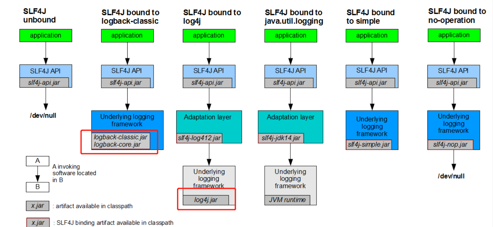
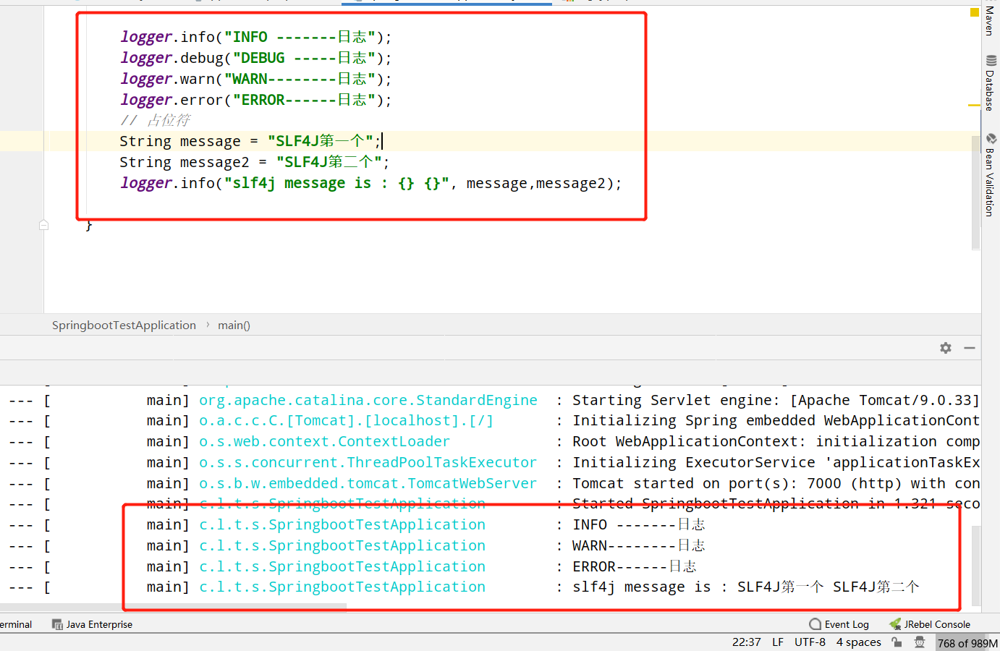

## 一、日志框架

日志框架也是非常多的， 常见的有<br>

JCL、Jboss-logging、slf4j（接口抽象层）<br>

JUL、、logback、log4j、log4j2（实现）<br>

在springboot中，我们底层使用**slf4j + logback** , logback 性能要高于log4j

官网：[http://www.slf4j.org/](http://www.slf4j.org/)<br>

slf4j 的全称是 Simple Loging Facade For Java，即它仅仅是一个为 Java 程序提供日志输出的统一接口，并不是一个具体的日志实现方案，就比如 JDBC 一样，只是一种规则而已。所以单独的 slf4j 是不能工作的，必须搭配其他具体的日志实现方案，比如 apache 的 `org.apache.log4j.Logger`，JDK 自带的 `java.util.logging.Logger`  等。<br>

我们只引入 **slf4j-api.jar**是不能直接记录的，只能通过**logback-core.jar或slf4j-log4j.jar**等

 

### 

springboot依赖了spring-boot-starter-logging。

```
<dependency>
  <groupId>org.springframework.boot</groupId>
  <artifactId>spring-boot-starter-logging</artifactId>
  <version>2.3.1.RELEASE</version>
  <scope>compile</scope>
</dependency>
```


## 二、日志级别 

- fatal(致命的)
- error
- warn
- info
- debug
- trace(堆栈)

## 三、pom.xml引入： 

```text
        <dependency>
            <groupId>org.slf4j</groupId>
            <artifactId>slf4j-log4j12</artifactId>
            <version>1.7.25</version>
        </dependency>
```

## 四、log4j.properties 

在 `src/main/resources` 目录下创建名为 `log4j.properties` 的属性配置文件

```text
#配置了日志级别为 INFO，预定义了名称为 console、file 两种附加器
log4j.rootLogger=INFO, console, file

log4j.appender.console=org.apache.log4j.ConsoleAppender
log4j.appender.console.layout=org.apache.log4j.PatternLayout
log4j.appender.console.layout.ConversionPattern=%d %p [%c] - %m%n
#每天一个文件
log4j.appender.file=org.apache.log4j.DailyRollingFileAppender
log4j.appender.file.File=logs/log.log
log4j.appender.file.layout=org.apache.log4j.PatternLayout
#最大文件
log4j.appender.A3.MaxFileSize=1024KB
#最多10个
log4j.appender.A3.MaxBackupIndex=10
log4j.appender.file.layout.ConversionPattern=%d %p [%c] - %m%n
```

## 五、使用 

```text
@SpringBootApplication
public class SpringbootTestApplication {

    public static final Logger logger = LoggerFactory.getLogger(SpringbootTestApplication.class);

    public static void main(String[] args) {
        SpringApplication.run(SpringbootTestApplication.class, args);

        logger.info("INFO -------日志");
        logger.debug("DEBUG -----日志");
        logger.warn("WARN--------日志");
        logger.error("ERROR------日志");
        // 占位符
        String message = "SLF4J第一个";
        String message2 = "SLF4J第二个";
        logger.info("slf4j message is : {} {}", message,message2);

    }
```




&nbsp;&nbsp;&nbsp;&nbsp; 本人授权[维权骑士](http://rightknights.com)对我发布文章的版权行为进行追究与维权。未经本人许可，不可擅自转载或用于其他商业用途。


