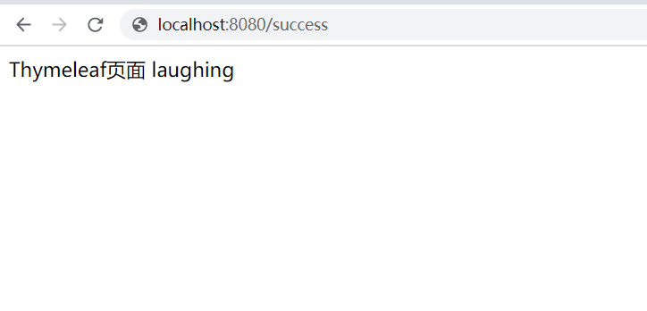

## 引入依赖

```
<dependency>
    <groupId>org.springframework.boot</groupId>
    <artifactId>spring-boot-starter-web</artifactId>
</dependency>
```

之前写过spring boot场景启动器和自动配置原理的相关，这里我们主要看web相关的东西。

## 一、spring boot对静态资源的映射规则

### webjars

传统的项目中，我们把静态资源放在webapps中。spring boot有新的映射规则。<br>

springboot可以使用webjar的方式打包和对静态资源进行统一依赖管理<br>

我们可以查看**WebMvcAutoConfiguration**的**addResourceHandlers**方法

 

它扫描的是**classpath:/META-INF/resources/webjars/**  目录<br>

可以在官网查找添加依赖[https://www.webjars.org/](https://www.webjars.org/)<br>

 


比如引入jquery：

```
<dependency>
    <groupId>org.webjars</groupId>
    <artifactId>jquery</artifactId>
    <version>3.3.1</version>
</dependency>
```

 

**classpath:/META-INF/resources/webjars/**  就可以取到jq的静态。<br>

启动服务以后，访问http://localhost:8080/webjars/jquery/3.3.1/jquery.js也可直接取到<br>


### 映射规则
在spring boot自动配置的过程中，**ResourceProperties**实现对资源的配置<br>

可以找到映射位置：

```
private static final String[] CLASSPATH_RESOURCE_LOCATIONS = { 
"classpath:/META-INF/resources/",
"classpath:/resources/",
"classpath:/static/",
"classpath:/public/" };
```

默认映射路径："classpath:/META-INF/resources/", "classpath:/resources/", "classpath:/static/", "classpath:/public/"；优先级顺序为：META-INF/resources > resources > static > public<br>

注意默认的classpath就是resources目录<br>

 

对应这个映射规则,我们访问 http://localhost:8080/static.html，就能访问到static.html。<br>

### 默认欢迎页index.html：<br>

在**WebMvcAutoConfiguration**中有**WebMvcAutoConfiguration**方法会定位到index.html<br>

 

包括**favicon.ico** 也是相同路径映射

### 自定义配置
```
spring:
  resources:
    static-locations: classpath:/static/,classpath:/public/
```
## 二、Thymeleaf模板引擎

springboot内嵌tomcat是打jar包运行的，所以并不支持jsp,这里我们使用Thymeleaf模板引擎。

### 引入Thymeleaf：

```
<dependency>
    <groupId>org.springframework.boot</groupId>
    <artifactId>spring-boot-starter-thymeleaf</artifactId>
</dependency>
```

**如果想使用更高版本**

```
<properties>
    <java.version>1.8</java.version>
    <thymeleaf.version>3.0.9.RELEASE</thymeleaf.version>
	<!--布局功能支持 -->
	<thymeleaf-layout-dialect.version>2.2.2</thymeleaf-layout-dialect.version>
</properties>
```

### Thymeleaf路径映射：

根据springboot的自动配置原理，可以打开**ThymeleafProperties**和**ThymeleafAutoConfiguration**了解Thymeleaf的自动配置。

```
ublic class ThymeleafProperties {

   private static final Charset DEFAULT_ENCODING = StandardCharsets.UTF_8;

   public static final String DEFAULT_PREFIX = "classpath:/templates/";

   public static final String DEFAULT_SUFFIX = ".html";
```

得知识别的路径为**classpath:/templates/** 后缀为**.html**<br>

我在controller层增加requestmapping

```
@Controller
public class HelloWord {
    @RequestMapping("/success")
    public String success(){
        return "thymeleaf";
    }
}
```

访问http://localhost:8080/success  即可定位到在**classpath:/templates/** 目录下的thymeleaf.html

### Thymeleaf简单语法：

参考文档：[https://www.thymeleaf.org/doc/tutorials/3.0/usingthymeleaf.pdf](https://www.thymeleaf.org/doc/tutorials/3.0/usingthymeleaf.pdf)<br>

1、在html页面导入thymeleaf的命名空间

```
<html xmlns:th="http://www.thymeleaf.org">
```

2、可以像引擎传入map

```
@RequestMapping("/success")
public String success(Map<String,Object> map){
    map.put("name","laughing");
    map.put("id","a");
    return "thymeleaf";
}
```

```
<!DOCTYPE html>
<html xmlns:th="http://www.thymeleaf.org">
<html lang="en">
<head>
    <meta charset="UTF-8">
    <title>Thymeleaf</title>
</head>
<body>
<span>Thymeleaf页面</span>
<span th:id="${id}" th:text="${name}">样例name</span>
</body>
</html>
```



<br>

本节主要学习springboot对静态资源的访问规则，Thymeleaf 的详细内容将在后续更新。


&nbsp;&nbsp;&nbsp;&nbsp; 本人授权[维权骑士](http://rightknights.com)对我发布文章的版权行为进行追究与维权。未经本人许可，不可擅自转载或用于其他商业用途。


