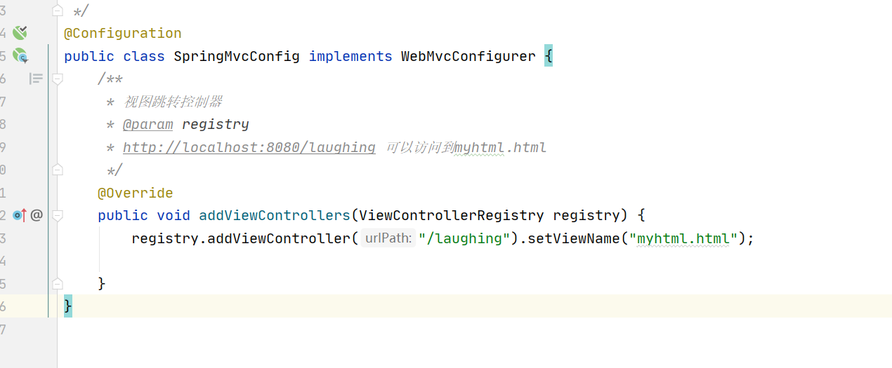

## 一、Spring MVC Auto-configuration

以前使用Spring MVC的时候需要自己配置web.xml和MVC配置文件，spring boot这里就可以自动配置。

**文档位置**<br>

https://docs.spring.io/spring-boot/docs/2.3.1.RELEASE/reference/htmlsingle/#boot-features  <br>

spring boot对spring mvc的自动配置都在WebMvcAutoConfiguration.java里


Inclusion of `ContentNegotiatingViewResolver` and `BeanNameViewResolver` beans.<br>

**ContentNegotiatingViewResolver**就是视图控制器，自动配置了**ViewResolver**，会把我们的视图组装进去<br>

```
@Bean
@ConditionalOnBean(ViewResolver.class)
@ConditionalOnMissingBean(name = "viewResolver", value = ContentNegotiatingViewResolver.class)
public ContentNegotiatingViewResolver viewResolver(BeanFactory beanFactory) {
   ContentNegotiatingViewResolver resolver = new ContentNegotiatingViewResolver();
   resolver.setContentNegotiationManager(beanFactory.getBean(ContentNegotiationManager.class));
   // ContentNegotiatingViewResolver uses all the other view resolvers to locate
   // a view so it should have a high precedence
   resolver.setOrder(Ordered.HIGHEST_PRECEDENCE);
   return resolver;
}
```

## 二、spring mvc扩展

If you want to keep those Spring Boot MVC customizations and make more [MVC customizations](https://docs.spring.io/spring/docs/5.2.7.RELEASE/spring-framework-reference/web.html#mvc) (interceptors, formatters, view controllers, and other features), you can add your own `@Configuration` class of type `WebMvcConfigurer` but **without** `@EnableWebMvc`.

增加一个springmvc的配置类，实现WebMvcConfigurer接口：

```
@Configuration
public class SpringMvcConfig implements WebMvcConfigurer {

}
```

配置我们可以看**WebMvcAutoConfiguration.java**：

```
spring:
  mvc:
    format:    # 设定日期的格式，比如dd/MM/yyyy
      date: dd/MM/yyyy
    view:
      prefix:
      suffix:
    async:
      request-timeout:            #设定async请求的超时时间，以毫秒为单位
```
我们给SpringMvcConfig 增加一些自定义配置


省去setViewName html后缀：
.png)

其他配置：
```
@Configuration
public class SpringMvcConfig implements WebMvcConfigurer {
    @Autowired
    private LogInterceptor logInterceptor;
    /**
     * 配置路径匹配参数
     * @param configurer
     */
    @Override
    public void configurePathMatch(PathMatchConfigurer configurer) {
        //当此参数设置为true的会后，那么地址/user，/user/都能正常访问。
        //当此参数设置为false的时候，那么就只能访问/user了。
        configurer.setUseTrailingSlashMatch(true);
    }

    /**
     * 视图跳转控制器
     * @param registry
     * http://localhost:8080/laughing 可以访问到myhtml.html
     */
    @Override
    public void addViewControllers(ViewControllerRegistry registry) {
        // 视图定向
        registry.addViewController("/laughing").setViewName("myhtml");
        // 重定向
        registry.addRedirectViewController("/app","/laughing");
        // 状态码
        registry.addStatusController("/admin/**", HttpStatus.NOT_FOUND);
    }

    /**
     * 资源格式化
     * @param registry
     */
    @Override
    public void addFormatters(FormatterRegistry registry) {
    }

    /*
     * 自定义静态资源映射
     */
    @Override
    public void addResourceHandlers(ResourceHandlerRegistry registry) {
        registry.addResourceHandler("/static");
    }

    /**
     * 配置 Cors
     * @param registry
     */
    @Override
    public void addCorsMappings(CorsRegistry registry) {
        // 配置可以被跨域的路径，可以任意配置，可以具体到直接请求路径。
        registry.addMapping("/**")
                .allowedMethods("*")
                .allowedOrigins("*")
                .allowedHeaders("*");

    }
    /**
     * 拦截器
     */
    @Override
    public void addInterceptors(InterceptorRegistry registry) {
        registry.addInterceptor(logInterceptor).addPathPatterns("/**");
    }
}
```


&nbsp;&nbsp;&nbsp;&nbsp; 本人授权[维权骑士](http://rightknights.com)对我发布文章的版权行为进行追究与维权。未经本人许可，不可擅自转载或用于其他商业用途。


