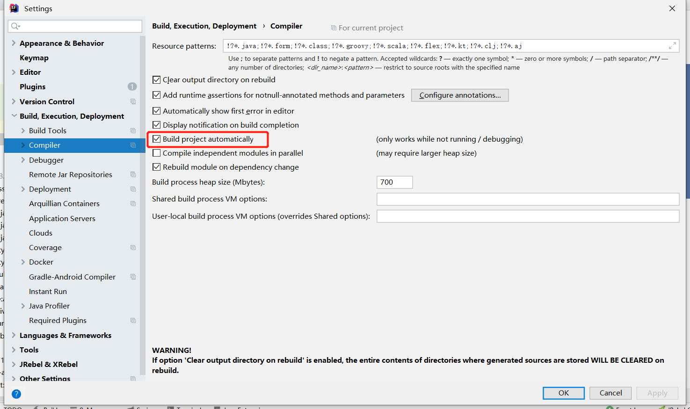

## spring-boot-devtools实现热部署

pom文件引入：

```
<dependency>
    <groupId>org.springframework.boot</groupId>
    <artifactId>spring-boot-devtools</artifactId>
    <optional>true</optional>
  </dependency>
```

plugin配置：

```
<plugin>
    <groupId>org.springframework.boot</groupId>
    <artifactId>spring-boot-maven-plugin</artifactId>
    <configuration>
        <fork>true</fork>
    </configuration>
</plugin>
```

yml配置：

```
spring:
  thymeleaf:
    cache: false
  devtools:
    restart:
      #热部署生效
      enabled: true
      #设置重启的目录
      additional-paths: src/main/java
      #classpath目录下的WEB-INF文件夹内容修改不重启
      exclude: WEB-INF/**
```


开启项目自动构建：





&nbsp;&nbsp;&nbsp;&nbsp; 本人授权[维权骑士](http://rightknights.com)对我发布文章的版权行为进行追究与维权。未经本人许可，不可擅自转载或用于其他商业用途。


