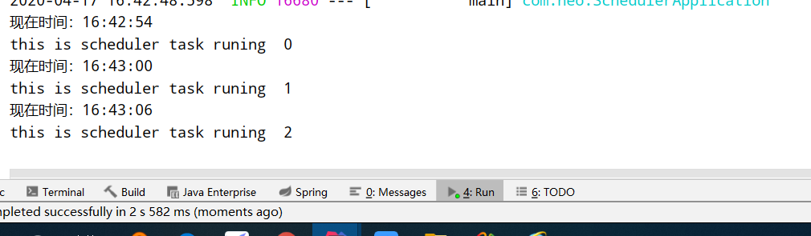

## 一、pom依赖

    <dependencies>
     	<dependency>
     		<groupId>org.springframework.boot</groupId>
     		<artifactId>spring-boot-starter</artifactId>
     	</dependency>
     	<dependency>
     		<groupId>org.springframework.boot</groupId>
     		<artifactId>spring-boot-starter-test</artifactId>
     		<scope>test</scope>
     	</dependency>
    </dependencies>
## 二、启动类注解@EnableScheduling

    @EnableScheduling
    
## 三、定时任务实现类
    
    @Scheduled(cron = "0/5 * * * * *")
    public void cron() {
        System.out.println(new Date());
    }
    
## 四、配置文件形式   
    
&nbsp;&nbsp;&nbsp;&nbsp;那我们有多个定时任务且需要经常更改，每次都要找@Scheduled来更改cron表达式很不方便，可改为以配置文件的形式操作     
    
    @Component
    @PropertySource("classpath:/task-config.properties")
    public class Scheduler2Task {
    
        private static final SimpleDateFormat dateFormat = new SimpleDateFormat("HH:mm:ss");
    
        // @Scheduled(fixedRate = 5000)
        @Scheduled(cron = "${cron}")
        public void reportCurrentTime() {
            System.out.println("现在时间：" + dateFormat.format(new Date()));
        }
    
    }
    
&nbsp;&nbsp;&nbsp;&nbsp;新建配置文件task-config.properties 
&nbsp;&nbsp;&nbsp;&nbsp;cron= */6 * * * * ? 
&nbsp;&nbsp;&nbsp;&nbsp;现在就是6s执行一次 

   

&nbsp;&nbsp;&nbsp;&nbsp; 本人授权[维权骑士](http://rightknights.com)对我发布文章的版权行为进行追究与维权。未经本人许可，不可擅自转载或用于其他商业用途。

 