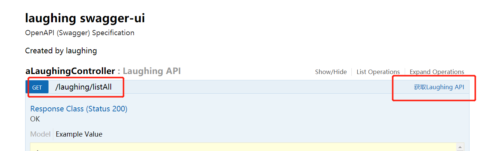
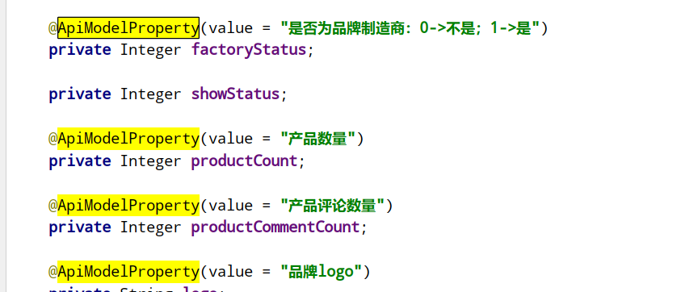

::: tip Swagger-UI
本文介绍如何用spring boot集成Swagger-UI，实现项目在线接口文档的实现
:::

## 一、Swagger-UI简介

&nbsp;&nbsp;&nbsp;&nbsp;Swagger是一个Restful风格接口的文档在线自动生成和测试的框架 
&nbsp;&nbsp;&nbsp;&nbsp;官网对Swagger-UI的介绍： 
 
&nbsp;&nbsp;&nbsp;&nbsp;简单的说就是：Swagger提供了一组静态页面，可以在SpringBoot应用中集成这些静态页面，直接访问静态页面，并打开指定的Swagger规范，就可以显示、测试调用接口： 
&nbsp;&nbsp;&nbsp;&nbsp;而在SpringBoot中集成Swagger是非常容易的，仅需增加几个简单的注解。 
&nbsp;&nbsp;&nbsp;&nbsp;效果如图： 
 
## 二、pom 依赖
 
## 三、pom 配置Swagger2Config类

&nbsp;&nbsp;&nbsp;&nbsp;Swagger2Config类位于config包，用来配置swagger。 
&nbsp;&nbsp;&nbsp;&nbsp;介绍一些简单的配置： 
### API接口文档的生成范围
&nbsp;&nbsp;&nbsp;&nbsp;Swagger对生成API文档的范围有三种不同的选择 
**&nbsp;&nbsp;&nbsp;&nbsp;生成指定包面的类的API文档下 
&nbsp;&nbsp;&nbsp;&nbsp;生成有指定注解的类的API文档 
&nbsp;&nbsp;&nbsp;&nbsp;生成有指定注解的方法的API文档 **
&nbsp;&nbsp;&nbsp;&nbsp;三种方式如图：
 
### 配置页面信息
&nbsp;&nbsp;&nbsp;&nbsp;对应关系如图
 
 
## 四、给交易类配置注解

&nbsp;&nbsp;&nbsp;&nbsp;常用注解 
&nbsp;&nbsp;&nbsp;&nbsp;@Api：用于修饰Controller类，生成Controller相关文档信息 
&nbsp;&nbsp;&nbsp;&nbsp;@ApiOperation：用于修饰Controller类中的方法，生成接口方法相关文档信息 
&nbsp;&nbsp;&nbsp;&nbsp;@ApiParam：用于修饰接口中的参数，生成接口参数相关文档信息 
&nbsp;&nbsp;&nbsp;&nbsp;@ApiModelProperty：用于修饰实体类的属性，当实体类是请求参数或返回结果时，直接生成相关文档信息 

### @Api
 
&nbsp;&nbsp;&nbsp;&nbsp;value - 字段说明 
&nbsp;&nbsp;&nbsp;&nbsp;description - 注释说明这个类 
&nbsp;&nbsp;&nbsp;&nbsp;对应： 
 
### @ApiOperation
&nbsp;&nbsp;&nbsp;&nbsp;value - 字段说明 
&nbsp;&nbsp;&nbsp;&nbsp;notes - 注释说明 
&nbsp;&nbsp;&nbsp;&nbsp;httpMethod - 说明这个方法被请求的方式 
&nbsp;&nbsp;&nbsp;&nbsp;response - 方法的返回值的类型 

 
 
### @ApiModelProperty
&nbsp;&nbsp;&nbsp;&nbsp;value–字段说明 
&nbsp;&nbsp;&nbsp;&nbsp;name–重写属性名字 
&nbsp;&nbsp;&nbsp;&nbsp;dataType–重写属性类型 
&nbsp;&nbsp;&nbsp;&nbsp;required–是否必填 
&nbsp;&nbsp;&nbsp;&nbsp;example–举例说明 
&nbsp;&nbsp;&nbsp;&nbsp;hidden–隐藏 
 
 

### @ApiResponse
&nbsp;&nbsp;&nbsp;&nbsp;code - 响应的HTTP状态码 
&nbsp;&nbsp;&nbsp;&nbsp;message - 响应的信息内容 
## 五、authorizations

&nbsp;&nbsp;&nbsp;&nbsp;如项目集成了OAuth2或JWT等 用户验证，不能直接调用需要添加 authorizations 
 
 

&nbsp;&nbsp;&nbsp;&nbsp;可以从控制台拿到，添加后就可以自由调用 

 

## 六、文档调用
&nbsp;&nbsp;&nbsp;&nbsp;http://localhost:8080/swagger-ui.html 
 
&nbsp;&nbsp;&nbsp;&nbsp;看版本信息 
&nbsp;&nbsp;&nbsp;&nbsp;http://localhost:8080/swagger-resources/ 
  
&nbsp;&nbsp;&nbsp;&nbsp; 本人授权[维权骑士](http://rightknights.com)对我发布文章的版权行为进行追究与维权。未经本人许可，不可擅自转载或用于其他商业用途。

 