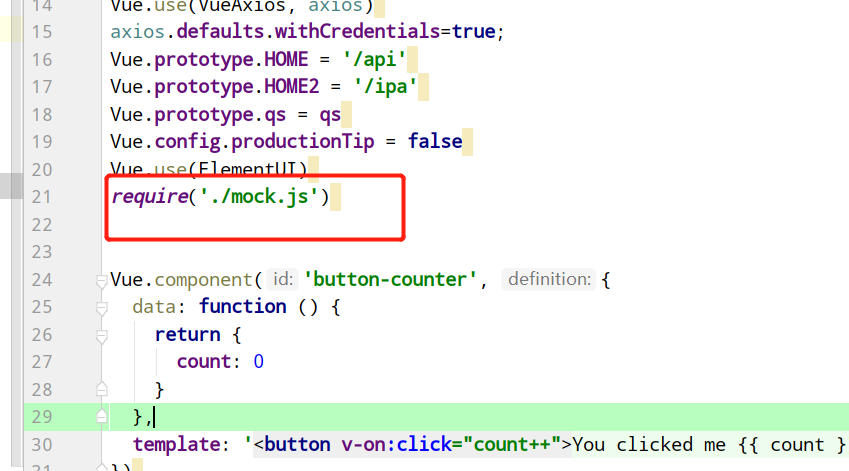
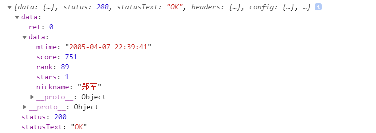

&nbsp;&nbsp;&nbsp;&nbsp;是不是感觉造数据有点麻烦，或者后台还没开发完，这时候就可以用Mock.js生成随机模拟数据了,拦截 Ajax Axios请求。 
&nbsp;&nbsp;&nbsp;&nbsp;官方网站：[http://mockjs.com/](http://mockjs.com/) 
   * 1、安装 
&nbsp;&nbsp;&nbsp;&nbsp;   使用npm安装: 

            
    npm install mockjs;
&nbsp;&nbsp;&nbsp;&nbsp;   或直接: 

           
    ;

   * 2、使用 
&nbsp;&nbsp;&nbsp;&nbsp;   在src下新建mock.js并在入口文件main.js引入 
   
&nbsp;&nbsp;&nbsp;&nbsp;   axios请求 

            getMockData: function(){
                this.axios.get('/rest/data').then(function(res){
                    console.log(res)
                }).catch(function(err){
                    console.log(err)
                })
            },

&nbsp;&nbsp;&nbsp;&nbsp;   mock.js生成数据模板： 

           var Mock = require('mockjs')
           Mock.mock('/rest/data', {
           /*      //生成1-100个id
               // 属性 list 的值是一个数组，其中含有 1 到 10 个元素
               'list|1-100': [{
                 // 属性 id 是一个自增数，起始值为 1，每次增 1
                 'id|+1': 1
               }]*/
             "ret":0,
             "data":
               {
                 "mtime": "@datetime",//随机生成日期时间
                 "score|1-800": 800,//随机生成1-800的数字
                 "rank|1-100":  100,//随机生成1-100的数字
                 "stars|1-5": 5,//随机生成1-5的数字
                 "nickname": "@cname",//随机生成中文名字
               }
           })
           
           //延时1s请求到数据
           Mock.setup({
             timeout: 1000
           })
           //延时200-600毫秒请求到数据
   
&nbsp;&nbsp;&nbsp;&nbsp; 本人授权[维权骑士](http://rightknights.com)对我发布文章的版权行为进行追究与维权。未经本人许可，不可擅自转载或用于其他商业用途。

 