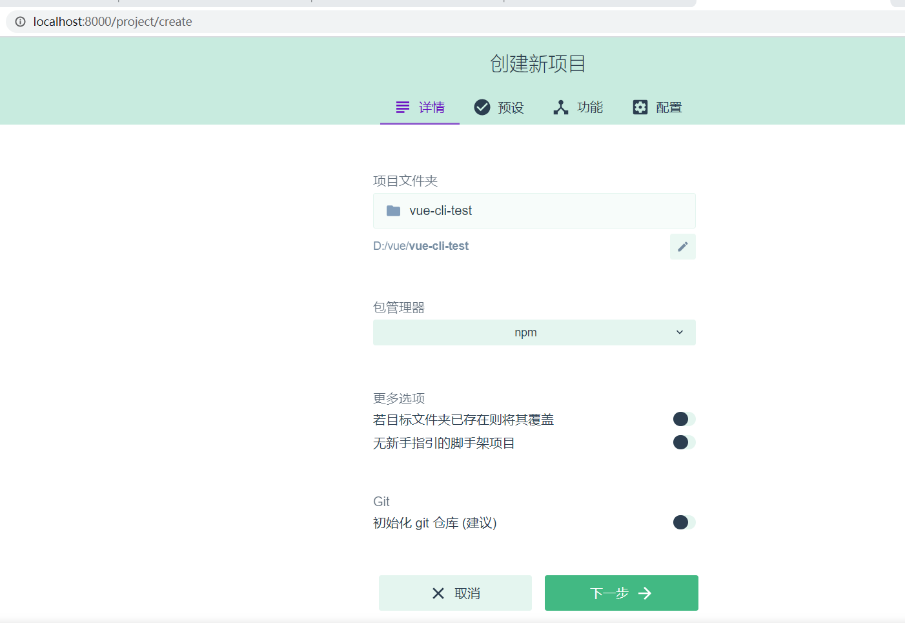
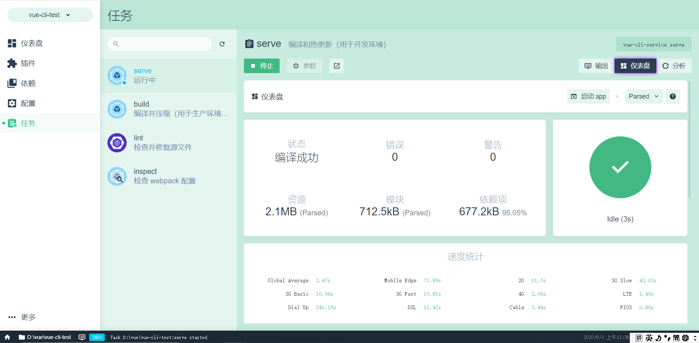
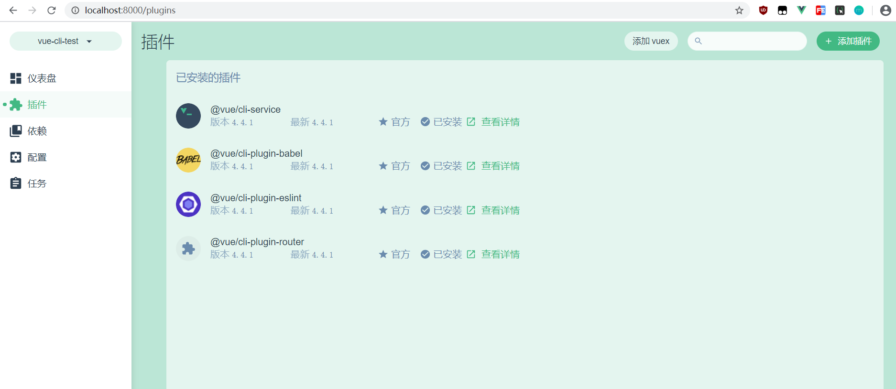
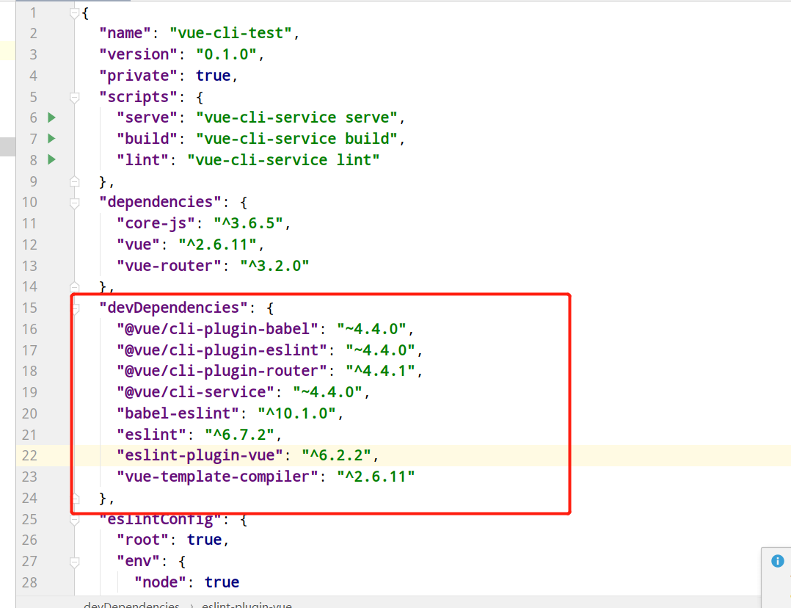

### 一、安装

使用淘宝镜像：

```
npm install -g cnpm --registry=https://registry.npm.taobao.org
```

使用淘宝镜像：

```
npm install -g @vue/cli
```

如果你已经全局安装了旧版本的 `vue-cli` (1.x 或 2.x)，你需要先通过 `npm uninstall vue-cli -g` 或 `yarn global remove vue-cli` 卸载它。<br>

查看版本：

```bash
vue --version

@vue/cli 4.4.1
```

安装全局依赖：

```bash
npm install -g @vue/cli-service-global
```


### 二、创建项目

```bash
vue create projectName
```

ui 界面使用

```bash
vue ui
```

  
  <br>

### 三、插件

可以在devDependencies添加插件 自动刷新：

  <br>

  <br>

`@vue/cli-plugin-` 开头的<br>

Babel 是一个 JavaScript 编译器；Babel 是一个工具链，主要用于将 ECMAScript 2015+ 版本的代码转换为向后兼容的 JavaScript 语法，以便能够运行在当前和旧版本的浏览器或其他环境中。<br>

**命令行安装插件：**<br>

```bash
vue add eslint
# 这个和之前的用法等价
vue add cli-plugin-eslint
```

**本地插件：**<br>

```json
  "vuePlugins": {
    "service": ["my-commands.js"]
  }
```


**preset（预设）<br>**

**文件路径：<br>**

```
C:\Users\Administrator\.vuerc
```


### 四、CLI 服务

```
"scripts": {
  "serve": "vue-cli-service serve --open --port 8082",
  "build": "vue-cli-service build",
  "lint": "vue-cli-service lint"
},
```

`vue-cli-service serve` 命令会启动一个开发服务器 (基于 [webpack-dev-server](https://github.com/webpack/webpack-dev-server)) 并附带开箱即用的模块热重载 (Hot-Module-Replacement)。

```text
用法：vue-cli-service serve [options] [entry]

选项：

  --open    在服务器启动时打开浏览器
  --copy    在服务器启动时将 URL 复制到剪切版
  --mode    指定环境模式 (默认值：development)
  --host    指定 host (默认值：0.0.0.0)
  --port    指定 port (默认值：8080)
  --https   使用 https (默认值：false)
```

**打包：**

```text
用法：vue-cli-service build [options] [entry|pattern]

选项：

  --mode        指定环境模式 (默认值：production)
  --dest        指定输出目录 (默认值：dist)
  --modern      面向现代浏览器带自动回退地构建应用
  --target      app | lib | wc | wc-async (默认值：app)
  --name        库或 Web Components 模式下的名字 (默认值：package.json 中的 "name" 字段或入口文件名)
  --no-clean    在构建项目之前不清除目标目录
  --report      生成 report.html 以帮助分析包内容
  --report-json 生成 report.json 以帮助分析包内容
  --watch       监听文件变化
```


### 五、项目结构


### 六、public和index.html

静态资源可以通过两种方式进行处理：<br>

- 在 JavaScript 被导入或在 template/CSS 中通过相对路径被引用。这类引用会被 webpack 处理。<br>
- 放置在 `public` 目录下或通过**绝对路径**被引用。这类资源将会直接被拷贝，而不会经过 webpack 的处理。<br>


&nbsp;&nbsp;&nbsp;&nbsp; 本人授权[维权骑士](http://rightknights.com)对我发布文章的版权行为进行追究与维权。未经本人许可，不可擅自转载或用于其他商业用途。


