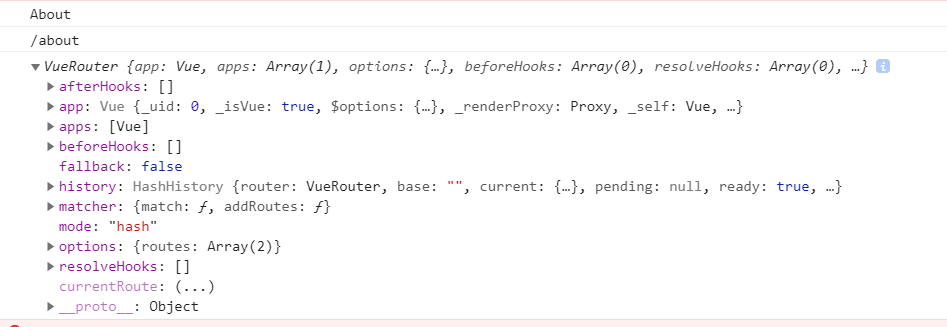

### 一、配置

基于vue-cli 4.0的路由配置：

```
import Vue from 'vue'
import VueRouter from 'vue-router'  // 路由包
import Home from '../views/Home.vue' // 引入 Home的component

Vue.use(VueRouter)  // 使用路由

  const routes = [
  {
    path: '/',
    name: 'Home',
    component: Home
  },
  {
    path: '/about',
    name: 'About',
    // route level code-splitting  懒加载方式
    // this generates a separate chunk (about.[hash].js) for this route
    // which is lazy-loaded when the route is visited.
    component: () => import(/* webpackChunkName: "about" */ '../views/About.vue')
  }
]

const router = new VueRouter({  //new 路由实例
  routes
})

export default router  //导出路由模块
```

**入口main.js：**

```
new Vue({
  router,
  render: h => h(App)
}).$mount('#app')
```

```
<template>
  <div id="app">
    <div id="nav">
      <router-link to="/">Home</router-link> |
      <router-link to="/about">About</router-link>
    </div>
    <router-view/>
  </div>
</template>
```

### 二、router对象

通过注入路由器，我们可以在任何组件内通过 `this.$router` 访问路由器，也可以通过 `this.$route` 访问当前路由：

```
console.log(this.$route.name); // About
console.log(this.$route.path); // /about
console.log(this.$router);
window.history.length > 1 ? this.$router.go(-1) : this.$router.push('/')
```

  

常用方法：

```
this.$router.push('/path')  //跳转  这个方法会向history栈添加一个记录
his.$router.replace()   //跳转  history  无记录
this.$router.go(n)  -1 、 2  前进后退


// 命名的路由
router.push({ name: 'user', params: { userId: '123' }})

// 带查询参数，变成 /register?plan=private
router.push({ path: 'register', query: { plan: 'private' }})


const userId = '123'
router.push({ name: 'user', params: { userId }}) // -> /user/123
router.push({ path: `/user/${userId}` }) // -> /user/123
// 这里的 params 不生效
router.push({ path: '/user', params: { userId }}) // -> /user
```


### 三、动态路由匹配

我在路由index.js中定义路径

```
  {
    path: '/user/:id',
    name: 'User',
    component: () => import(/* webpackChunkName: "about" */ '../views/User.vue')
  }
```

在**User.vue**页面访问获取：<br>

http://localhost:8082/#/User/1234567<br>

```
<template>
  <div class="user">
    <h1>User页</h1>
    <h1>{{ $route.params.id }}</h1>  //1234567
  </div>
</template>  
```


**全匹配  *  就可以了**


### 四、嵌套路由


```
{
  path: '/user/:id',
  name: 'User',
  component: () => import(/* webpackChunkName: "about" */ '../views/User.vue'),
  children: [
    // 当 /user/:id 匹配成功，
    // 再渲染 一个 User.vue
    { path: '',
      component: () => import(/* webpackChunkName: "about" */ '../views/User.vue')
    },
    {
      // 当 /user/:id/profile 匹配成功，
      // Profile 会被渲染在 User 的 <router-view> 中
      path: 'profile',
      component: () => import(/* webpackChunkName: "about" */ '../views/Profile.vue')
    }
  ]
}
```


  


###  五、(同级) 展示多个视图

```
{
  path: '/app',
  components: {
    a: () => import(/* webpackChunkName: "about" */ '../views/A.vue'),
    b: () => import(/* webpackChunkName: "about" */ '../views/B.vue')
  }
}
```

用name区别

```html
<router-view class="view two" name="a"></router-view>
<router-view class="view three" name="b"></router-view>
```

### 六、重定向和别名


**重定向redirect：**

```
{
  path: '/a',
  redirect: '/b' 
}
//  可以直接写路由名

{ path: '/a', redirect: { name: 'foo' }}
```

**别名alias：**

```js
const router = new VueRouter({
  routes: [
    { path: '/a', component: A, alias: '/b' }
  ]
})
```


&nbsp;&nbsp;&nbsp;&nbsp; 本人授权[维权骑士](http://rightknights.com)对我发布文章的版权行为进行追究与维权。未经本人许可，不可擅自转载或用于其他商业用途。


