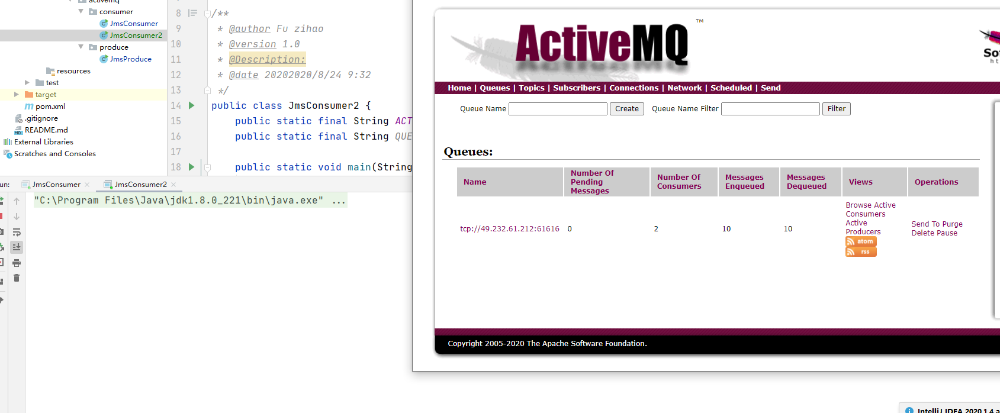
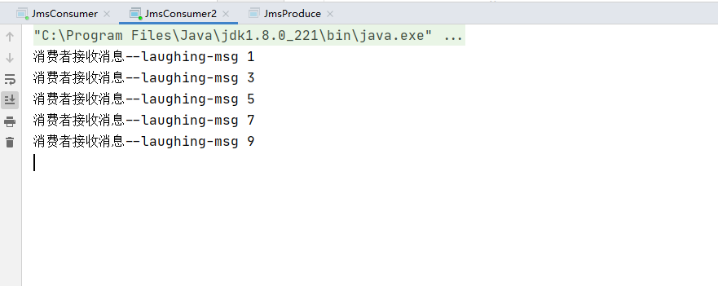

## 一、Message Queue消息队列


### 异步处理

我们可以把消息队列比作是一个存放消息的容器，当我们需要使用消息的时候可以取出消息供自己使用。消息队列是分布式系统中重要的组件，使用消息队列主要是为了通过异步处理提高系统性能和削峰、降低系统耦合性。

消息队列主要有两点好处：1.通过异步处理提高系统性能（削峰、减少响应所需时间）;2.降低系统耦合性。


### 消息队列的两种模式

### 点对点模式


**一个消息只会被一个消费者消费**

### 发布订阅模式


## 二、消息中间件


## 三、ActiveMQ安装

官网：[http://activemq.apache.org/](http://activemq.apache.org/)

下载地址： [http://activemq.apache.org/components/classic/download/](http://activemq.apache.org/components/classic/download/)

```
tar -zxvf apache--activemq-5.16.0
```

bin目录下启动

```
/usr/activemq/apache-activemq-5.16.0/bin

./activemq start


ps  -ef|grep activemq
```

activemq的默认端口为61616

+++++++++++++++++++++++++++++++++++++++++++++++++++++++++++++++

启动报错 cat activemq.log


服务器名称不能有下滑线

vim /etc/sysconfig/network


重新远程连接即可

+++++++++++++++++++++++++++++++++++++++++++++++++++++++++++++++

日志目录 /apache-activemq-5.16.0/data/activemq.log


## 四、ActiveMQ控制台

端口8161

注意开端口策略

 修改jetty.xml


用户名密码


## 五、JMS标准

JMS即[Java消息服务](http://baike.baidu.com/view/3292569.htm)（Java Message Service）应用程序接口，是一个[Java平台](http://baike.baidu.com/view/209634.htm)中关于面向[消息中间件](http://baike.baidu.com/view/3118541.htm)（MOM）的[API](http://baike.baidu.com/subview/16068/5889234.htm)，用于在两个应用程序之间，或[分布式系统](http://baike.baidu.com/view/991489.htm)中发送消息，进行异步通信。Java消息服务是一个与具体平台无关的API，绝大多数MOM提供商都对JMS提供支持（百度百科给出的概述）。我们可以简单的理解：两个应用程序之间需要进行通信，我们使用一个JMS服务，进行中间的转发，通过JMS 的使用，我们可以解除两个程序之间的耦合。


## 六、生产者

需要的包

```
<dependency>
    <groupId>org.apache.activemq</groupId>
    <artifactId>activemq-all</artifactId>
    <version>5.16.0</version>
</dependency>
<dependency>
    <groupId>org.apache.xbean</groupId>
    <artifactId>xbean-spring</artifactId>
    <version>3.6</version>
</dependency>
```


```
public class JmsProduce {

    public static final String ACTIVEMQ_URL = "tcp://49.232.61.212:61616";
    public static final String QUEUE_NAME = "laughing-queue";

    public static void main(String[] args) throws JMSException {
        // 1、创建ActiveMQConnectionFactory
        ActiveMQConnectionFactory activeMQConnectionFactory = new ActiveMQConnectionFactory(ACTIVEMQ_URL);
        // 2、创建connection 启动
        Connection connection = activeMQConnectionFactory.createConnection();
        connection.start();
        // 3、创建session  createSession(boolean transacted, int acknowledgeMode)
        // transacted 事务 ， acknowledgeMode 签收
        Session session = connection.createSession(false, Session.AUTO_ACKNOWLEDGE);
        // 4、创建目的地 队列
        // Destination destination = session.createQueue(ACTIVEMQ_URL);
        Queue queue = session.createQueue(ACTIVEMQ_URL);
        // 5、创建消息生产者 放入队列
        MessageProducer messageProducer = session.createProducer(queue);
        // 6、生成消息发送到queue
        for (int i = 0; i < 10; i++) {
            // 7、生成消息
            TextMessage textMessage = session.createTextMessage("laughing-msg " + i);
            // 8、通过生产者messageProducer，发送给MQ
            messageProducer.send(textMessage);

        }
        // 9、关闭
        messageProducer.close();
        session.close();
        connection.close();
        System.out.println("MQ发送成功！");


    }
}
```


发送10条消息到MQ的队列


## 七、消费者

receive同步阻塞

```
public class JmsConsumer {
    public static final String ACTIVEMQ_URL = "tcp://127.0.0.1:61616";
    public static final String QUEUE_NAME = "laughing-queue";

    public static void main(String[] args) throws JMSException {
        // 1、创建ActiveMQConnectionFactory
        ActiveMQConnectionFactory activeMQConnectionFactory = new ActiveMQConnectionFactory(ACTIVEMQ_URL);
        // 2、创建connection 启动
        Connection connection = activeMQConnectionFactory.createConnection();
        connection.start();
        // 3、创建session  createSession(boolean transacted, int acknowledgeMode)
        // transacted 事务 ， acknowledgeMode 签收
        Session session = connection.createSession(false, Session.AUTO_ACKNOWLEDGE);
        // 4、创建目的地 队列
        // Destination destination = session.createQueue(ACTIVEMQ_URL);
        Queue queue = session.createQueue(ACTIVEMQ_URL);
        // 5、消费者
        MessageConsumer messageConsumer = session.createConsumer(queue);
        while (true) {
            TextMessage textMessage = (TextMessage) messageConsumer.receive();
            System.out.println("接收MQ:");
            if (null != textMessage) {
                System.out.println(textMessage.getText());
            } else {
                break;
            }
        }
        messageConsumer.close();
        session.close();
        connection.close();

    }
}
```


## 八、消费者监听

异步非阻塞方法

```
public class JmsConsumer {
    public static final String ACTIVEMQ_URL = "tcp://49.232.61.212:61616";
    public static final String QUEUE_NAME = "laughing-queue";

    public static void main(String[] args) throws JMSException, IOException {
        // 1、创建ActiveMQConnectionFactory
        ActiveMQConnectionFactory activeMQConnectionFactory = new ActiveMQConnectionFactory(ACTIVEMQ_URL);
        // 2、创建connection 启动
        Connection connection = activeMQConnectionFactory.createConnection();
        connection.start();
        // 3、创建session  createSession(boolean transacted, int acknowledgeMode)
        // transacted 事务 ， acknowledgeMode 签收
        Session session = connection.createSession(false, Session.AUTO_ACKNOWLEDGE);
        // 4、创建目的地 队列
        // Destination destination = session.createQueue(ACTIVEMQ_URL);
        Queue queue = session.createQueue(ACTIVEMQ_URL);
        // 5、消费者
        // receive 方法
        MessageConsumer messageConsumer = session.createConsumer(queue);
/*        while (true) {
            TextMessage textMessage = (TextMessage) messageConsumer.receive(4000L);
            System.out.println("接收MQ:");
            if (null != textMessage) {
                System.out.println(textMessage.getText());
            } else {
                break;
            }
        }*/
        // 消费者监听

        messageConsumer.setMessageListener(new MessageListener() {
            public void onMessage(Message message) {
                if (message != null && message instanceof TextMessage) {
                    TextMessage textMessage = (TextMessage) message;
                    try {
                        System.out.println("消费者接收消息--"+textMessage.getText());
                    } catch (JMSException e) {
                        e.printStackTrace();
                    }

                }

            }
        });

        System.in.read();

        messageConsumer.close();
        session.close();
        connection.close();

    }
}
```


## 九、两个消费者的情况

1、先启动生产者，在依次启动两个消费者

第二个消费者拿不到消息



2、启动两个消费者，再启动生产者

轮询平均分配




## 十、总结


