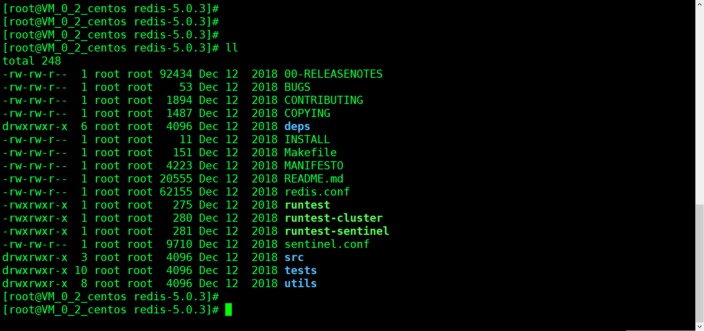
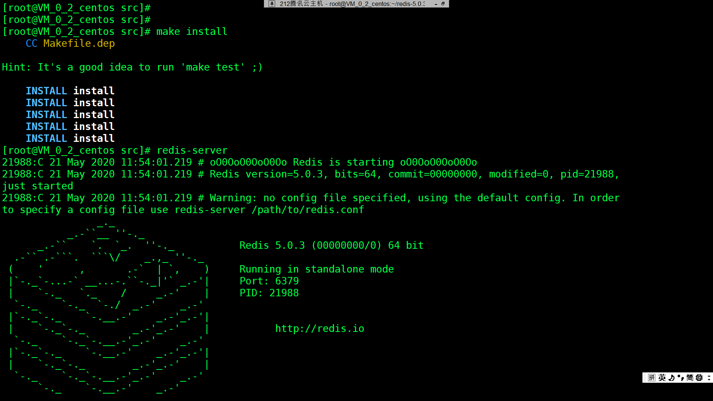
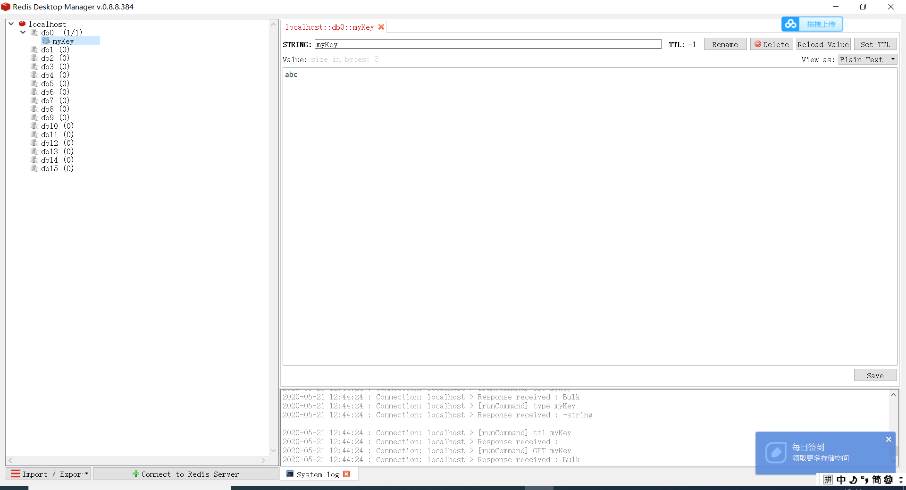

&nbsp;&nbsp;&nbsp;&nbsp;   * 一、**基本介绍**<br/>
&nbsp;&nbsp;&nbsp;&nbsp;Redis是个高性能的key-value数据库。用作缓存数据库<br/>

&nbsp;&nbsp;&nbsp;Redis支持五种数据类型：string（字符串），hash（哈希），list（列表），set（集合）及zset(sorted set：有序集合)。<br/>


&nbsp;&nbsp;&nbsp;&nbsp;   * 二、**下载安装配置**<br/>

&nbsp;&nbsp;下载**Redis-x64-xxx.zip**并安装<br/>

&nbsp;&nbsp;**下载地址：**  https://github.com/MSOpenTech/redis/releases。

&nbsp;&nbsp;基本命令：

```
set myKey abc
get myKey
redis-server --service-install redis.windows.conf --loglevel verbose # 装win服务
```

&nbsp;&nbsp;linux安装：

```
wget http://download.redis.io/releases/redis-5.0.3.tar.gz
tar xzf redis-5.0.3.tar.gz
#进目录
make  #对解压的Redis文件进行编译
#进入src文件夹
make install
redis-server #启动
```



 &nbsp;&nbsp;配置文件为：**redis.conf**

```
daemonize no  #使用yes启用守护进程
bind 127.0.0.1
port 6379
timeout 300
dir ./ #指定本地数据库存放目录
```


&nbsp;&nbsp;&nbsp;&nbsp;   * 三、**Redis Desktop Manager**<br/>

&nbsp;&nbsp;&nbsp;&nbsp;[https://redisdesktop.com/](https://redisdesktop.com/)<br/>


&nbsp;&nbsp;&nbsp;&nbsp;   * 四、**Spring Boot + Redis**<br/>


&nbsp;&nbsp;&nbsp;&nbsp; 本人授权[维权骑士](http://rightknights.com)对我发布文章的版权行为进行追究与维权。未经本人许可，不可擅自转载或用于其他商业用途。


