 ## 一、基本介绍
### RDBMS

遵循ACID规则

事务在英文中是transaction，和现实世界中的交易很类似，它有如下四个特性：

**1、A (Atomicity) 原子性**

原子性很容易理解，也就是说事务里的所有操作要么全部做完，要么都不做，事务成功的条件是事务里的所有操作都成功，只要有一个操作失败，整个事务就失败，需要回滚。

比如银行转账，从A账户转100元至B账户，分为两个步骤：1）从A账户取100元；2）存入100元至B账户。这两步要么一起完成，要么一起不完成，如果只完成第一步，第二步失败，钱会莫名其妙少了100元。

**2、C (Consistency) 一致性**

一致性也比较容易理解，也就是说数据库要一直处于一致的状态，事务的运行不会改变数据库原本的一致性约束。

例如现有完整性约束a+b=10，如果一个事务改变了a，那么必须得改变b，使得事务结束后依然满足a+b=10，否则事务失败。

**3、I (Isolation) 独立性**

所谓的独立性是指并发的事务之间不会互相影响，如果一个事务要访问的数据正在被另外一个事务修改，只要另外一个事务未提交，它所访问的数据就不受未提交事务的影响。

比如现在有个交易是从A账户转100元至B账户，在这个交易还未完成的情况下，如果此时B查询自己的账户，是看不到新增加的100元的。

**4、D (Durability) 持久性**

持久性是指一旦事务提交后，它所做的修改将会永久的保存在数据库上，即使出现宕机也不会丢失。

### Nosql

NoSQL最常见的解释是“non-relational”， “Not Only SQL”也被很多人接受。NoSQL仅仅是一个概念，泛指非关系型的数据库，区别于关系数据库，它们不保证关系数据的ACID特性。NoSQL是一项全新的数据库革命性运动，其拥护者们提倡运用非关系型的数据存储，相对于铺天盖地的关系型数据库运用，这一概念无疑是一种全新的思维的注入。

1、方便扩展

2、大数据量高性能

3、数据类型多样（不需要先设计数据库）

**分类：**

KV 键值对 （Redis memcache）

文档型数据库 MongoDB

列存储数据库 Hbase 分布式文件系统

图形关系数据库 

### Redis

Redis（Remote Dictionary Server )，即远程字典服务，是一个开源的使用ANSI C语言编写、支持网络、可基于内存亦可持久化的日志型、Key-Value数据库，并提供多种语言的API。从2010年3月15日起，Redis的开发工作由VMware主持。从2013年5月开始，Redis的开发由Pivotal赞助。

Redis是个高性能的key-value数据库。用作缓存数据库

Redis支持五种数据类型：string（字符串），hash（哈希），list（列表），set（集合）及zset(sorted set：有序集合)。


##  二、下载安装配置

&nbsp;&nbsp;下载**Redis-x64-xxx.zip**并安装<br/>

&nbsp;&nbsp;**下载地址：**  https://github.com/MSOpenTech/redis/releases。

&nbsp;&nbsp;基本命令：

```
set myKey abc
get myKey
redis-server --service-install redis.windows.conf --loglevel verbose # 装win服务
```

&nbsp;&nbsp;linux安装：

```
wget http://download.redis.io/releases/redis-5.0.3.tar.gz
tar xzf redis-5.0.3.tar.gz
#进目录
make  #对解压的Redis文件进行编译
#进入src文件夹
make install
redis-server #启动
```


 &nbsp;&nbsp;配置文件为：**redis.conf**

```
daemonize no  #使用yes启用守护进程
bind 127.0.0.1
port 6379
timeout 300
dir ./ #指定本地数据库存放目录
```

 默认安装目录

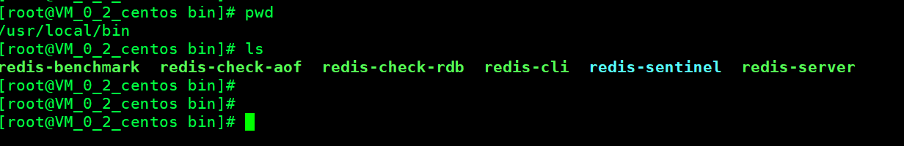 

调整为后台启动，修改配置文件**redis.conf**

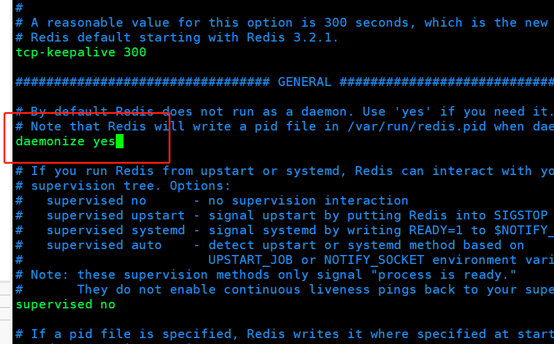

启动命令：

```
redis-server redis.conf
```

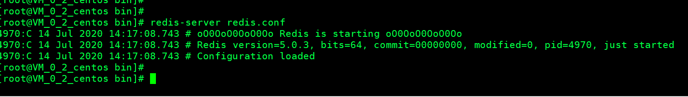

连接：

```
redis-cli -p 6379
```

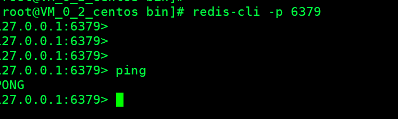

默认有16个数据库

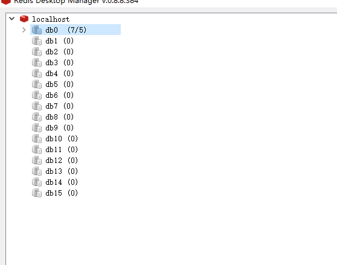


切换数据库

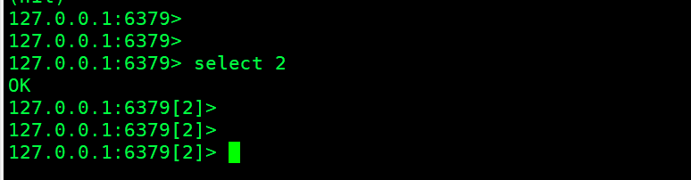

## 三、Redis 普通数据类型

Redis支持五种数据类型：string（字符串），hash（哈希），list（列表），set（集合）及zset(sorted set：有序集合)。

### string字符串

```
127.0.0.1:6379> set key1 value1
OK
127.0.0.1:6379> get key1
"value1"
127.0.0.1:6379> keys *
1) "key1"
2) "name"
127.0.0.1:6379> append key1 appendxxx
(integer) 15
127.0.0.1:6379> get key1
"value1appendxxx"
127.0.0.1:6379> strlen key1
(integer) 15
127.0.0.1:6379> 
```

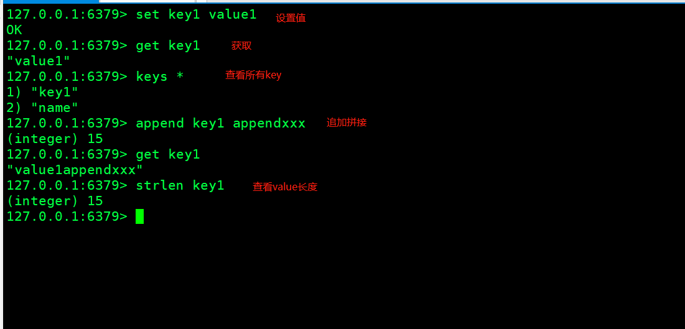

value自增加,比如一篇文章的浏览数量

```
127.0.0.1:6379> incr views
(integer) 3
127.0.0.1:6379> get views
"3"
127.0.0.1:6379> decr views
(integer) 2
127.0.0.1:6379> incrby views 10
(integer) 12
127.0.0.1:6379> decrby views 10
```

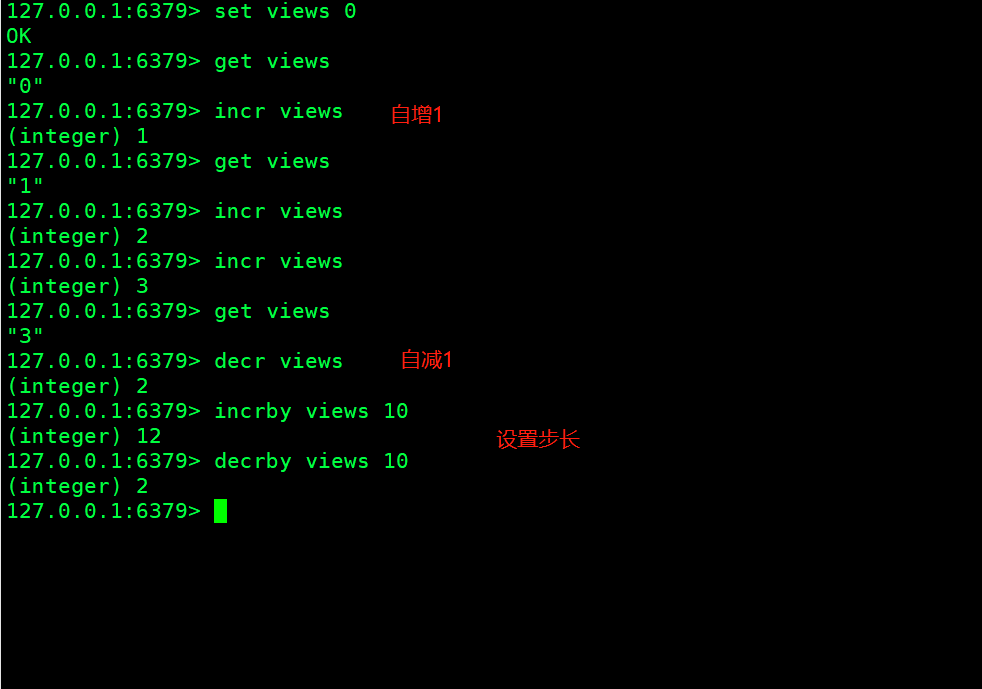

截取字符串

```
127.0.0.1:6379> get key1
"value1"
127.0.0.1:6379> getrange key1 0 2
"val"
```

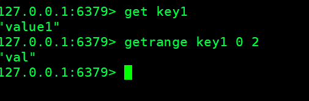

字符串替换

```
127.0.0.1:6379> setrange key2 2 xx
(integer) 7
127.0.0.1:6379> get key2
"abxxefg"
127.0.0.1:6379> 
```


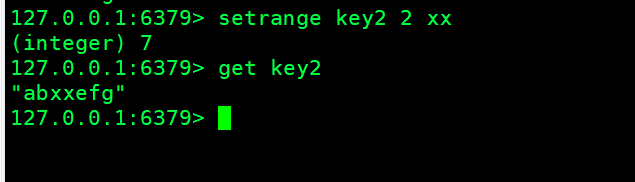


```
127.0.0.1:6379> setex key3 10 value3
OK
127.0.0.1:6379> ttl key3
(integer) 6
127.0.0.1:6379> get key3
(nil)
127.0.0.1:6379> setnx mykey myvalue
(integer) 1
127.0.0.1:6379> setnx mykey myvalue2
(integer) 0
127.0.0.1:6379> get mykey
"myvalue"
```

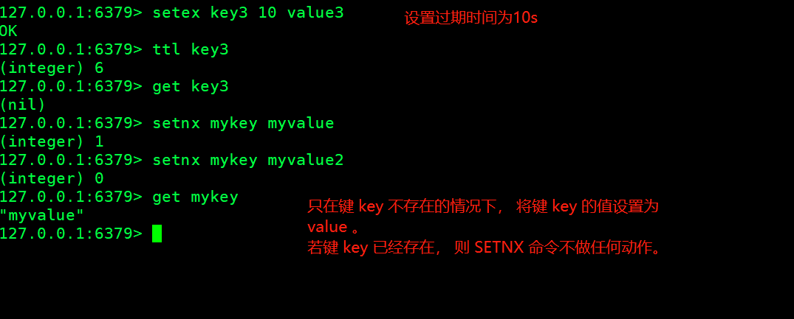

mset和mget

```
127.0.0.1:6379> mset k1 v1 k2 v2 k3 v3
OK
127.0.0.1:6379> mget k1 k2 k3
1) "v1"
2) "v2"
3) "v3"
127.0.0.1:6379> 

```

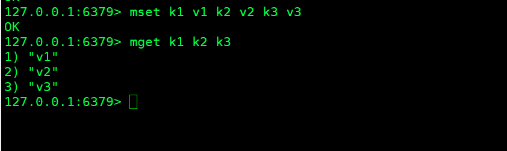

应用场景：

1、计数器（文章阅读量）

2、统计数字（对象缓存、粉丝数量）


### list列表

```
127.0.0.1:6379> lpush list one
(integer) 1
127.0.0.1:6379> lpush list two
(integer) 2
127.0.0.1:6379> lpush list three
(integer) 3
127.0.0.1:6379> lrange list 0 -1
1) "three"
2) "two"
3) "one"
127.0.0.1:6379> lrange list 0 1
1) "three"
2) "two"
127.0.0.1:6379> rpush list xxx
(integer) 4
127.0.0.1:6379> lrange list 0 -1
1) "three"
2) "two"
3) "one"
4) "xxx"
```

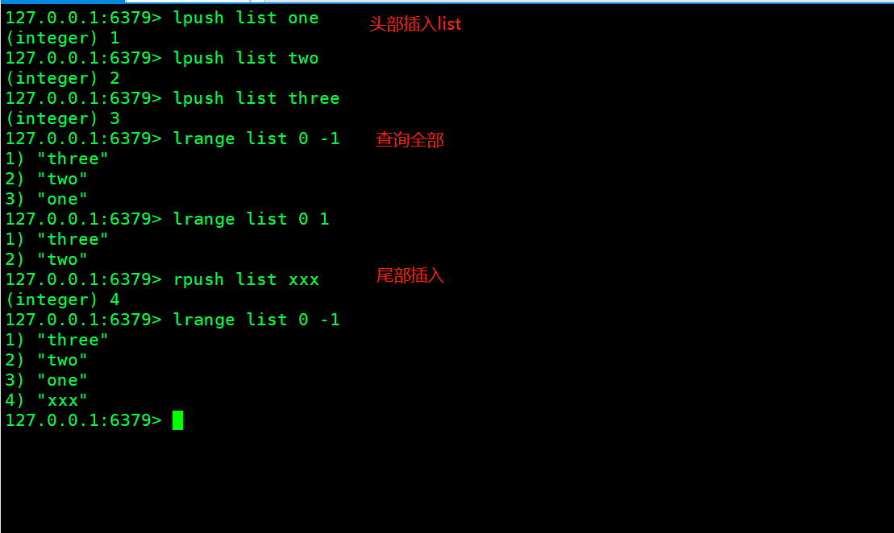

移除

```
127.0.0.1:6379> lpop list
"three"
127.0.0.1:6379> rpop list
"xxx"
127.0.0.1:6379> 
```

通过下标获取值

```
127.0.0.1:6379> lindex list 0
"two"
127.0.0.1:6379> 
```

list长度

```
127.0.0.1:6379> llen list
(integer) 2
```

移除一个value为two的

```
127.0.0.1:6379> lrem list 1 two
```


### set集合

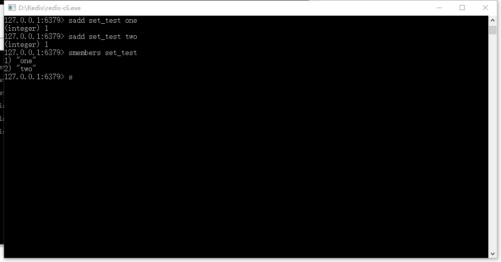


## 四、常用命令

增加key

```
redis 127.0.0.1:6379> SET  KEY_NAME VALUE
OK
```

获取Key

```
redis 127.0.0.1:6379> GET KEY_NAME
```

删除key

```
redis 127.0.0.1:6379> DEL KEY_NAME
```

```
127.0.0.1:6379> move name 1
```

设置过期时间，单位为秒

```
redis 127.0.0.1:6379> Expire KEY_NAME TIME_IN_SECONDS
```

移除过期时间

```
redis 127.0.0.1:6379> PERSIST KEY_NAME
```

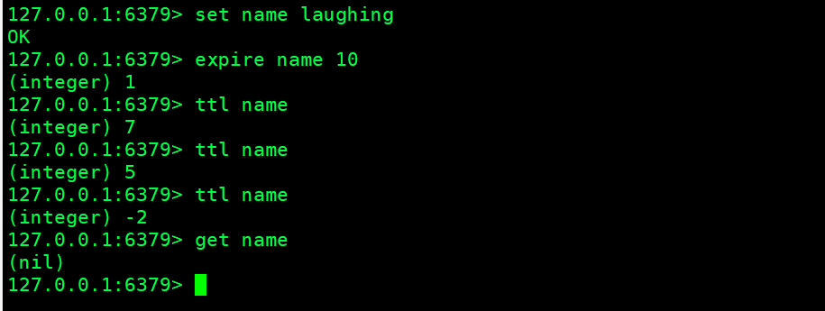

查看过期时间：

```
127.0.0.1:6379> ttl name
(integer) 7
```

移动key到db

```
redis 127.0.0.1:6379> MOVE KEY_NAME DESTINATION_DATABASE
```

hash Hset 

```
redis 127.0.0.1:6379> HSET KEY_NAME FIELD VALUE 
```

hash Hget

```
redis 127.0.0.1:6379> HGET KEY_NAME FIELD_NAME 
```

获取list长度

```
redis 127.0.0.1:6379> LLEN KEY_NAME 
```

LPUSH

```
redis 127.0.0.1:6379> LPUSH KEY_NAME VALUE1.. VALUEN
```

Lrem 移除

```
redis 127.0.0.1:6379> LREM KEY_NAME COUNT VALUE
```

清除数据库

```
127.0.0.1:6379[2]> flushdb
#清除全部
127.0.0.1:6379[2]> flushall
```

查看所有建

```
127.0.0.1:6379[2]> keys *
1) "key1"
```


## 五、Redis Desktop Manager

&nbsp;&nbsp;&nbsp;&nbsp;[https://redisdesktop.com/](https://redisdesktop.com/)<br/>


&nbsp;&nbsp;&nbsp;&nbsp; 本人授权[维权骑士](http://rightknights.com)对我发布文章的版权行为进行追究与维权。未经本人许可，不可擅自转载或用于其他商业用途。


