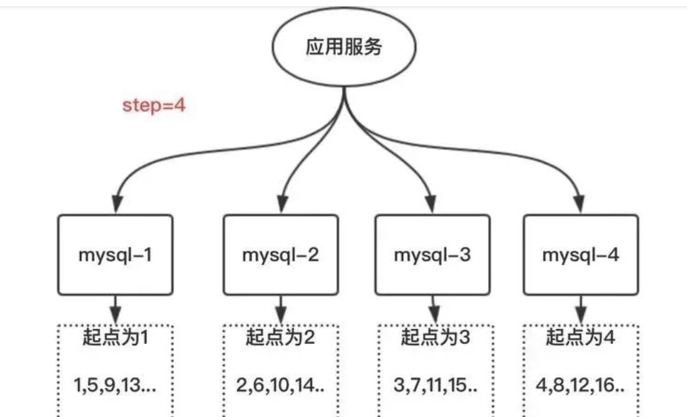

&nbsp;&nbsp;&nbsp;&nbsp;   * 一、**UUID** 
&nbsp;&nbsp;&nbsp;&nbsp;UUID有五个版本。 
&nbsp;&nbsp;&nbsp;&nbsp;xxxxxxxx-xxxx-Mxxx-Nxxx-xxxxxxxxxxxx 
&nbsp;&nbsp;&nbsp;&nbsp;数字 M的四位表示 UUID 版本，当前规范有5个版本，M可选值为1, 2, 3, 4, 5 ； 
&nbsp;&nbsp;&nbsp;&nbsp;**UUID Version 1**：基于时间的UUID，UUID 是 通用唯一识别码（Universally Unique Identifier）,是长32的字符串，128比特。 
&nbsp;&nbsp;&nbsp;&nbsp;UUID用来识别属性类型，UUID是基于当前时间、计数器（counter）和硬件标识（通常为无线网卡的MAC地址）等数据计算生成的
，在所有空间和时间上被视为唯一的标识。一般来说，可以保证这个值是真正唯一的任何地方产生的任意一个UUID都不会有相同的值。 

         
    f9214aa0-8b96-4263-8c91-676d1abbaebe
    UUID的编码规则：
    1）1~8位采用系统时间，在系统时间上精确到毫秒级保证时间上的惟一性；
    2）9~16位采用底层的IP地址，在服务器集群中的惟一性；
    3）17~24位采用当前对象的HashCode值，在一个内部对象上的惟一性；
    4）25~32位采用调用方法的一个随机数，在一个对象内的毫秒级的惟一性。
    通过以上4种策略可以保证惟一性。在系统中需要用到随机数的地方都可以考虑采用UUID算法。

&nbsp;&nbsp;&nbsp;&nbsp;**UUID Version 3**：基于名字的UUID（MD5）基于名字的UUID通过计算名字和名字空间的MD5散列值得到。相同名字空间中相同名字的UUID重复生成是相同的。 
&nbsp;&nbsp;&nbsp;&nbsp;通常我们建议使用UUID来标识对象或持久化数据，对于具有名称不可重复的自然特性的对象，可以使用Version 3。Java的实现是Version3或4 
&nbsp;&nbsp;&nbsp;&nbsp;**UUID Version 4**：随机UUID 
&nbsp;&nbsp;&nbsp;&nbsp;根据随机数，或者伪随机数生成UUID。也不用担心重复，0.0000000004 (4 x 10-10)的概率。实现简单，用的多。 

    /**
     * 使用静态工厂来获取版本4（伪随机数生成器）的 UUID
     * Static factory to retrieve a type 4 (pseudo randomly generated) UUID.
     * 这个UUID生成使用了强加密的伪随机数生成器(PRNG)
     * The {@code UUID} is generated using a cryptographically strong pseudo
     * random number generator.
     *
     * @return  A randomly generated {@code UUID}
     */
    public static UUID randomUUID() {
        // 与Random(弱伪随机数生成器)不一样，SecureRandom是强伪随机数生成器，结果不可预测
        // 使用SecureRandom生成随机数，替换version和variant就是 UUID
        SecureRandom ng = Holder.numberGenerator;

        byte[] randomBytes = new byte[16];
        ng.nextBytes(randomBytes);
        randomBytes[6]  &= 0x0f;  /* clear version        */
        randomBytes[6]  |= 0x40;  /* set to version 4     */
        randomBytes[8]  &= 0x3f;  /* clear variant        */
        randomBytes[8]  |= 0x80;  /* set to IETF variant  */
        return new UUID(randomBytes);
    }

&nbsp;&nbsp;&nbsp;&nbsp;   * 二、**主键自增** 
&nbsp;&nbsp;&nbsp;&nbsp;例如MySQL的主键自增auto_increment，默认每次ID加1。 
&nbsp;&nbsp;&nbsp;&nbsp;好处是数字类型自增，可辨识，查询效率高。
但比如据库双向同步时，就会存在相同ID情况 

&nbsp;&nbsp;&nbsp;&nbsp;部署多台机器后，需要MySQL多实例主键自增，在auto_increment基本上面，设置step步长 
   

&nbsp;&nbsp;&nbsp;&nbsp;当使用数据库来生成ID性能不够要求的时候，我们可以尝试使用Redis来生成ID。这主要依赖于Redis是单线程的，所以也可以用生成全局唯一的ID。可以用Redis的原子操作 INCR和INCRBY来实现。一旦Redis挂了，整个系统不可用。

&nbsp;&nbsp;&nbsp;&nbsp; 本人授权[维权骑士](http://rightknights.com)对我发布文章的版权行为进行追究与维权。未经本人许可，不可擅自转载或用于其他商业用途。

 