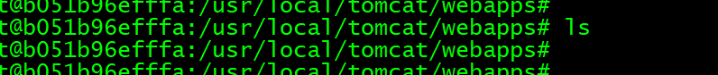
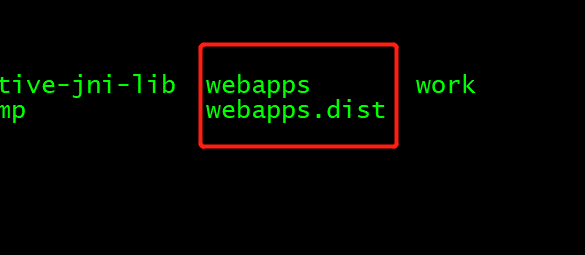

&nbsp;&nbsp;&nbsp;&nbsp;   * 1、**下载安装docker** 
         
    yum install -y epel-release
    yum install docker-io  
    chkconfig docker on     # 加入开机启动
    service docker start     # 启动docker服务

&nbsp;&nbsp;&nbsp;&nbsp;   * 2、**查找服务器的tomcat信息**    

    docker search tomcat

&nbsp;&nbsp;&nbsp;&nbsp;   * 3、**下载下来官方的镜像Starts最高的那个**    

    docker pull  docker.io/tomcat     
    docker pull : 从镜像仓库中拉取或者更新指定镜像

&nbsp;&nbsp;&nbsp;&nbsp;   * 4、**查看镜像**    

    docker images 

&nbsp;&nbsp;&nbsp;&nbsp;   * 5、**先关了tomcat**    
         
    ps -ef |grep tomcat
    kill -9 xxxx 

&nbsp;&nbsp;&nbsp;&nbsp;   * 6、**启动**   
         
    docker run -d --name tomcat -p 8081:8080 tomcat:7

&nbsp;&nbsp;&nbsp;&nbsp;前者是外围访问端口：后者是容器内部端口

&nbsp;&nbsp;&nbsp;&nbsp;   * 7、**进入和退出容器**   
         
    docker exec -it b051b96efffa /bin/bash
    Ctrl+P+Q 退出容器

&nbsp;&nbsp;&nbsp;&nbsp;docker ps 
&nbsp;&nbsp;&nbsp;&nbsp;惊人的发现 webapps什么也没有 
   
&nbsp;&nbsp;&nbsp;&nbsp;而目录都在webapps.dist 
   

改一下就可以访问了

&nbsp;&nbsp;&nbsp;&nbsp; 本人授权[维权骑士](http://rightknights.com)对我发布文章的版权行为进行追究与维权。未经本人许可，不可擅自转载或用于其他商业用途。

