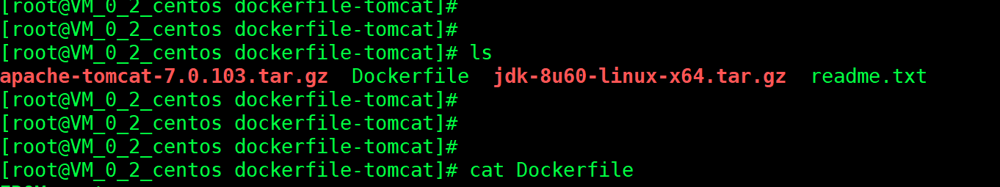
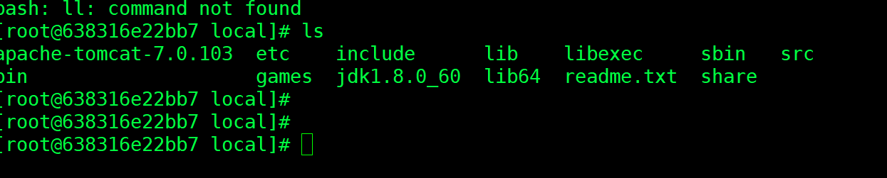
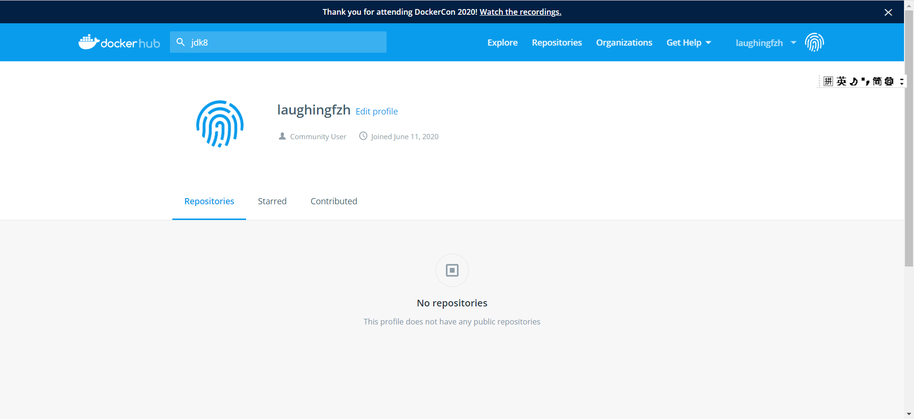

## 一、上传jdk和tomcat




## 二、dockerfile文件

```
FROM centos
MAINTAINER laughing<619426619@qq.com>

COPY readme.txt /usr/local/readme.txt

ADD jdk-8u60-linux-x64.tar.gz /usr/local/
ADD apache-tomcat-7.0.103.tar.gz /usr/local/

RUN yum -y install vim

ENV MYPATH /usr/local
WORKDIR $MYPATH

ENV JAVA_HOME  /usr/local/jdk1.8.0_60
ENV CLASSPATH $JAVA_HOME/lib/dt.jar:$JAVA_HOME/lib/tools.jar
ENV CATALINA_HOME /usr/local/apache-tomcat-7.0.103
ENV CATALINA_BASE /usr/local/apache-tomcat-7.0.103
ENV PATH $PATH:$JAVA_HOME/bin:$CATALINA_HOME/lib:$CATALINA_HOME/bin

EXPOSE 8080

CMD /usr/local/apache-tomcat-7.0.103/bin/startup.sh  && tail  -F /usr/local/apache-tomcat-7.0.103/bin/logs/catalina.out


```


## 三、构建运行


```
docker build -t laughing-tomcat .

docker ps 

#挂载webapps和logs
docker run -d -p 8020:8080  --name laughing-tomcat -v /home/laughing-tomcat:/usr/local/apache-tomcat-7.0.103/webapps -v /home/laughing-tomcat/logs:/usr/local/apache-tomcat-7.0.103/logs  laughing-tomcat

```

**容器里面：**




**挂载成功**


## 四、发布项目

卷挂载目录到了tomcat的webapps里了<br>

```
cd /home/laughing-tomcat
```

上传war包！<br>

restart<br>


## 五、发布镜像到dockerHub

注册：




```
docker  login

Login Succeeded


#加上标签
docker tag laughing-tomcat laughingfzh/laughing-tomcat:1.0

docker push laughingfzh/laughing-tomcat:1.0 
```


&nbsp;&nbsp;&nbsp;&nbsp; 本人授权[维权骑士](http://rightknights.com)对我发布文章的版权行为进行追究与维权。未经本人许可，不可擅自转载或用于其他商业用途。


