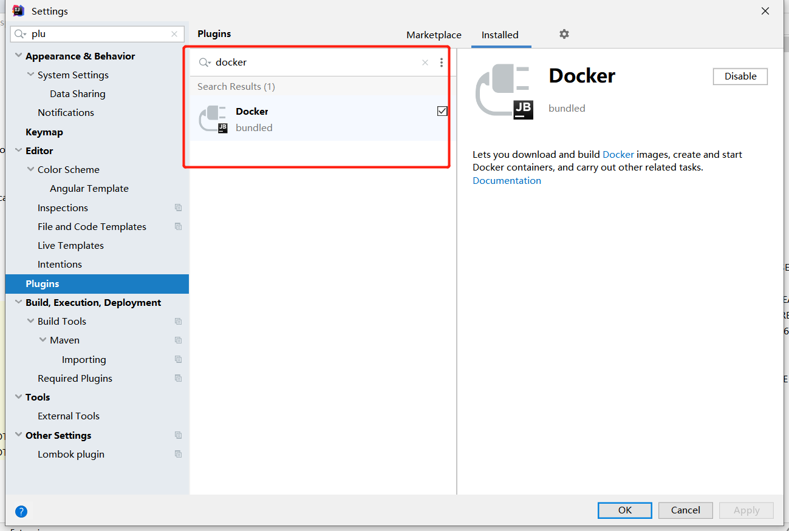
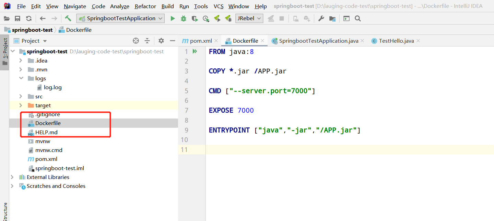
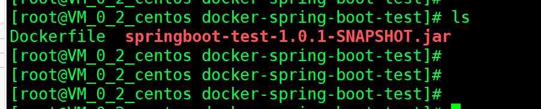

## 一、创建spring-boot的项目

用一个以前的获取端口的demo;<br>

package成jar包；<br>

测试一下是否正常启动；<br>

java -jar springboot-test-1.0.1-SNAPSHOT.jar<br>


## 二、下载idea的docker插件



编写Dockerfile:

```
FROM java:8

COPY *.jar /APP.jar

CMD ["--server.port=7000"]

EXPOSE 7000

ENTRYPOINT ["java","-jar","/APP.jar"]
```




## 三、上传jar包和Dockerfile



## 四、构建运行

```
docker build -t spring-boot-test .


docker run -d -p 7000:7000 --name spring-boot-test spring-boot-test

```


&nbsp;&nbsp;&nbsp;&nbsp; 本人授权[维权骑士](http://rightknights.com)对我发布文章的版权行为进行追究与维权。未经本人许可，不可擅自转载或用于其他商业用途。


