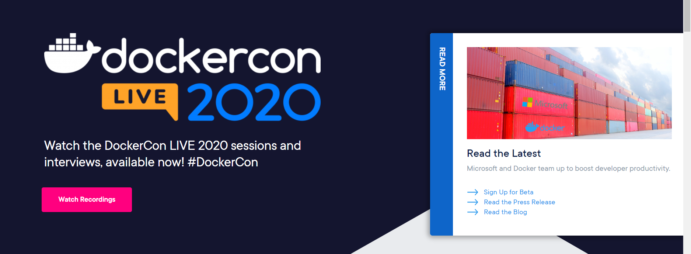
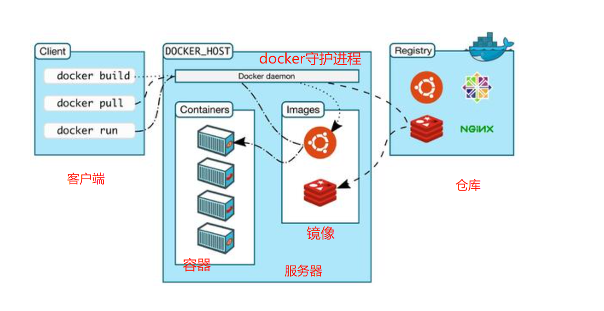
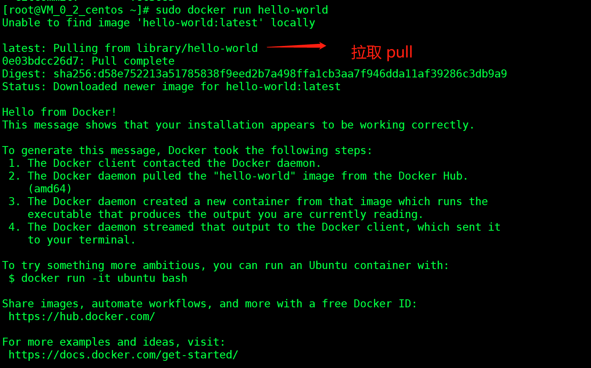

::: tip docker
docker 容器技术已成为必须掌握的知识
:::


# 一、概述



**官网：**<br>

[https://www.docker.com](https://www.docker.com)<br>

**dockerhub:**<br>

[https://hub.docker.com/](https://hub.docker.com/)<br>

Docker 是一个开源的应用容器引擎，基于Go语言，并遵从 Apache2.0 协议开源。<br>

Docker 可以让开发者打包**他们的应用以及依赖包**到一个轻量级、可移植的容器中，然后发布到任何流行的 Linux 机器上，也可以实现虚拟化。<br>

容器是完全使用**沙箱机制**，相互之间不会有任何接口,更重要的是容器性能开销极低。<br>

比如我们把项目从windows发布到linux环境并不能跨平台，以前发布一个jar或者war，需要在机器上配置redis、mysql、ES、jdk。现在使用docker后可以带上环境来打包（镜像）。<br>


# 二、组成





**镜像（image）**:通过镜像来创建容器，相当于是一个 root 文件系统，创建 Docker 容器的模板。<br>

**容器（container）**：独立运行应用，是镜像运行时的实体。<br>

**仓库（repository）**：Docker 仓库用来保存镜像，可以理解为代码控制中的代码仓库。<br>


# 三、安装

CentOS的安装文档：<br>

[https://docs.docker.com/engine/install/centos/](https://docs.docker.com/engine/install/centos/)<br>

1、卸载：

```
 sudo yum remove docker \
                  docker-client \
                  docker-client-latest \
                  docker-common \
                  docker-latest \
                  docker-latest-logrotate \
                  docker-logrotate \
                  docker-engine
```

2、安装包：

```
sudo yum install -y yum-utils
```

3、设置镜像仓库

```
sudo yum-config-manager \
    --add-repo \
    https://download.docker.com/linux/centos/docker-ce.repo
```
不用这个 用阿里云的镜像地址：
```
sudo yum-config-manager \
    --add-repo \
http://mirrors.aliyun.com/docker-ce/linux/centos/docker-ce.repo
```

安装最新docker-ce社区版的核心：

```
sudo yum install docker-ce docker-ce-cli containerd.io
```

或者指定版本：

```
sudo yum install docker-ce-<VERSION_STRING> docker-ce-cli-<VERSION_STRING> containerd.io
```

作为服务启动：

```
sudo systemctl start docker
```

docker run：

```
sudo docker run hello-world
```



&nbsp;&nbsp;&nbsp;&nbsp; 本人授权[维权骑士](http://rightknights.com)对我发布文章的版权行为进行追究与维权。未经本人许可，不可擅自转载或用于其他商业用途。


