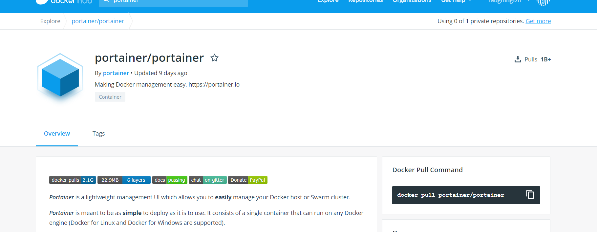
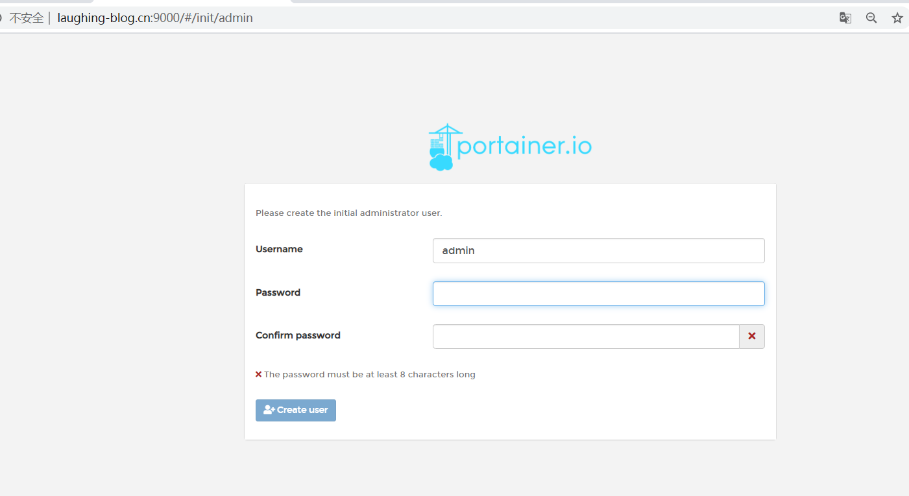
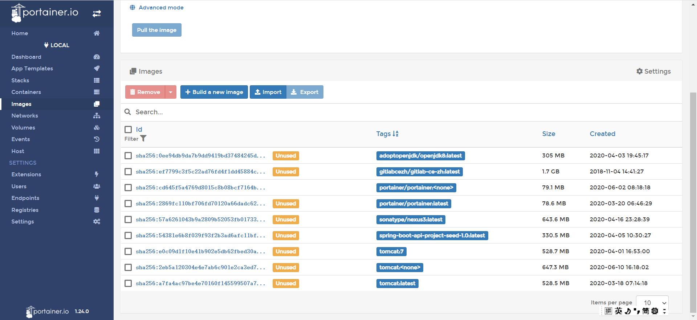
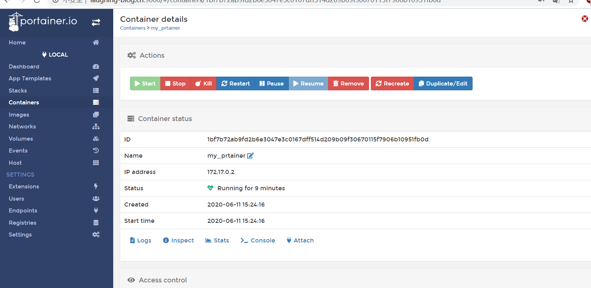

::: tip Portainer
Portainer是Docker的图形化管理工具，提供状态显示面板、应用模板快速部署、容器镜像网络数据卷的基本操作（包括上传下载镜像，创建容器等操作）、事件日志显示、容器控制台操作、Swarm集群和服务等集中管理和操作、登录用户管理和控制等功能。功能十分全面，基本能满足中小型单位对容器管理的全部需求。
:::

### 一、安装



```
docker pull portainer/portainer

docker run -d -p 9000:9000 \
--restart=always \
-v /var/run/docker.sock:/var/run/docker.sock \
--name my_prtainer \
docker.io/portainer/portainer
```

**默认是9000端口，初始化密码：**



**选中local本地连接**






&nbsp;&nbsp;&nbsp;&nbsp; 本人授权[维权骑士](http://rightknights.com)对我发布文章的版权行为进行追究与维权。未经本人许可，不可擅自转载或用于其他商业用途。


