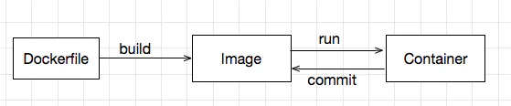
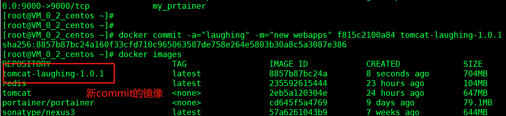

## 一、Docker镜像加载原理



**Dockerfile**: 用于描述镜像的生成规则。 Dockerfile中的每一条命令，都在Docker镜像中以一个独立镜像层的形式存在。<br>

**Image**: 由Dockerfile生成, 呈现层级结构, 每层镜像包含：镜像文件以及镜像json元数据信息。<br>

**Container**: Container 是Image 的动态运行结果，概括而言，就是在Docker镜像之上，运行进程。<br>


**联合文件系统**<br>

把不同的目录挂载到同一个虚拟文件系统中去。这种概念比较抽象，其实是可以简单理解为把不同的目录合并成一个目录，原来目录下的内容路径都不会改变<br>

**docker redis 的分层：**

       "RootFS": {
            "Type": "layers",
            "Layers": [
                "sha256:13cb14c2acd34e45446a50af25cb05095a17624678dbafbcc9e26086547c1d74",
                "sha256:e6b49c7dcaac7a2ec2acc379da5f5b1bcc6a5d3badd72814fe945296216557bd",
                "sha256:cdaf0fb0082b74223a224c39c2d2ea886c32f53b7e1d5b872d5354aae0df56b8",
                "sha256:72d3a7e6fe022824ee2f852ca132030e22c644fbaf8287f4ea8044268abe40b7",
                "sha256:67c707dbd847d8310d3b988c3e3d9d9eb53387ede0de472e36a15abbcb6c719c",
                "sha256:7b9c5be81844318508f57a5b0574822dabaaed3dc25ee35d960feec3a9e941c4"
            ]
        },
## 二、Commit 从容器创建一个新的镜像


**Docker 的镜像都是只读的。当容器启动后，一个新的可写层将会加载到镜像的顶部（容器层）。**<br>

我们可以**连带这个容器层**，重新**commit**;<br>

docker pull下来的tomcat里webapps是空的，文件都在webapps.dist里面，我重新commit一个webapps不为空的tomcat镜像。<br>


```
cp  -r webapps.dist/*  webapps
```

```
#退出去
docker commit 
#提交新版本
docker commit -a="laughing" -m="new webapps" f815c2100a84 tomcat-laughing-1.0.1
```



docker 没有vim解决方法:**

```
apt-get update

apt-get install vim
```

**我们可以用commit打一个稳定的版本镜像。**


&nbsp;&nbsp;&nbsp;&nbsp; 本人授权[维权骑士](http://rightknights.com)对我发布文章的版权行为进行追究与维权。未经本人许可，不可擅自转载或用于其他商业用途。


