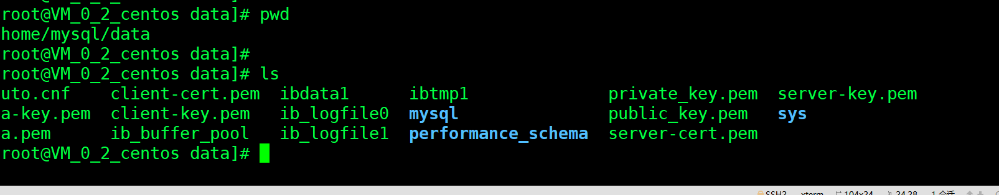

## 一、安装MySql

```
docker search mysql
docker pull mysql:5.7
```

## 二、运行挂载

```
#挂载mysql的配置文件和data文件
#-e MYSQL_ROOT_PASSWORD=123456设定密码

docker run -d -p 3306:3306 -v /home/mysql/conf:/etc/mysql/conf.d -v /home/mysql/data:/var/lib/mysql -e MYSQL_ROOT_PASSWORD=123456 --name mysql-lauging  9cfcce23593a
```

**已经挂载到本地：**




&nbsp;&nbsp;&nbsp;&nbsp; 本人授权[维权骑士](http://rightknights.com)对我发布文章的版权行为进行追究与维权。未经本人许可，不可擅自转载或用于其他商业用途。


