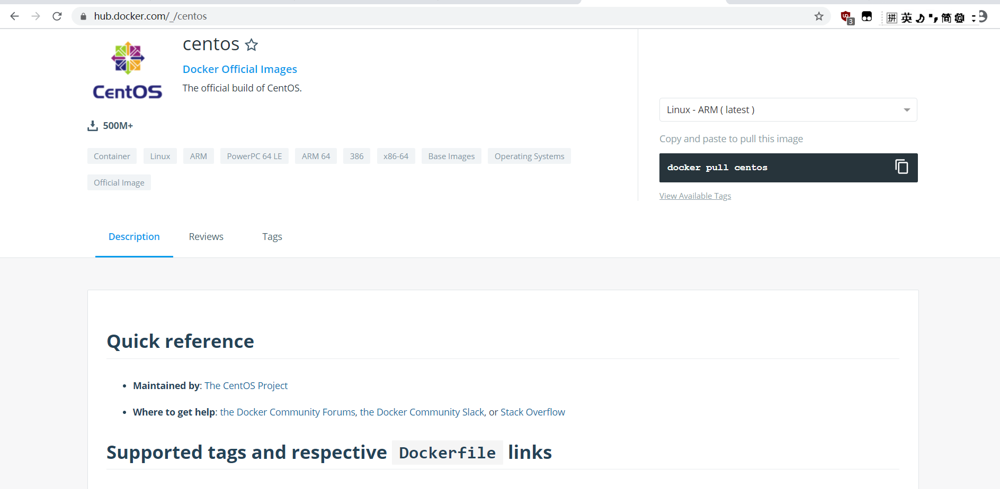
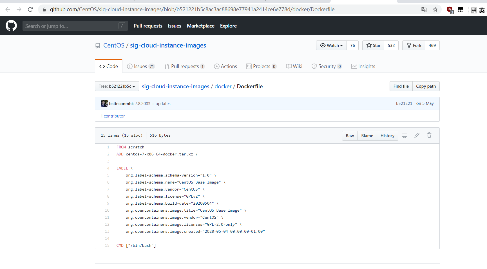
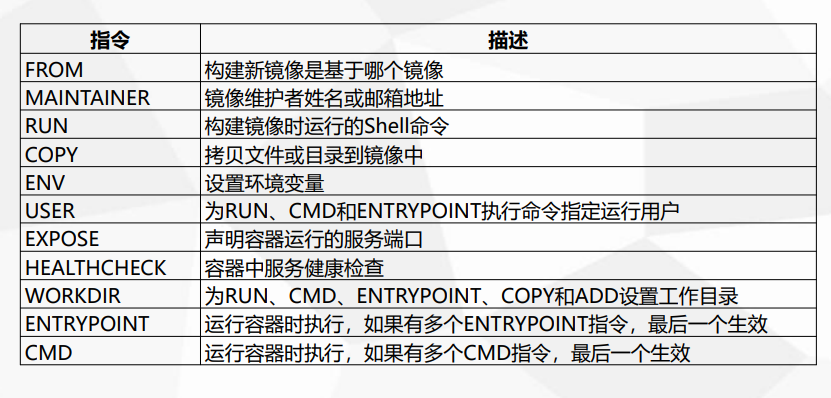
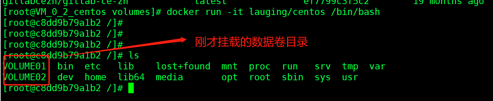

## 一、dockerfile文件
dockerfile文件可以直接作为交付物<br>
可以在dockerHub查看编写好的dockerfile文件，以centos为例：






基本命令：




## 二、编写dockerfile文件


```
[root@VM_0_2_centos docker-test]# vim dockerfile
[root@VM_0_2_centos docker-test]# 
[root@VM_0_2_centos docker-test]# cat dockerfile 
FROM centos

VOLUME ["VOLUME01","VOLUME02"]

CMD echo "-----------end----------"
CMD /bin/bash
[root@VM_0_2_centos docker-test]# 
```


## 三、docker build：

```
[root@VM_0_2_centos docker-test]# docker build -f dockerfile -t lauging/centos .
Sending build context to Docker daemon  2.048kB
Step 1/4 : FROM centos
latest: Pulling from library/centos
8a29a15cefae: Pull complete 
Digest: sha256:fe8d824220415eed5477b63addf40fb06c3b049404242b31982106ac204f6700
Status: Downloaded newer image for centos:latest
 ---> 470671670cac
Step 2/4 : VOLUME ["VOLUME01","VOLUME02"]
 ---> Running in fbdbe8ca0ca0
Removing intermediate container fbdbe8ca0ca0
 ---> 60368f558c1a
Step 3/4 : CMD echo "-----------end----------"
 ---> Running in b8fc4a10e713
Removing intermediate container b8fc4a10e713
 ---> 7ceed11abe2d
Step 4/4 : CMD /bin/bash
 ---> Running in af63693261be
Removing intermediate container af63693261be
 ---> 0d407d1d0669
Successfully built 0d407d1d0669
Successfully tagged lauging/centos:latest
#已经打好了lauging/centos
[root@VM_0_2_centos docker-test]# docker images
REPOSITORY                         TAG                 IMAGE ID            CREATED             SIZE
lauging/centos                     latest              0d407d1d0669        11 seconds ago      237MB
```

## 四、docker run 

```
#进入我们的容器

docker run -it lauging/centos /bin/bash
```





## 五、发布docker push


&nbsp;&nbsp;&nbsp;&nbsp; 本人授权[维权骑士](http://rightknights.com)对我发布文章的版权行为进行追究与维权。未经本人许可，不可擅自转载或用于其他商业用途。


