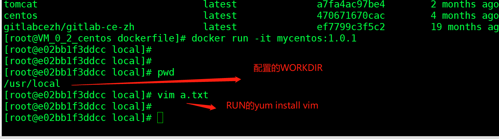
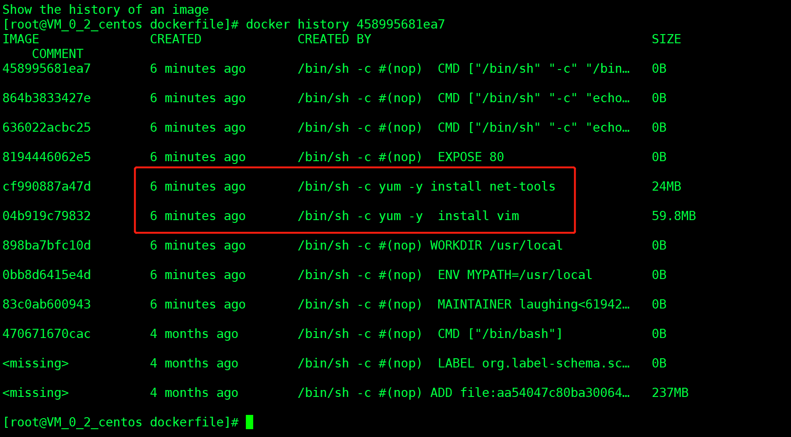

## 一、编写dockerfile文件

```
[root@VM_0_2_centos dockerfile]# vim mydockerfile
[root@VM_0_2_centos dockerfile]# cat mydockerfile 
FROM centos

MAINTAINER laughing<619426619@qq.com>

ENV MYPATH /usr/local
WORKDIR  $MYPATH         #工作目录

RUN yum -y  install vim       #下载vim
RUN yum -y install net-tools

EXPOSE 80   #暴露端口

CMD echo $MYPATH
CMD echo "-----end-----"
CMD /bin/bash

```


## 二、build


```
docker build -f mydockerfile -t  mycentos:1.0.1 .

...................
...................

Successfully built 458995681ea7
Successfully tagged mycentos:1.0.1
```

## 三、运行

```
docker run -it mycentos:1.0.1
```




```
docker history 8857b87bc24a
```





&nbsp;&nbsp;&nbsp;&nbsp; 本人授权[维权骑士](http://rightknights.com)对我发布文章的版权行为进行追究与维权。未经本人许可，不可擅自转载或用于其他商业用途。


