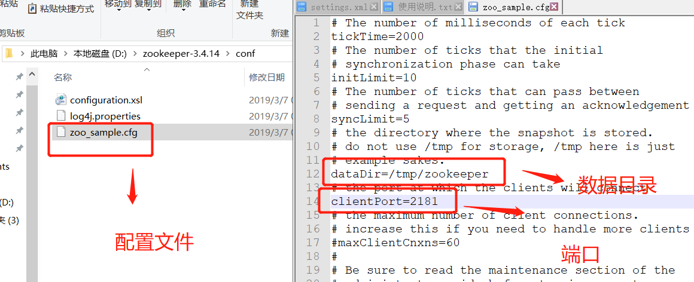
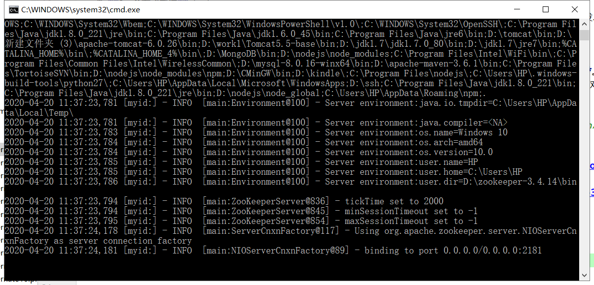
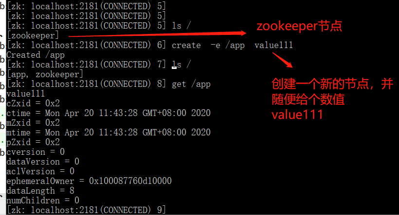
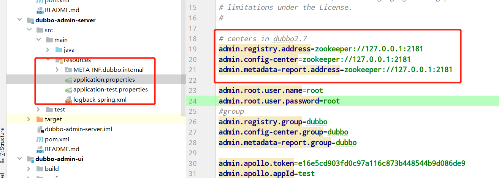
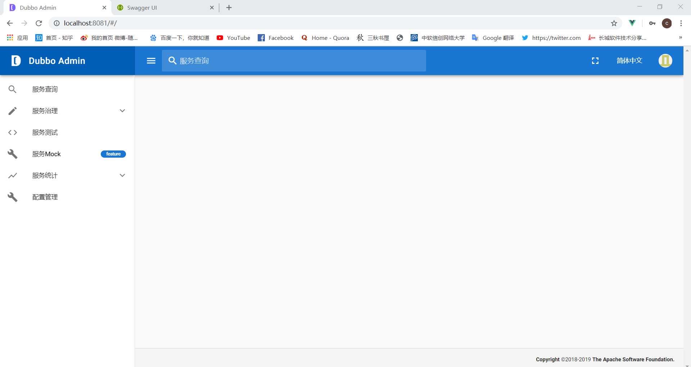
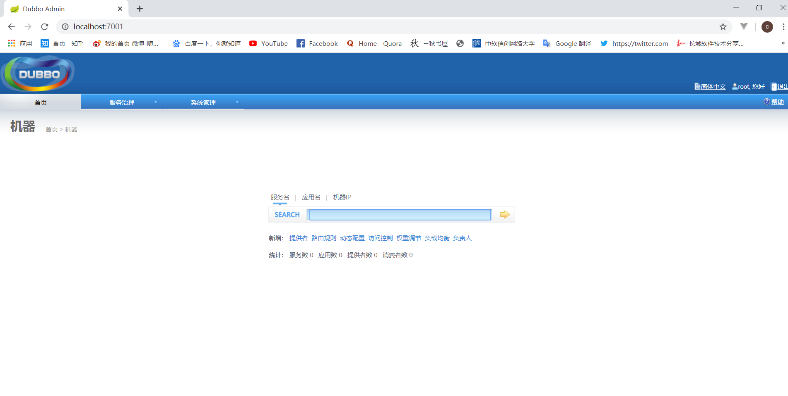

   * **1、分布式系统** 
&nbsp;&nbsp;&nbsp;&nbsp;比起普通的集群模式，采用微服务分布式系统，使系统之间的耦合度大大降低，并且可以独立开发、部署、测试。
由于分布式系统可能有很多独立的子系统组成，业务量增强以后，子系统通信关系复杂，这时就需要引入RPC框架    
   * **2、RPC框架** 
&nbsp;&nbsp;&nbsp;&nbsp;简单介绍RPC（Remote Procedure Call），大部分RPC框架都使用TCP协议。
比如微服务A需要调用微服务B的一个类的一个方法。A服务与B服务需要先建立一个Socket传输。原理基于**序列化和反序列化**。
B服务将Java对象序列化为二进制格式，传给A服务端，A服务端接收到之后，再反序列化为Java对象,服务A就可以调用这个Java对象了。
比起Restful的http模式，RPC是面向过程的，直接用二进制格式进行传输。
   * **3、dubbo简介** 
&nbsp;&nbsp;&nbsp;&nbsp;官方文档：[http://dubbo.apache.org/zh-cn/](http://dubbo.apache.org/zh-cn/) 

   * **4、注册中心搭建zookeeper** 
&nbsp;&nbsp;&nbsp;&nbsp;Zookeeper 是 Apacahe Hadoop 的子项目，这里作为 Dubbo 服务的注册中心[http://zookeeper.apache.org/](http://zookeeper.apache.org/) 
&nbsp;&nbsp;&nbsp;&nbsp;zookeeper-3.4.14下载地址： 
&nbsp;&nbsp;&nbsp;&nbsp;[http://mirror.bit.edu.cn/apache/zookeeper/zookeeper-3.4.14/zookeeper-3.4.14.tar.gz](http://mirror.bit.edu.cn/apache/zookeeper/zookeeper-3.4.14/zookeeper-3.4.14.tar.gz) 
&nbsp;&nbsp;&nbsp;&nbsp;解压 
&nbsp;&nbsp;&nbsp;&nbsp;更改配置文件，win下新建dataDir目录并配置更改，并将配置文件更改为zoo.cfg 
   
&nbsp;&nbsp;&nbsp;&nbsp;运行zkServer.cmd 
   
&nbsp;&nbsp;&nbsp;&nbsp;打开客户端zkCli.cmd，简单的几条查看命令 
   

   * **5、监控中心-管理控制台** 
c[https://github.com/apache/dubbo-admin](https://github.com/apache/dubbo-admin) 
&nbsp;&nbsp;&nbsp;&nbsp;官方给出的控制台是spring boot + vue.js的项目形式 
&nbsp;&nbsp;&nbsp;&nbsp;dubbo-admin-server/src/main/resources/application.properties中指定注册中心地址 
   

&nbsp;&nbsp;&nbsp;&nbsp;部署完成后，可以访问 http://localhost:8080/swagger-ui.html 来查看所有的restful api 
&nbsp;&nbsp;&nbsp;&nbsp;账号密码都是root 
      
   
&nbsp;&nbsp;&nbsp;&nbsp;老版本 用springboot jar包dubbo-admin-0.0.1-SNAPSHOT.jar    
      
   
   * **6、Dubbo项目构建**    
   
 &nbsp;&nbsp;&nbsp;&nbsp;**将provider注册到注册中心，consumer去注册中心订阅provider** 
 
 &nbsp;&nbsp;&nbsp;&nbsp;6.1、在provider引入dubbo和zookeeper 
    
             <!--dubbo依赖-->
             <dependency>
                 <groupId>com.alibaba</groupId>
                 <artifactId>dubbo</artifactId>
                 <version>2.6.2</version>
             </dependency>
             <!--zookeeper客户端-->
             <dependency>
                 <groupId>org.apache.curator</groupId>
                 <artifactId>curator-framework</artifactId>
                 <version>2.12.0</version>
             </dependency>

 &nbsp;&nbsp;&nbsp;&nbsp;6.2、用 Spring 配置声明暴露服务 
    
             <?xml version="1.0" encoding="UTF-8"?>
             <beans xmlns="http://www.springframework.org/schema/beans"
                    xmlns:xsi="http://www.w3.org/2001/XMLSchema-instance"
                    xmlns:dubbo="http://dubbo.apache.org/schema/dubbo"
                    xsi:schemaLocation="http://www.springframework.org/schema/beans        http://www.springframework.org/schema/beans/spring-beans-4.3.xsd        http://dubbo.apache.org/schema/dubbo        http://dubbo.apache.org/schema/dubbo/dubbo.xsd">
             
                 <!-- 当前应用名  -->
                 <dubbo:application name="servicce"  />
                 <!-- 注册中心位置 这里用之前的zookeeper-->
                 <dubbo:registry address="zookeeper://127.0.0.1:2181" />
                 <!-- 用dubbo协议在20880端口暴露服务 -->
                 <dubbo:protocol name="dubbo" port="20880" />
                 <!-- 声明需要暴露的服务接口 ref指向实现-->
                 <dubbo:service interface="gwssi.service.UserService" ref="UserServiceImpl" />
                 <!-- 和本地bean一样实现服务 -->
                 <bean id="UserServiceImpl" class="com.gwssi.service.impl.UserServiceImpl" />
             </beans>
 &nbsp;&nbsp;&nbsp;&nbsp;6.3、启动              
  
   
   
   
   
   
   
   
   
   
   
   
   
   
   
   
   
   
   
   
   
&nbsp;&nbsp;&nbsp;&nbsp; 本人授权[维权骑士](http://rightknights.com)对我发布文章的版权行为进行追究与维权。未经本人许可，不可擅自转载或用于其他商业用途。

 