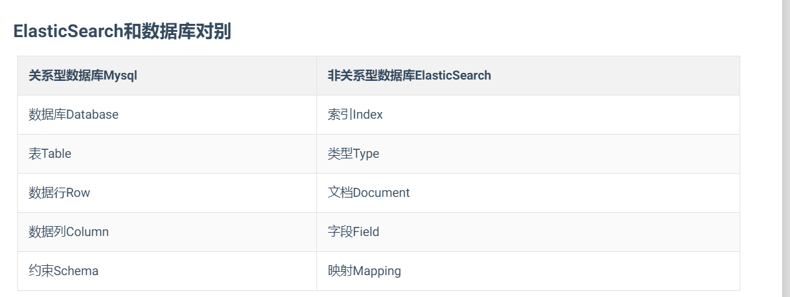

#### **索引**

**索引**index,是文档的容器，是一类文档的集合，类似关系数据库中的表，索引体现的是一种逻辑空间的概念，每个索引都应该有自己的`Mapping`定义，用于定义包含文档的字段名和字段类型。其中`Shard`（分片）体现的是物理空间的一种概念，就是索引中的数据存放在`Shard`上，因为有集群，要保证高空用，当其中一个机器崩溃中，保存在它上的分片数据也能被正常访问，因此，存在**分片副本**。 

#### **文档**

**文档**Elasticsearch面向文档性，文档就是所有可搜索数据的最小单位。文档会被序列化成`JSON`格式，保存在Elasticsearch中。 

#### **节点**

**节点**就是一个`Elaseticsearch`实例，本质就是一个`JAVA`进程。每一个节点启动后，默认就是一个`master eligible`节点。就是具备成为`master`资格的节点，你也可以指定（`node.master:false`），

第一个节点启动后，他就选自己成为`Master`节点类，每一个节点上都保存了集群状态，但是，只有`Master`才能修改集群状态信息。集群状态信息就比如：

- 所有的节点信息。
- 所有的索引信息，索引对应的`mapping`信息和`setting`信息。
- 分片的路由信息。

#### **分片（shard）**

- 主分片：用于解决数据的水平扩展问题，通过主分片就数据分布在集群内的不同节点上，主分片在创建索引的时候就指定了，后面就不允许修改，除非重新定义`Index`。
- 副本：用于解决高可用的问题，分片是主分片的拷贝。副本分片数可以动态的调整，增加副本数量可以在一定的程度上提高服务的可用性。关于主分片的理解可以如下图，看是怎样实现高可用的，

