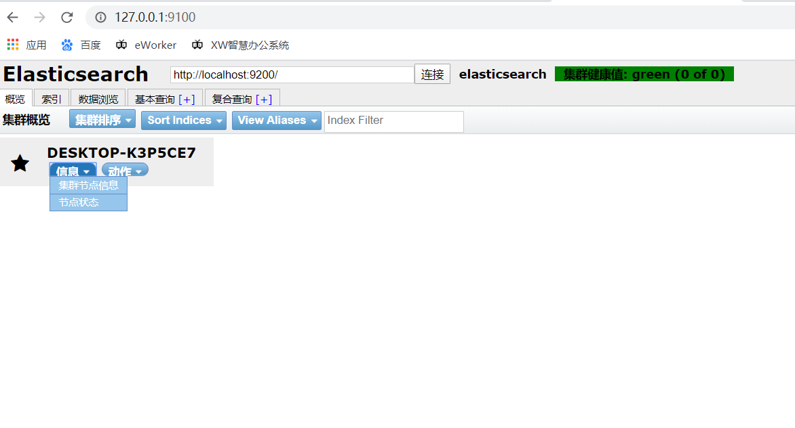
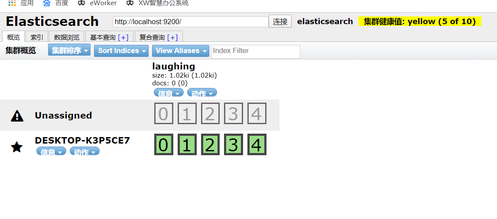
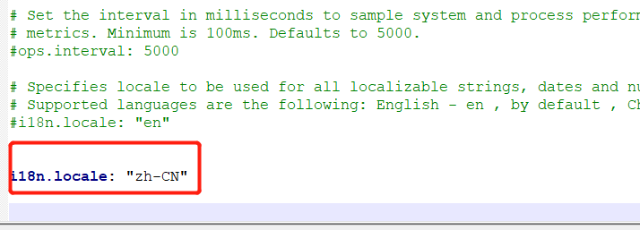
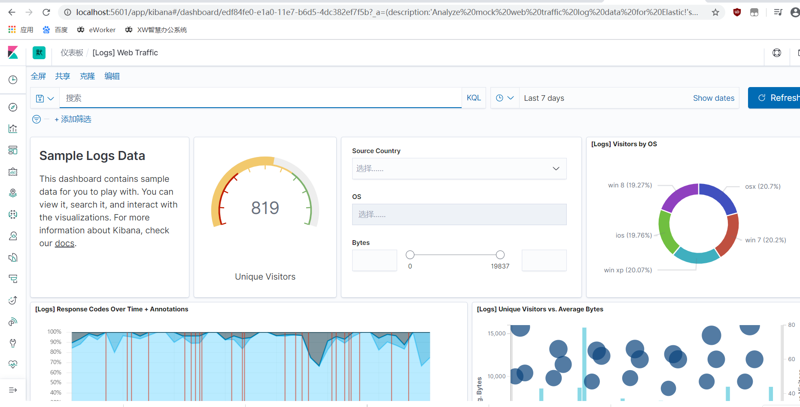
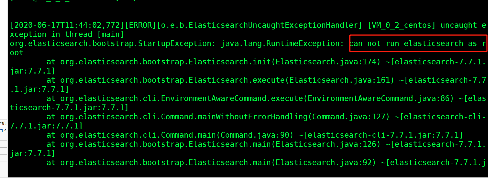
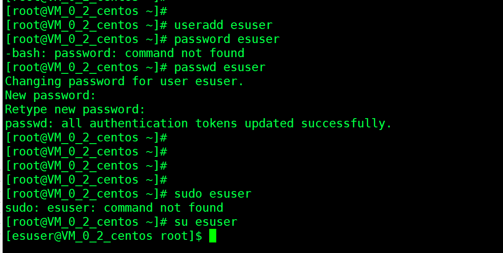

### 一、下载

ElasticSearch官网：<br>

[https://www.elastic.co/cn/](https://www.elastic.co/cn/)

下载：<br>

[https://www.elastic.co/cn/downloads/elasticsearch](https://www.elastic.co/cn/downloads/elasticsearch)

<br>


`ElasticSearch`是一个**分布式搜索服务**，提供的是一组`Restful API`，底层基于`Lucene`，采用多`shard`（分片）的方式保证数据安全，并且提供自动resharding的功能。是目前全文搜索引擎的首选，可以快速的存储、搜索和分析海量数据，`Springboot`通过整合`Spring Data ElasticSearch`为我们提供了非常方便的检索功能支持。

### 二、配置运行

我们需要启动三个服务：<br>

**ES服务**：elasticsearch-7.7.1-windows-x86_64.zip  9200<br>

**ES head可视化**：elasticsearch-head-master.zip   9100<br>

**kibana**：kibana-7.7.1-windows-x86_64.zip   5601<br> 

### 三、elasticsearch-7.7.1

配置文件：D:\elasticsearch\elasticsearch-7.7.1\config\elasticsearch.yml

**运行 elasticsearch.bat**


### 四、elasticsearch-head-master

github: [https://github.com/mobz/elasticsearch-head](https://github.com/mobz/elasticsearch-head)<br>

依赖node环境<br>

```
cd elasticsearch-head

npm install

npm run start

open` http://localhost:9100/
```


elasticsearch运行在9200，elasticsearch head在9100，解决跨域问题：<br>

修改D:\elasticsearch\elasticsearch-7.7.1\config\elasticsearch.yml

```
http.cors.enabled: true
http.cors.allow-origin: "*"
```




**新建索引：**





### 五、Kibana安装

解压缩包<br>

修改汉化：<br>

D:\elasticsearch\kibana-7.7.1-windows-x86_64\config\kibana.yml<br>




http://localhost:5601/





### 六、linux安装es




不能使用root账户,创建一个esuser用户并且授权：

```
chown -R esuser:esuser /usr/elasticsearch-7.7.1
```





