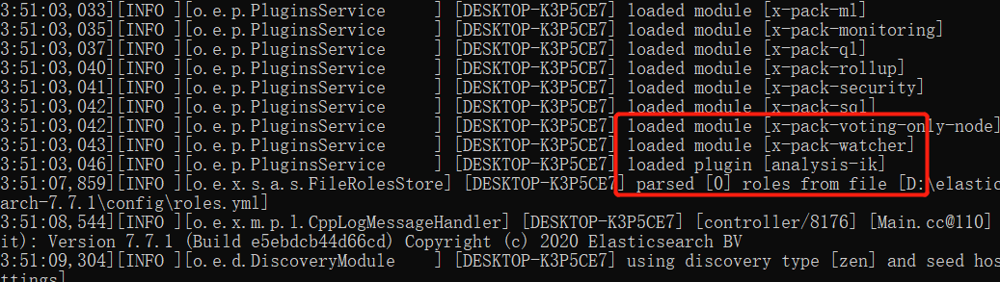
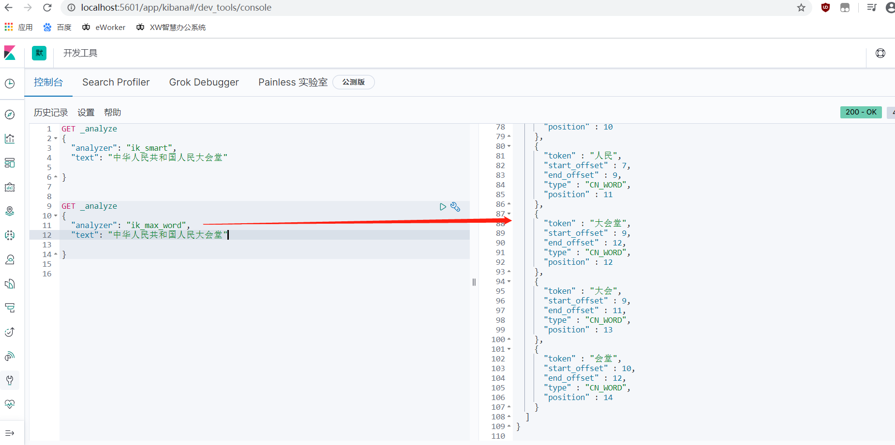
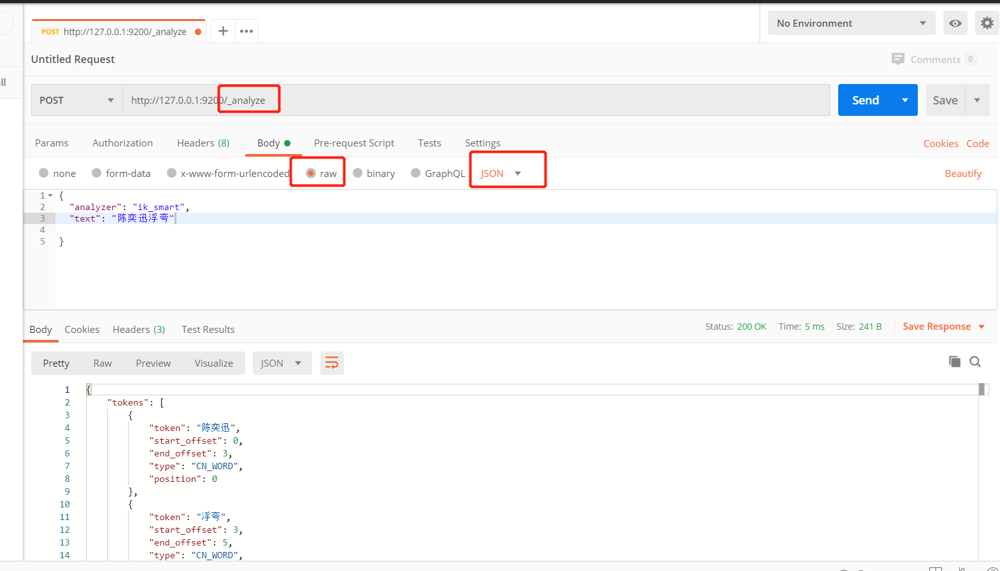
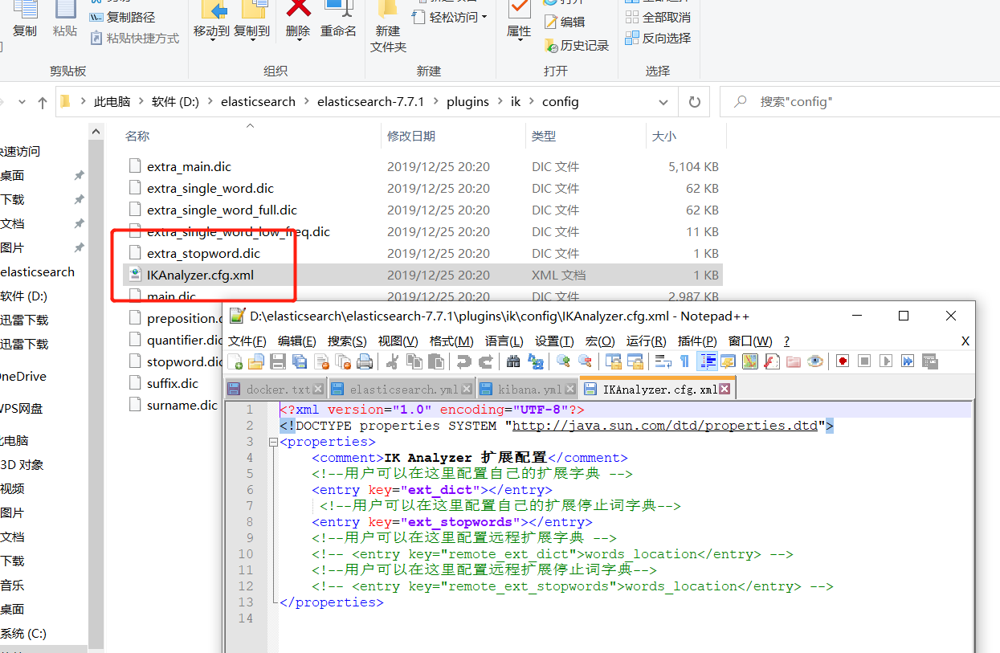

### 一、IK分词器插件下载

github [https://github.com/medcl/elasticsearch-analysis-ik/releases](https://github.com/medcl/elasticsearch-analysis-ik/releases)

 

解压到D:\elasticsearch\elasticsearch-7.7.1\plugins\ik 

### 二、ik_smart （最少切分）和 ik_max_word（最细粒度）

分词:即把一段中文或者别的划分成一个个的关键字,我们在搜索时候会把自己的信息进行分词,会把数据库中或者索引库中的数据进行分词,然后进行一个匹配操作。 

IK提供了两个分词算法 
**ik_smart （最粗）和 ik_max_word（最细）** 
其中 ik_smart 为最少切分，ik_max_word为最细粒度划分 

使用postman:

### 三、IK分词器分词字典增加配置

D:\elasticsearch\elasticsearch-7.7.1\plugins\ik\config 

新建dic字典，可增加自己的配置