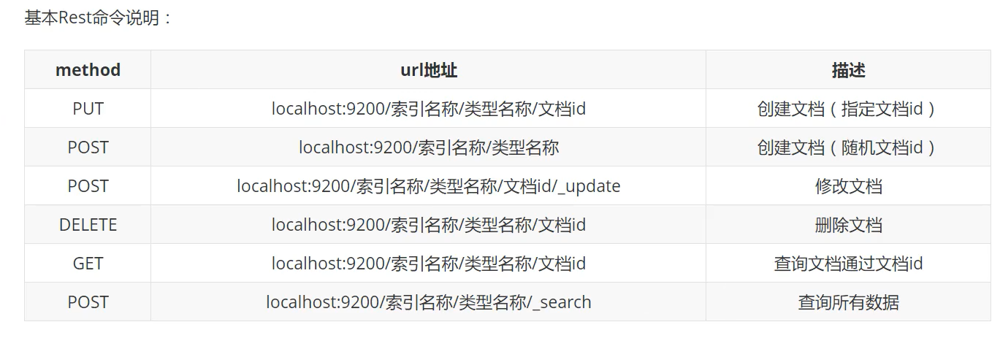
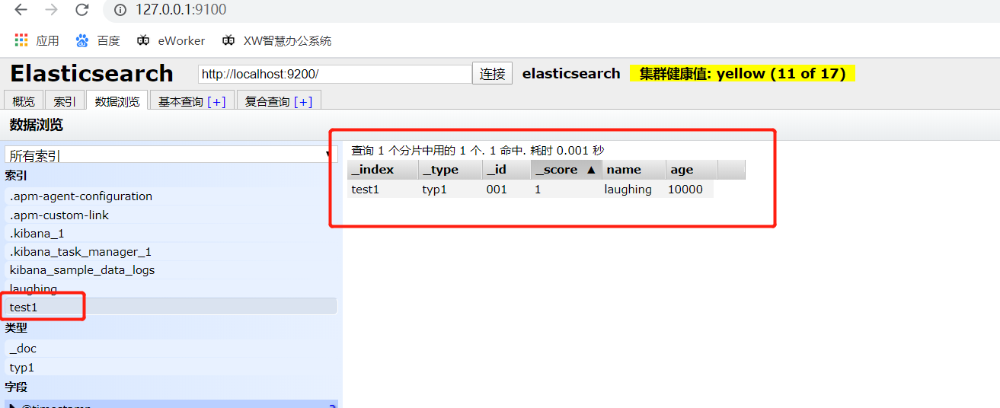
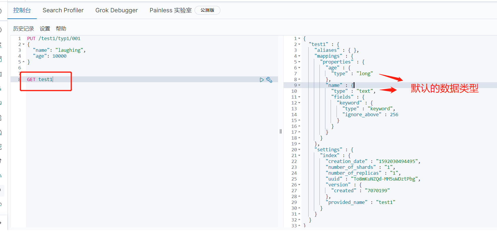
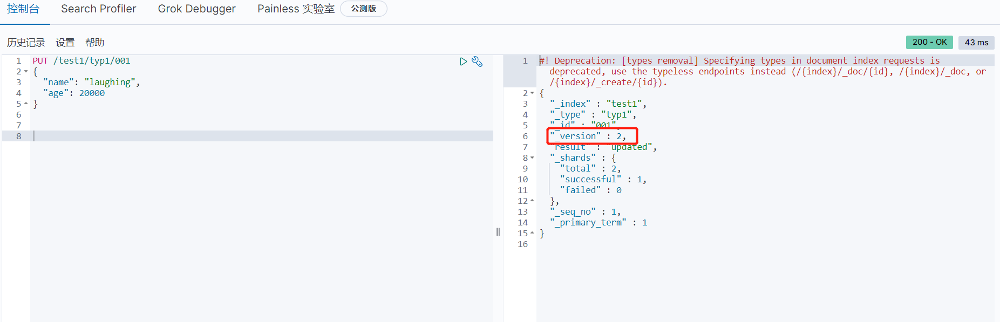
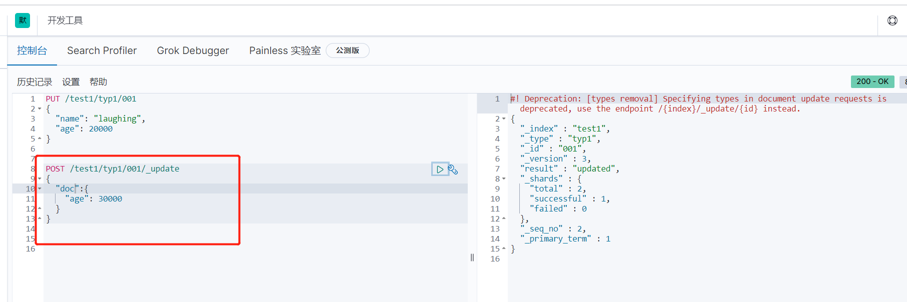
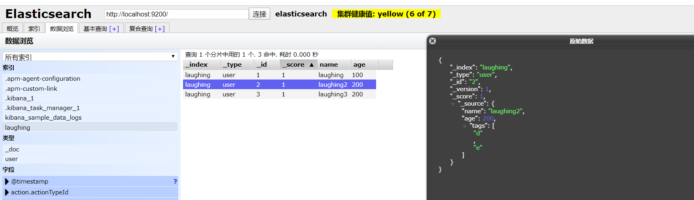
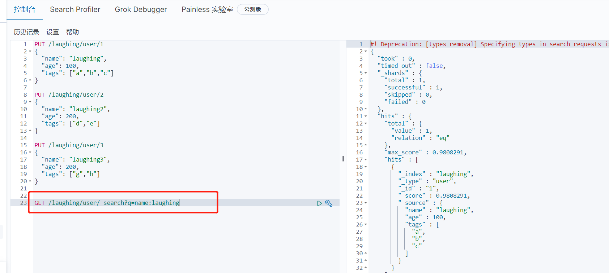

### 一、ES数据类型

```
### 1. 核心数据类型

（1）字符串类型： text, keyword

（2）数字类型：`long`, `integer`, `short`, `byte`, `double`, `float`, `half_float`, `scaled_float`

（3）日期：date

（4）日期 纳秒：date_nanos

（5）布尔型：boolean

（6）Binary：binary

（7）Range: `integer_range`, `float_range`, `long_range`, `double_range`, `date_range`

### 2. 复杂数据类型

（1）Object: object(for single JSON objects)

（2）Nested: `nested` (for arrays of JSON objects)

### 3. 地理数据类型

（1）Geo-point： geo_point （for lat/lon points）

（2）Geo-shape: geo_shape (for complex shapes like polygons)

### 4. 特殊数据类型

（1）IP: ip (IPv4 和 IPv6 地址)

（2）Completion类型：completion （to provide auto-complete suggestions）


```


### 二、创建索引：

```
PUT /索引name/类型名/id

PUT /test1/typ1/001
{
  "name": "laughing",
  "age": 10000
}

返回：

#! Deprecation: [types removal] Specifying types in document index requests is deprecated, use the typeless endpoints instead (/{index}/_doc/{id}, /{index}/_doc, or /{index}/_create/{id}).
{
  "_index" : "test1",      #索引名
  "_type" : "typ1",
  "_id" : "001",		  #索引id
  "_version" : 1,
  "result" : "created",
  "_shards" : {
    "total" : 2,
    "successful" : 1,
    "failed" : 0
  },
  "_seq_no" : 0,
  "_primary_term" : 1
}

```







### 三、修改

**直接PUT**





**使用post方法：**




```
PUT /test1/typ1/001
{
  "name": "laughing",
  "age": 20000
}

#####用POST比较安全

POST /test1/typ1/001/_update
{
  "doc":{
    "age": 30000
  }
}

```


### 四、删除

```
DELETE test1/typ1/001
DELETE test1
```


#### 五、文档操作

新建三条数据：

```
PUT /laughing/user/1
{
  "name": "laughing",
  "age": 100,
  "tags": ["a","b","c"]
}

PUT /laughing/user/2
{
  "name": "laughing2",
  "age": 200,
  "tags": ["d","e"]
}

PUT /laughing/user/3
{
  "name": "laughing3",
  "age": 200,
  "tags": ["g","h"]
}
```




**curl方式：**

```
curl -XPUT "http://localhost:9200/laughing/user/2" -H 'Content-Type: application/json' -d'{  "name": "laughing2",  "qge": 1,  "tag": ["e","f","g"]}'
```


**查询：**

```
# id查询
GET /laughing/user/1

#条件查询

GET /laughing/user/_search?q=name:laughing

GET /laughing/user/_search?q=qge:1&q=name:laughing1


```





