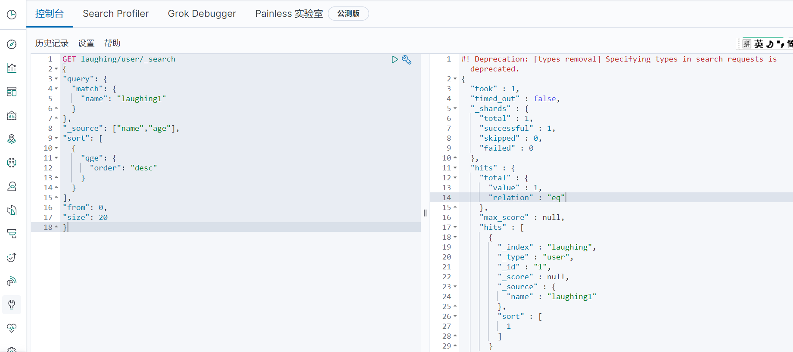

### 一、参数体方式查询

**match会使用分词器**<br>

text类型会被分词器解析<br>

keyword不会被分词器解析<br>

```
GET laughing/user/_search
{
"query": {
  "match": {
    "name": "laughing1"
  }
}
}
```


### 二、过滤、升序、分页

```
GET laughing/user/_search
{
"query": {
  "match": {
    "name": "laughing1"
  }
},
"_source": ["name","age"],        //过滤
"sort": [						// 升降序
  {
    "qge": {
      "order": "desc" 
    }
  }
],
"from": 0,                   //分页
"size": 20
}
```




### 三、布尔值多条件查询

```
GET laughing/user/_search
{
"query": {
  "bool": {
    "must": [          //should  must_not
      {"match": {
        "name": "laughing1"
      }},{
        "match": {
          "qge": "1"
        }
      }
    ]
  }
}
}
```


### 四、过滤器


```
GET laughing/user/_search
{
"query": {
  "bool": {
    "must": [
      {"match": {
        "name": "laughing1"
      }},{
        "match": {
          "qge": "1"
        }
      }
    ],
    "filter": [
      {
        "range": {
          "qge": {
            "gte": 0,
            "lte": 20
          }
        }
      }
    ]
  }
}
}

```


### 五、精确查询

term查询是通过倒排索引精确查询的（效率更高）;


### 六、高亮查询


```
GET laughing/user/_search
{
"query": {
  "match": {
    "name": "laughing1"
  }
},
"highlight": {
  "pre_tags": "<p class='key' style='color:red'>",
  "post_tags": "</p>", 
  "fields": {
    "name":{}
  }
}
}

```


