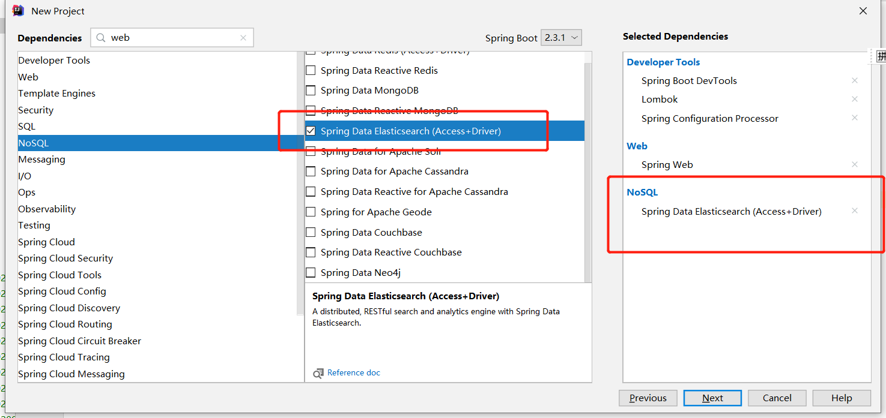
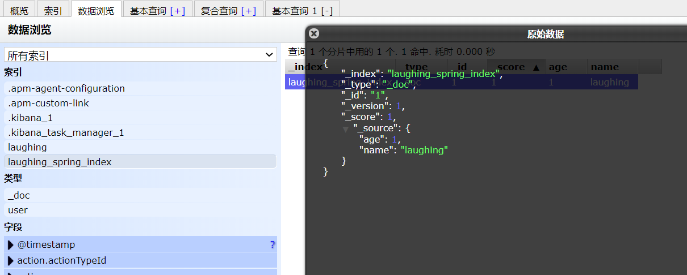

### 一、新建项目




### 二、配置类ElasticSearchConfig


```
/**
 * @author fzh
 * @version 1.0
 * @date 2020/6/15 13:58
 */
@Configuration
public class ElasticSearchConfig {

    @Bean
    public RestHighLevelClient restHighLevelClient() {
        RestHighLevelClient client = new RestHighLevelClient(
                RestClient.builder(new HttpHost("127.0.0.1", 9200, "http"))
        );

        return client;
    }
}
```


### 三、API详解

**索引创建：**

```
//  索引创建 Request
@Test
void testCreatIndex() throws IOException {
    // 1.创建索引的请求 Request
    CreateIndexRequest indexRequest = new CreateIndexRequest("laughing_spring_index");
    // 2.执行请求
    CreateIndexResponse indexResponse = restHighLevelClient.indices().create(indexRequest, RequestOptions.DEFAULT);
    // indexResponse为响应
    System.out.println(indexResponse);
}

//  获取索引
@Test
void testExistIndex() throws IOException {
    GetIndexRequest Request = new GetIndexRequest("laughing_spring_index");
    // 索引是否存在
    boolean exists = restHighLevelClient.indices().exists(Request, RequestOptions.DEFAULT);
    System.out.println(exists);

}

//  删除索引
void testDeleteIndex() {

}
```

**文档创建**：


```
// 添加文档
// put /laughing_spring_index/user/1
@Test
void testAddDocument() throws IOException {
    User user = new User("laughing", 1);
    // 创建请求 连接索引
    IndexRequest request = new IndexRequest("laughing_spring_index");
    request.id("1");
    request.timeout("5s");
    // 请求体   JSON
    request.source(JSON.toJSONString(user), XContentType.JSON);
    // 发送请求
    IndexResponse response = restHighLevelClient.index(request,RequestOptions.DEFAULT);
    System.out.println(response.toString());
}
```

**返回response值：**

```
IndexResponse[index=laughing_spring_index,type=_doc,id=1,version=1,result=created,seqNo=0,primaryTerm=1,shards={"total":2,"successful":1,"failed":0}]
```





