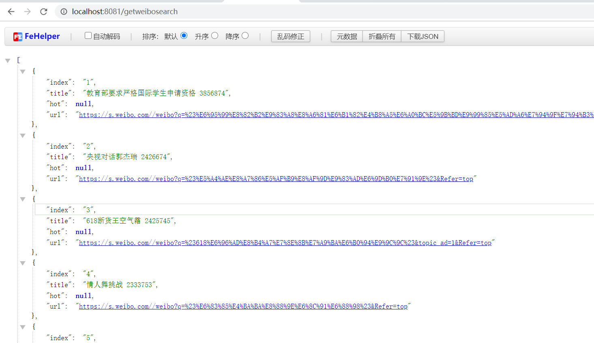

### 一、jsoup进行HTML解析

jsoup 是一款Java 的HTML解析器，可直接解析某个URL地址、HTML文本内容。它提供了一套非常省力的API，可通过DOM，CSS以及类似于jQuery的操作方法来取出和操作数据。<br>

文档：<br>

[https://www.open-open.com/jsoup/](https://www.open-open.com/jsoup/)<br>

pom文件：<br>

```
<!-- https://mvnrepository.com/artifact/org.jsoup/jsoup -->
<dependency>
    <groupId>org.jsoup</groupId>
    <artifactId>jsoup</artifactId>
    <version>1.11.3</version>
</dependency>
```

解析测试类：

```
@Test
void contextLoads() throws IOException {
    Document doc = Jsoup.connect("https://s.weibo.com/top/summary")
            .data("query", "Java")
            .userAgent("Mozilla")
            //       .cookie("auth", "token")
            .timeout(3000)
            .get();

    Elements elements = doc.getElementsByTag("tr");
    for (int i = 2; i < elements.size(); i++) {
        String ranktop = elements.get(i).getElementsByClass("ranktop").text();
        String title = elements.get(i).getElementsByClass("td-02").text();
        String href = elements.get(i).getElementsByTag("a").attr("href");
        if (href.equals("javascript:void(0);")) {
            href = elements.get(i).getElementsByTag("a").attr("href_to");
        }
        href = "https://s.weibo.com/" + href;
        System.out.println(ranktop);
        System.out.println(title);
        System.out.println(href);
    }
```

效果：


### 二、ElasticSearchConfig

```
public class ElasticSearchConfig {
    @Bean
    public RestHighLevelClient restHighLevelClient() {
        RestHighLevelClient client = new RestHighLevelClient(
                RestClient.builder(new HttpHost("127.0.0.1", 9200, "http"))
        );

        return client;
    }
}
```

### 三、存储业务类

```
/**
 * @author fzh
 * @version 1.0
 * @date 2020/6/16 9:48
 */

@RestController
public class WeiboSearchController {
    @Autowired
    private RestHighLevelClient restHighLevelClient;
    // 创建索引
    @GetMapping("/createindex")
    public void createIndex() throws IOException {
        // 1.创建索引的请求 Request
        CreateIndexRequest indexRequest = new CreateIndexRequest("weibo_search");
        // 2.执行请求
        CreateIndexResponse indexResponse = restHighLevelClient.indices().create(indexRequest, RequestOptions.DEFAULT);
        // indexResponse为响应
        System.out.println(indexResponse);
    }
    // 微博热搜数据返回json
    @GetMapping("/getweibosearch")
    public ArrayList<WeiboSearchDao> getWeiboSearch() throws IOException {
        ArrayList<WeiboSearchDao> list = new ArrayList<>();
        Document doc = Jsoup.connect("https://s.weibo.com/top/summary")
                .data("query", "Java")
                .userAgent("Mozilla")
                //       .cookie("auth", "token")
                .timeout(3000)
                .get();

        Elements elements = doc.getElementsByTag("tr");
        for (int i = 2; i < elements.size(); i++) {
            String ranktop = elements.get(i).getElementsByClass("ranktop").text();
            String title = elements.get(i).getElementsByClass("td-02").text();
            String href = elements.get(i).getElementsByTag("a").attr("href");
            if (href.equals("javascript:void(0);")) {
                href = elements.get(i).getElementsByTag("a").attr("href_to");
            }
            href = "https://s.weibo.com/" + href;
            WeiboSearchDao weiboSearchDao = new WeiboSearchDao();
            weiboSearchDao.setIndex(ranktop);
            weiboSearchDao.setTitle(title);
            weiboSearchDao.setUrl(href);
            list.add(weiboSearchDao);

        }
        return list;
    }
    // 将微博数据存入elastic search
    // 增加定时任务 每天12点和24点各跑一次
    @Scheduled(cron = "0 0 0,12 * * ?")
    @GetMapping("/addweibosearch")
    public void addWeiboSearch() throws IOException {
        Document doc = Jsoup.connect("https://s.weibo.com/top/summary")
                .data("query", "Java")
                .userAgent("Mozilla")
                .timeout(3000)
                .get();

        Elements elements = doc.getElementsByTag("tr");
        for (int i = 2; i < elements.size(); i++) {
            String ranktop = elements.get(i).getElementsByClass("ranktop").text();
            String title = elements.get(i).getElementsByClass("td-02").text();
            String href = elements.get(i).getElementsByTag("a").attr("href");
            if (href.equals("javascript:void(0);")) {
                href = elements.get(i).getElementsByTag("a").attr("href_to");
            }
            href = "https://s.weibo.com/" + href;
            WeiboSearchDao weiboSearchDao = new WeiboSearchDao();
            weiboSearchDao.setIndex(ranktop);
            weiboSearchDao.setTitle(title);
            weiboSearchDao.setUrl(href);

            // 创建请求 连接索引
            IndexRequest request = new IndexRequest("weibo_search");

            request.id(String.valueOf(i-1));
            request.timeout("5s");
            // 请求体   JSON
            request.source(JSON.toJSONString(weiboSearchDao), XContentType.JSON);
            // 发送请求
            IndexResponse response = restHighLevelClient.index(request, RequestOptions.DEFAULT);
            System.out.println("=========>> doc response ======>>" + response.toString());
        }
    }


}
```

可以拿到数据：




存入ES:


用kibana进行查询：


