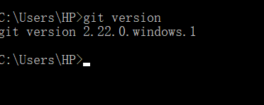
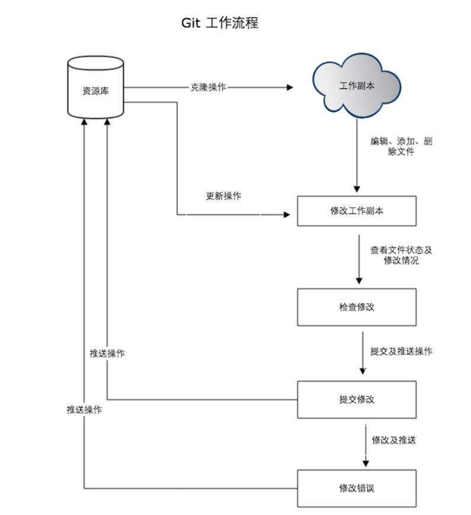

&nbsp;&nbsp;&nbsp;&nbsp;之前一直都是用SVN，用于微服务非常不方便，而Git是分布式的，现在学习使用Git。  
&nbsp;&nbsp;&nbsp;&nbsp;   * 1、**安装**  

&nbsp;&nbsp;&nbsp;&nbsp;Git  Windows安装地址：[https://gitforwindows.org/](https://gitforwindows.org/) 
&nbsp;&nbsp;&nbsp;&nbsp;小乌龟Git  Windows安装地址：[https://tortoisegit.org/download/](https://tortoisegit.org/download/) 
 

&nbsp;&nbsp;&nbsp;&nbsp;   * 2、**工作流程**  
&nbsp;&nbsp;&nbsp;&nbsp;类似于SVN  

&nbsp;&nbsp;&nbsp;&nbsp工作区：就是你在电脑里能看到的目录。  
&nbsp;&nbsp;&nbsp;&nbsp暂存区：英文叫stage, 或index。一般存放在 ".git目录下" 下的index文件（.git/index）中，所以我们把暂存区有时也叫作索引（index）。  
&nbsp;&nbsp;&nbsp;&nbsp版本库：工作区有一个隐藏目录.git，这个不算工作区，而是Git的版本库。  

&nbsp;&nbsp;&nbsp;&nbsp;   * 3、**Git使用** 
&nbsp;&nbsp;&nbsp;&nbsp目前主流的Git代码托管平台  
&nbsp;&nbsp;&nbsp;&nbsp;Github：[https://github.com/](https://gitforwindows.org/)  
&nbsp;&nbsp;&nbsp;&nbsp;GitLab：[https://gitee.com/](https://gitforwindows.org/)  
&nbsp;&nbsp;&nbsp;&nbsp;Gitee：[https://gitee.com/](https://gitforwindows.org/)  

&nbsp;&nbsp;&nbsp;&nbsp修改.gitignore配置文件，过滤掉eclipse、idea的目录.idea .project，不用上传  
&nbsp;&nbsp;&nbsp;&nbsp;克隆代码命令行 
       
       git clone https://github.com/laughingfuzihao/laughing.git
       
       git add *
       
       git commit -m “修改过滤文件”
       
       git push

&nbsp;&nbsp;&nbsp;&nbsp; 本人授权[维权骑士](http://rightknights.com)对我发布文章的版权行为进行追究与维权。未经本人许可，不可擅自转载或用于其他商业用途。

 